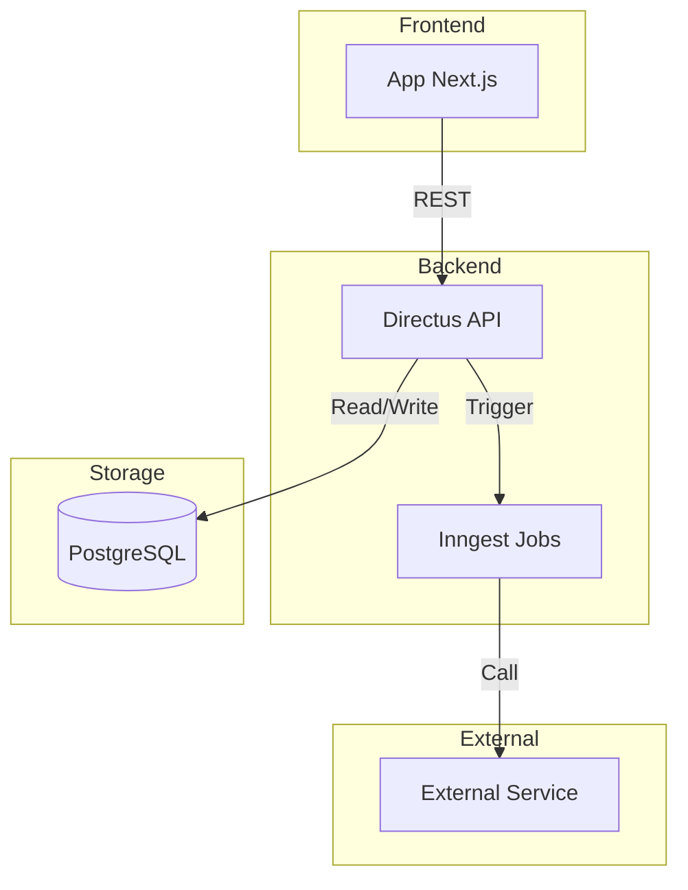
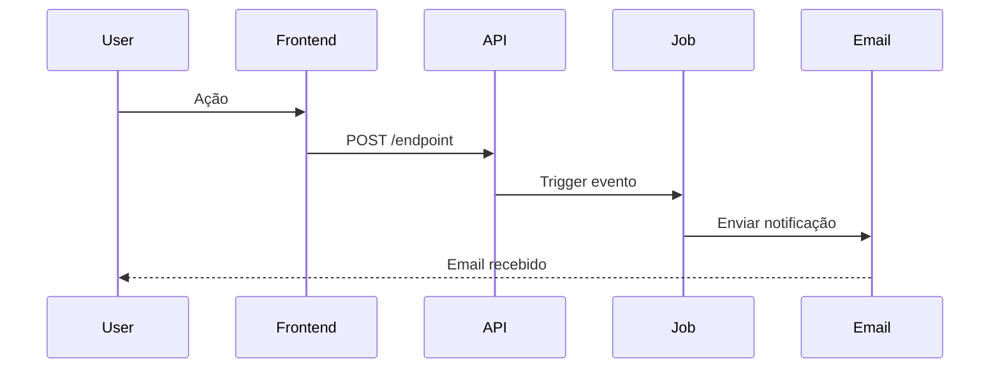
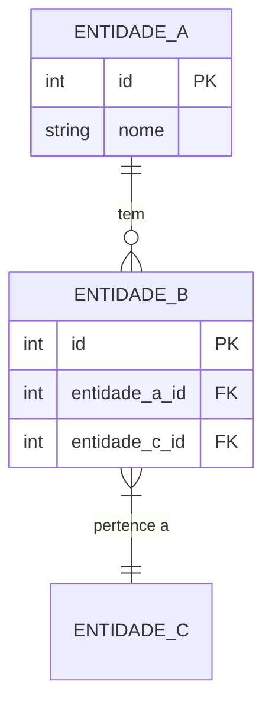

# Prompt: Criar Documentação Completa de Feature

## Contexto

Use este prompt para documentar qualquer feature nova seguindo a metodologia estruturada utilizada na documentação de **Pulsos**. Esta abordagem cobre API Reference, Guias de Usuário e Documentação Técnica.

## Prompt Principal

```
Preciso criar documentação completa para a feature [NOME_DA_FEATURE]. 

**Sobre a feature:**
[Descrever resumidamente o que a feature faz, quem usa, e onde está implementada]

**Repositórios/Locais:**
- Endpoints: [repo ou local]
- Frontend: [repo ou local]
- Jobs/Automações: [repo ou local]
- Database: [sistema, tabelas relevantes]

**Estrutura desejada:**

1. **API Reference** (em `api-reference/[modulo]/`):
   - index.mdx atualizado com seção sobre a feature
   - Arquivos separados para cada entidade/endpoint principal
   - Arquivo de webhooks/eventos (se aplicável)
   - Arquivo de exemplos práticos

2. **Guias de Usuário** (em `guides/`):
   - Para usuários finais (app-rh, app-talent, etc)
   - Para usuários internos (backoffice, operações, CS)
   - Incluir: quickstart, FAQs, troubleshooting

3. **Documentação Técnica** (em `documentation/domains/[dominio]/`):
   - index.mdx (visão geral com diagrama de arquitetura)
   - data-model.mdx (com diagramas ER)
   - jobs-[sistema].mdx (se houver jobs/automações)
   - integrations.mdx (serviços externos)
   - metrics.mdx (métricas e KPIs)
   - journeys.mdx (fluxos de usuário)
   - business-rules.mdx (regras de negócio)

4. **Navegação** (atualizar `docs.json`):
   - Adicionar novos arquivos nas seções apropriadas
   - Organizar em sub-grupos quando necessário

**Instruções:**

1. Explore os repositórios usando Glob, Grep e SemanticSearch para coletar informações
2. Use Task (explore subagent) para explorar múltiplos repos em paralelo
3. Se necessário, use MCP tools (GitHub, Supabase) para acessar schemas e códigos
4. **IMPORTANTE - Se o backend for Directus**: Explore extensions customizadas:
   - Verificar `extensions/hooks/src/` para hooks CRON e event listeners
   - Verificar `extensions/endpoints/src/` para endpoints customizados (além dos CRUD padrão)
   - Verificar `extensions/endpoints-workflows/src/` para workflows/operações especiais
   - Verificar `extensions/operations/src/` para operações customizadas
   - Verificar `extensions/shared/` para utilities compartilhadas
   
   Para cada extension encontrada:
   - Documentar rotas/endpoints customizados com método HTTP, parâmetros, validações e exemplos
   - Documentar hooks CRON com horários de execução, lógica e eventos disparados
   - Documentar eventos customizados que são enviados para Inngest ou outros sistemas
   - Incluir diagrama de fluxo mostrando: Hook CRON → Evento → Job Inngest
   - Adicionar seção "Extensions do Directus" em `integrations.mdx`
   - Adicionar seção "Hooks CRON" em `operations.mdx`
   - Criar arquivo separado para endpoints customizados: `api-reference/[modulo]/[feature]-endpoints-custom.mdx`
5. Para cada arquivo criado:
   - Use exemplos reais do código (com CodeGroup para múltiplas linguagens)
   - Inclua diagramas Mermaid quando apropriado (arquitetura, fluxos, ER)
   - Adicione Warnings, Tips e Notes para destacar informações importantes
   - Use CardGroups para organizar links relacionados
5. Priorize API Reference e Guias sobre documentação técnica detalhada se o tempo for limitado
6. SEMPRE atualize docs.json para que a nova documentação apareça na navegação

**Output esperado:**

Mínimo de 20 arquivos (pode chegar a 30+):
- ~5-7 arquivos de API Reference (incluindo endpoints customizados se houver)
- ~8-12 arquivos de Guias (divididos entre usuários finais e internos)
- ~5-8 arquivos de Documentação Técnica (incluindo seções sobre extensions)
- 1 atualização do docs.json

**Se o backend for Directus com extensions customizadas, adicione:**
- 1 arquivo `[feature]-endpoints-custom.mdx` em API Reference
- Seção "Hooks CRON" em `operations.mdx`
- Seção "Extensions do Directus" em `integrations.mdx`
- Diagrama de fluxo Hook → Evento → Job

Siga a estrutura usada na documentação de Pulsos como referência de qualidade e organização.
```

## Variações do Prompt

### Para Feature Simples (apenas API)

```
Preciso documentar apenas a API da feature [NOME_DA_FEATURE].

**Endpoints:**
- [Lista de endpoints]

**Estrutura desejada:**
- api-reference/[modulo]/[feature].mdx com todos os endpoints
- Atualizar api-reference/[modulo]/index.mdx
- Exemplos em múltiplas linguagens (cURL, TypeScript, Python)
- Atualizar docs.json

Total esperado: 2 arquivos + docs.json
```

### Para Feature com Jobs/Automações

```
Preciso documentar a feature [NOME_DA_FEATURE] que possui jobs automáticos.

**Jobs/Automações:**
[Sistema usado: Inngest, Make, Cron, etc]
[Lista de jobs e seus propósitos]

**Foco em:**
- documentation/domains/[dominio]/jobs-[sistema].mdx (detalhes técnicos de cada job)
- guides/backoffice/[feature]-operacoes.mdx (como operar/monitorar)
- guides/backoffice/[feature]-troubleshooting.mdx (resolver problemas)

Incluir diagramas de sequência (Mermaid) mostrando fluxos entre jobs.
```

### Para Feature com UI Complexa

```
Preciso documentar a feature [NOME_DA_FEATURE] que tem interface de usuário complexa.

**Usuários:**
- [Tipo de usuário 1]: [O que fazem]
- [Tipo de usuário 2]: [O que fazem]

**Foco em:**
- guides/app-[tipo]/[feature]-introducao.mdx (o que é, para quê serve)
- guides/app-[tipo]/[feature]-quickstart.mdx (tutorial de 5min)
- guides/app-[tipo]/[feature]-[acao-principal].mdx (para cada ação chave)
- guides/app-[tipo]/[feature]-faq.mdx (perguntas frequentes)

Incluir screenshots ou descrições detalhadas das telas.
```

### Para Feature com Extensions do Directus

```
Preciso documentar a feature [NOME_DA_FEATURE] que usa Directus com extensions customizadas.

**Repositório do Backend:**
[Nome do repo, ex: directus-backoffice-with-extensions]

**Tipos de extensions a explorar:**
- Hooks CRON em `extensions/hooks/src/hook-cron-*`
- Endpoints customizados em `extensions/endpoints/src/`
- Workflows em `extensions/endpoints-workflows/src/`
- Shared utilities em `extensions/shared/`

**Foco em:**
1. Criar api-reference/[modulo]/[feature]-endpoints-custom.mdx com:
   - Todos os endpoints customizados (método HTTP, params, validações)
   - Exemplos em cURL e TypeScript
   - Casos de uso práticos
   - Tratamento de erros com códigos específicos

2. Atualizar documentation/domains/[dominio]/operations.mdx com:
   - Seção "Hooks CRON" detalhando horários e lógica
   - Diagrama Mermaid: Hook CRON → Evento → Job Inngest
   - Instruções de troubleshooting para cada hook
   - Como testar e fazer deploy de alterações

3. Atualizar documentation/domains/[dominio]/integrations.mdx com:
   - Seção "Arquitetura de Extensions do Directus"
   - Diagrama mostrando dependências entre extensions
   - Exemplos de código real das extensions
   - Fluxo de integração com Inngest/outros serviços

4. Atualizar guides/backoffice/[feature]-acessar-via-api.mdx com:
   - Seção "Endpoints Avançados" com 5-7 exemplos práticos
   - Uso em contexto real (dashboard, interface)
   - Tratamento de erros de validação

5. Atualizar api-reference/[modulo]/index.mdx:
   - Adicionar card/seção sobre endpoints customizados
   - Link para o novo arquivo de documentação

6. Atualizar docs.json:
   - Adicionar [feature]-endpoints-custom na navegação

**Instruções específicas:**
- Use Glob/Grep para encontrar todas as extensions relacionadas à feature
- Para cada endpoint customizado, documente validações e regras de negócio
- Para hooks CRON, inclua horários exatos (UTC) e frequência
- Documente eventos disparados para Inngest com payload completo
- Inclua diagramas de sequência para fluxos complexos
```

## Checklist Pós-Criação

Após criar a documentação, valide:

- [ ] Todos os arquivos `.mdx` têm frontmatter completo (title, description)
- [ ] Diagramas Mermaid renderizam corretamente (sem erros de sintaxe)
- [ ] Code blocks usam syntax highlighting apropriado
- [ ] Links internos funcionam (caminhos corretos)
- [ ] `docs.json` foi atualizado e JSON é válido
- [ ] Navegação faz sentido (ordem lógica, agrupamentos corretos)
- [ ] Exemplos de código são completos e executáveis
- [ ] Não há informações sensíveis (tokens, senhas, IPs internos)
- [ ] **Se Directus**: Extensions customizadas foram documentadas (hooks, endpoints, workflows)
- [ ] **Se Directus**: Arquivo de endpoints customizados criado e adicionado ao docs.json
- [ ] **Se Directus**: Diagrama de fluxo Hook → Evento → Job incluído em operations.mdx

## Estrutura de Pastas Padrão

```
.
├── api-reference/
│   ├── backoffice/
│   │   ├── index.mdx
│   │   └── [feature]/
│   │       ├── [entidade-1].mdx
│   │       ├── [entidade-2].mdx
│   │       ├── [feature]-endpoints-custom.mdx  ← SE HOUVER EXTENSIONS
│   │       ├── webhooks.mdx
│   │       └── examples.mdx
│   └── [outro-modulo]/
│
├── guides/
│   ├── app-rh/
│   │   └── [feature]/
│   │       ├── introducao.mdx
│   │       ├── quickstart.mdx
│   │       ├── [acao-1].mdx
│   │       └── faq.mdx
│   └── backoffice/
│       └── [feature]/
│           ├── operacoes.mdx
│           ├── troubleshooting.mdx
│           ├── manual-tecnico.mdx
│           └── acessar-via-api.mdx
│
├── documentation/
│   └── domains/
│       └── [dominio]/
│           ├── index.mdx
│           ├── data-model.mdx
│           ├── jobs-[sistema].mdx
│           ├── integrations.mdx
│           ├── metrics.mdx
│           ├── journeys.mdx
│           ├── business-rules.mdx
│           └── operations.mdx
│
└── docs.json
```

## Exemplos de Bons Diagramas

### Arquitetura



### Fluxo de Processo



### Modelo de Dados



## Dicas Finais

1. **Priorize usuários finais**: Guias de usuário são mais valiosos que documentação técnica profunda
2. **Use linguagem clara**: Evite jargões técnicos em guias de usuário
3. **Exemplos reais**: Sempre use exemplos baseados no código real, não inventados
4. **Mantenha consistência**: Use a mesma estrutura para features similares
5. **Atualize incrementalmente**: É melhor documentar bem uma parte do que superficialmente tudo
6. **Teste a navegação**: Após atualizar docs.json, verifique que os links funcionam

## Referência

A documentação de **Pulsos** serve como exemplo completo desta metodologia:
- API Reference: 7 arquivos
- Guias: 12 arquivos (8 app-rh + 4 backoffice)
- Docs Técnicas: 8 arquivos (com diagramas Mermaid)
- Total: ~27 arquivos

Consulte esses arquivos como referência de qualidade e estrutura.
