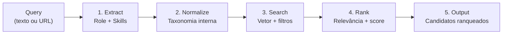

## O que é o Agent System

O Agent System é a camada de inteligência artificial da plataforma Leapy. O agente atual em
produção é o **Matchmaker**, responsável por descobrir talentos com base em uma query de
linguagem natural ou URL de vaga.

O sistema usa um pipeline de 5 etapas orquestrado por IA:



## Camadas de Acesso

O Agent System é acessado em duas camadas, dependendo do contexto:

| Camada | Endpoint | Quem usa | Auth |
|---|---|---|---|
| BFF (Next.js) | `POST /api/matchmaker/search` | App RH (frontend) | Sessão NextAuth |
| Proxy Directus | `POST /matchmaker/search` | BFF → Directus | Bearer token Directus |
| Agent System direto | `POST /matchmaker/search` | Directus → Agent System | API Key interna |

Na prática, o fluxo completo é:

```
Frontend → Next.js BFF → Directus (proxy + auth) → Agent System
```

O `account_id` é injetado automaticamente pelo Directus a partir do token de autenticação,
garantindo **isolamento multi-tenant**: cada busca retorna apenas talentos da conta do usuário.

## Endpoints

### Matchmaker

| Endpoint | Método | Descrição |
|---|---|---|
| [`/matchmaker/search`](/api-reference/agent-system/matchmaker-search) | `POST` | Busca síncrona — aguarda o pipeline completo |
| [`/matchmaker/search/stream`](/api-reference/agent-system/matchmaker-stream) | `POST` | Busca com SSE — feedback em tempo real |
| [`/matchmaker/extract`](/api-reference/agent-system/matchmaker-extract) | `POST` | Extrai role e skills de texto/URL (sem busca) |
| [`/matchmaker/health`](/api-reference/agent-system/matchmaker-health) | `GET` | Health check do serviço |

## Autenticação

### Via BFF (recomendado para o frontend)

O BFF em `leapy-rh` injeta o Bearer token da sessão NextAuth automaticamente.
Não é necessário gerenciar tokens no cliente.

```typescript
// Chamada do frontend — sem token explícito
const response = await fetch('/api/matchmaker/search', {
  method: 'POST',
  headers: { 'Content-Type': 'application/json' },
  body: JSON.stringify({ query: 'Desenvolvedor Python sênior', limit: 10 }),
});
```

### Via Directus (para integrações diretas)

```bash
POST https://backoffice.leapy.com/matchmaker/search
Authorization: Bearer <directus_access_token>
Content-Type: application/json

{
  "query": "Desenvolvedor Python sênior",
  "limit": 10
}
```

## Parâmetros Comuns

Todos os endpoints de busca aceitam:

| Parâmetro | Tipo | Obrigatório | Descrição |
|---|---|---|---|
| `query` | `string` | Sim | Texto livre, URL de vaga LinkedIn, ou misto |
| `limit` | `integer` | Não | Máximo de resultados (1–100, default: 10) |
| `department` | `string` | Não | Filtro por departamento |
| `account_id` | `string` (UUID) | Via Directus | Injetado automaticamente pelo proxy |

## Tipos de Query

O Matchmaker aceita três formatos:

### 1. Texto livre
```
"Desenvolvedor Python sênior com experiência em FastAPI e AWS"
```

### 2. URL de vaga
```
"https://www.linkedin.com/jobs/view/123456"
```

### 3. Misto
```
"https://linkedin.com/jobs/view/123456 — preciso de alguém com mais foco em backend"
```

Quando uma URL é detectada, o pipeline extrai o conteúdo da página antes de processar.

## Escolhendo entre Search e Stream

| Critério | `/search` (síncrono) | `/search/stream` (SSE) |
|---|---|---|
| **UX recomendada** | Integrações, scripts, testes | Frontend e app RH |
| **Tempo de resposta** | Até 120s (bloqueia) | Progressivo (eventos em tempo real) |
| **Feedback durante processamento** | Nenhum | Sim — passo a passo visível |
| **Implementação** | Simples (fetch normal) | Requer leitor de SSE |

## Tratamento de Erros

| Status | Significado |
|---|---|
| `400` | `query` ausente ou vazia |
| `401` | Sessão expirada ou token inválido |
| `408` / `504` | Timeout — pipeline demorou mais de 120 segundos |
| `500` | Erro interno no Agent System |

```json
{
  "error": "Timeout",
  "message": "A busca demorou mais de 120 segundos. Tente uma query mais específica.",
  "status": 408
}
```

## Exemplo Rápido

```typescript
// Busca com streaming (recomendado)
const response = await fetch('/api/matchmaker/search/stream', {
  method: 'POST',
  headers: { 'Content-Type': 'application/json' },
  body: JSON.stringify({
    query: 'Analista de dados com Python e Power BI',
    limit: 5,
  }),
});

const reader = response.body!.getReader();
const decoder = new TextDecoder();

while (true) {
  const { done, value } = await reader.read();
  if (done) break;

  const lines = decoder.decode(value).split('\n');
  for (const line of lines) {
    if (!line.startsWith('data: ')) continue;
    const event = JSON.parse(line.slice(6));

    if (event.type === 'candidates') {
      console.log('Candidatos:', event.data);
    }
    if (event.type === 'done') break;
  }
}
```

<CardGroup cols={2}>
  <Card title="Busca Síncrona" icon="magnifying-glass" href="/api-reference/agent-system/matchmaker-search">
    POST /matchmaker/search — pipeline completo, resposta única
  </Card>
  <Card title="Busca com Streaming" icon="bolt" href="/api-reference/agent-system/matchmaker-stream">
    POST /matchmaker/search/stream — feedback em tempo real via SSE
  </Card>
  <Card title="Extração de Skills" icon="brain" href="/api-reference/agent-system/matchmaker-extract">
    POST /matchmaker/extract — extrai role e skills sem retornar candidatos
  </Card>
  <Card title="Exemplos Práticos" icon="code" href="/api-reference/agent-system/matchmaker-examples">
    Cenários reais de uso com código TypeScript e cURL
  </Card>
</CardGroup>
