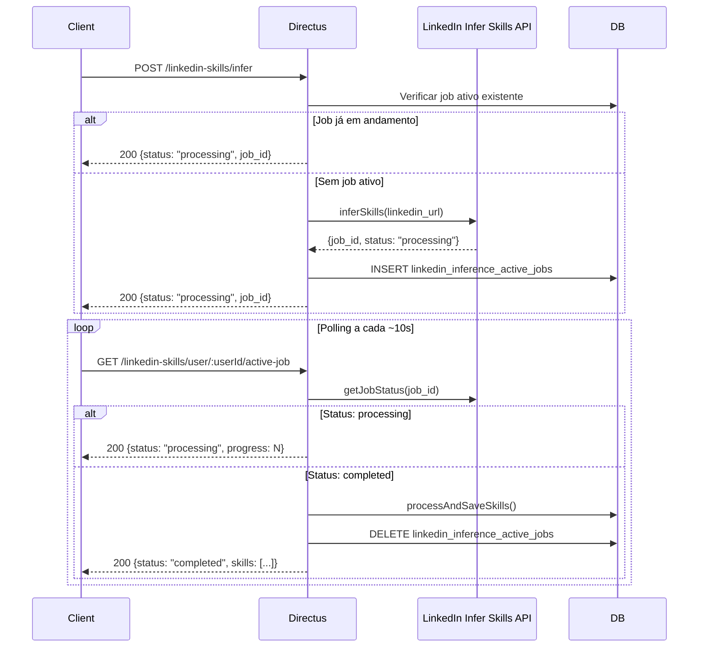

## Visão Geral

O endpoint `linkedin-skills` integra a Leapy com um serviço externo de inferência de skills
baseado em IA. Dado um perfil LinkedIn, o serviço analisa a experiência profissional e extrai
competências que são salvas em `user_careers` com origem `linkedin_infer`.

O fluxo é assíncrono: `POST /infer` inicia o job e retorna imediatamente. O cliente faz
polling via `GET /status/:requestId` ou `GET /user/:userId/active-job` até o job completar.
Quando completo, as skills são persistidas automaticamente e o job é removido da fila.

**Rate limit:** 5 requisições por minuto por usuário (desativado no debug mode via
`LINKEDIN_SKILLS_DEBUG_MODE=true`).

---

## `POST /linkedin-skills/infer`

Inicia a inferência de skills a partir de um perfil LinkedIn.

### Autenticação

Requer sessão Directus ativa (`401` sem autenticação).

### Permissões

| Cenário | Permitido |
|---|---|
| Usuário inferindo próprio perfil | Sempre |
| Admin inferindo perfil de outro usuário | Sim (`admin_access = true`) |
| Debug mode (`LINKEDIN_SKILLS_DEBUG_MODE=true`) | Sim (qualquer usuário) |
| Usuário comum inferindo perfil de terceiro | `403 Forbidden` |

### Request

```json
{
  "linkedin_url": "https://www.linkedin.com/in/ana-lima",
  "user_id": "uuid-do-usuario"
}
```

| Campo | Tipo | Obrigatório | Validação |
|---|---|---|---|
| `linkedin_url` | `string` | Sim | Regex `linkedin.com/in/<slug>` — aceita variações de URL e query strings |
| `user_id` | `string` (UUID) | Sim | Deve ter `user_careers` cadastrado |

### Idempotência — job ativo existente

Se o usuário já tem um job em andamento (`linkedin_inference_active_jobs`), o endpoint
**não cria um novo job**. Consulta o status do existente e retorna:

```json
{
  "message": "Job já em andamento para este usuário",
  "job_id": "ext-job-abc123",
  "status": "processing",
  "progress": 45,
  "started_at": "2026-05-05T10:00:00.000Z"
}
```

Se o job existente não for encontrado na API externa (erro 404), ele é removido da tabela
e um novo job é criado normalmente.

### Response — job assíncrono (caso mais comum)

```json
{
  "success": true,
  "status": "processing",
  "request_id": "uuid-interno",
  "job_id": "ext-job-abc123",
  "user_id": "uuid-do-usuario",
  "linkedin_url": "https://www.linkedin.com/in/ana-lima",
  "message": "Inferência iniciada. Use o job_id para consultar o status."
}
```

### Response — job completado imediatamente (raro)

Quando a API externa resolve de forma síncrona:

```json
{
  "success": true,
  "status": "completed",
  "request_id": "uuid-interno",
  "user_id": "uuid-do-usuario",
  "linkedin_url": "https://www.linkedin.com/in/ana-lima",
  "skills_inferred": 12,
  "skills_saved": 8,
  "skills_updated": 3,
  "skills_skipped": 1,
  "execution_time_ms": 1840,
  "talent_info": {
    "name": "Ana Lima",
    "headline": "Engenheira de Software"
  },
  "skills": [
    { "name": "TypeScript", "proficiency": 3, "origin": "linkedin_infer" }
  ]
}
```

### Status Codes e Erros

| Status | Condição |
|---|---|
| `200` | Job iniciado ou completado com sucesso |
| `400` | `linkedin_url` ou `user_id` ausentes; URL com formato inválido |
| `401` | Usuário não autenticado |
| `403` | Tentativa de inferir perfil de terceiro sem permissão de admin |
| `404` | `user_careers` não encontrado para o `user_id` |
| `429` | Rate limit excedido (5 req/min) ou API externa em sobrecarga |
| `504` | Timeout — inferência demorou mais de 2 minutos |
| `500` | Erro interno ou erro da API externa |

**Rate limit (429):**
```json
{
  "error": "Too Many Requests",
  "message": "Limite de 5 requisições por minuto excedido",
  "retry_after": 45
}
```

**Timeout da API externa (504):**
```json
{
  "error": "Timeout",
  "message": "A inferência demorou mais de 2 minutos. Tente novamente.",
  "request_id": "uuid-interno",
  "execution_time_ms": 120043
}
```

**Rate limit da API externa (429):**
```json
{
  "error": "RateLimitExceeded",
  "message": "Muitas requisições simultâneas. Tente novamente em alguns minutos.",
  "user_message": "O sistema está processando muitas solicitações no momento. Por favor, aguarde alguns minutos e tente novamente.",
  "retry_after_seconds": 300,
  "retry_after_minutes": 5,
  "retry_suggestion": "Recomendamos aguardar 5 minutos antes de tentar novamente.",
  "error_source": "linkedin_api"
}
```

---

## `GET /linkedin-skills/status/:requestId`

Consulta o status de um job de inferência pelo `requestId` (equivalente ao `job_id` retornado
pelo `POST /infer`). Internamente usa o mesmo handler que `GET /user/:userId/active-job`.

### Autenticação

Requer sessão Directus ativa. Admins podem consultar jobs de qualquer usuário.

### Response — em processamento

```json
{
  "success": true,
  "status": "processing",
  "job_id": "ext-job-abc123",
  "user_id": "uuid-do-usuario",
  "linkedin_url": "https://www.linkedin.com/in/ana-lima",
  "started_at": "2026-05-05T10:00:00.000Z",
  "progress": 72,
  "message": "Analisando experiências profissionais"
}
```

### Response — completado

Quando o job completa, as skills são persistidas automaticamente e o job é removido da
tabela `linkedin_inference_active_jobs`. A resposta inclui o resultado completo:

```json
{
  "success": true,
  "status": "completed",
  "job_id": "ext-job-abc123",
  "user_id": "uuid-do-usuario",
  "linkedin_url": "https://www.linkedin.com/in/ana-lima",
  "started_at": "2026-05-05T10:00:00.000Z",
  "skills_inferred": 12,
  "skills_saved": 8,
  "skills_updated": 3,
  "skills_skipped": 1,
  "talent_info": {
    "name": "Ana Lima",
    "headline": "Engenheira de Software"
  },
  "skills": [
    {
      "name": "TypeScript",
      "proficiency": 3,
      "origin": "linkedin_infer",
      "assessment_method": "ai_inference"
    }
  ]
}
```

### Status Codes

| Status | Condição |
|---|---|
| `200` | Status retornado (processing, completed ou failed) |
| `401` | Não autenticado |
| `403` | Consulta de job de outro usuário sem permissão de admin |
| `404` | Nenhum job ativo encontrado para o usuário |
| `429` | Rate limit da API externa |
| `500` | Erro interno |

---

## `GET /linkedin-skills/user/:userId/active-job`

Consulta o job ativo de um usuário específico pelo `user_id` (UUID do Directus).
Funciona identicamente ao `GET /status/:requestId`, mas o parâmetro de busca é o
`userId` em vez do `job_id` externo.

**Uso típico:** verificar se um usuário já tem job em andamento antes de chamar `POST /infer`.

### Response `404` — sem job ativo

```json
{
  "error": "Not Found",
  "message": "Nenhum job ativo encontrado para este usuário"
}
```

---

## `GET /linkedin-skills/health`

Health check do serviço. Não exige autenticação.

### Response

```json
{
  "status": "healthy",
  "service": "linkedin-skills",
  "timestamp": "2026-05-05T10:15:00.000Z"
}
```

---

## Fluxo Completo de Integração



## Persistência de Skills

Quando o job completa, as skills são salvas via `SkillsProcessor.processAndSaveSkills()` com:
- `origin`: `"linkedin_infer"`
- `assessment_method`: `"ai_inference"`
- `assessed_by`: UUID do usuário que iniciou a inferência

**Campos retornados no resultado:**

| Campo | Descrição |
|---|---|
| `skills_inferred` | Total de skills detectadas pela IA na análise do perfil |
| `skills_saved` | Skills novas criadas no banco |
| `skills_updated` | Skills existentes atualizadas com nova proficiência |
| `skills_skipped` | Skills ignoradas (duplicatas sem mudança) |

## Variáveis de Ambiente

| Variável | Descrição |
|---|---|
| `LINKEDIN_INFER_SKILLS_URL` | URL base da API externa de inferência |
| `LINKEDIN_INFER_SKILLS_API_KEY` | Chave de autenticação da API externa |
| `LINKEDIN_SKILLS_DEBUG_MODE` | `"true"` desativa rate limit e permite inferência de qualquer perfil |

## Observabilidade

```sql
-- Jobs de inferência ativos no momento
SELECT user_id, job_id, linkedin_url, started_at, started_by
FROM linkedin_inference_active_jobs
ORDER BY started_at DESC;

-- Verificar skills inferidas de um usuário (por origem)
SELECT s.name, us.proficiency, us.origin, us.assessment_method, us.updated_at
FROM user_skills us
JOIN skills s ON us.skill_id = s.id
JOIN user_careers uc ON us.career_id = uc.id
WHERE uc.user_id = '{user_id}'
  AND us.origin = 'linkedin_infer'
ORDER BY us.updated_at DESC;
```

## Referências de Código

| Arquivo | Repo | Descrição |
|---|---|---|
| `extensions/endpoints/src/linkedin-skills/index.js` | `directus-backoffice-with-extensions` | Roteador + middlewares de auth e rate limit |
| `extensions/endpoints/src/linkedin-skills/handlers/infer-skills.js` | `directus-backoffice-with-extensions` | Handler `POST /infer` — idempotência + chamada API |
| `extensions/endpoints/src/linkedin-skills/handlers/skills-status.js` | `directus-backoffice-with-extensions` | Handler `GET /status` e `GET /user/:userId/active-job` |
| `extensions/endpoints/src/linkedin-skills/linkedin-api-client.js` | `directus-backoffice-with-extensions` | Cliente HTTP para a API de inferência externa |
| `extensions/endpoints/src/linkedin-skills/skills-processor.js` | `directus-backoffice-with-extensions` | Lógica de persistência de skills com dedup |
| `extensions/endpoints/src/linkedin-skills/validation.js` | `directus-backoffice-with-extensions` | Validação de URL LinkedIn e UUID |

<CardGroup cols={2}>
  <Card title="Talentos" icon="star" href="/documentation/domains/talents/index">
    Domínio de talentos, PDI e progressão
  </Card>
  <Card title="Career Map" icon="map" href="/api-reference/career-map/index">
    BFF de mapeamento de competências e skill-gap
  </Card>
  <Card title="Competências" icon="brain" href="/api-reference/backoffice/competencias">
    Gestão de competências e habilidades
  </Card>
  <Card title="Backoffice — Visão Geral" icon="database" href="/api-reference/backoffice/index">
    Índice dos endpoints do backoffice Directus
  </Card>
</CardGroup>
