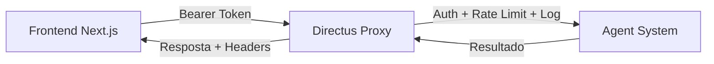

## Visão Geral

O Directus expõe endpoints customizados que servem como **proxy autenticado** entre o frontend e o Agent System. Esses endpoints adicionam autenticação, rate limiting e logging a cada requisição.

**Localização**: `extensions/endpoints/src/matchmaker/index.js`



---

## POST /matchmaker/search

Proxy para busca síncrona de candidatos.

### Request

```bash
POST /matchmaker/search
Authorization: Bearer <directus_access_token>
Content-Type: application/json
```

| Campo | Tipo | Obrigatório | Descrição |
|-------|------|-------------|-----------|
| `query` | string | Sim | Query do usuário |
| `limit` | integer | Não | Limite de candidatos (padrão: 10) |
| `department` | string | Não | Filtro por departamento |

### Validações

| Validação | Comportamento |
|-----------|--------------|
| **Autenticação** | Verifica `req.accountability.user`. Retorna 401 se ausente |
| **Isolamento por conta** | Resolve `account` do usuário via `directus_users`. Retorna 403 se sem conta válida |
| **Configuração** | Verifica `AGENT_SYSTEM_URL`. Retorna 503 se ausente |
| **Rate Limit** | 10 req/min por usuário. Retorna 429 se excedido |
| **Body** | `query` obrigatória e não-vazia. Retorna 400 se inválida |

<Note>
  **Isolamento multi-tenant**: O proxy resolve automaticamente o `account_id` do usuário autenticado a partir do banco de dados e o envia ao Agent System. Isso garante que o Matchmaker retorne apenas candidatos da mesma organização, sem que o frontend precise enviar o `account_id`.
</Note>

### Response

<CodeGroup>

```bash cURL
curl -X POST "https://backoffice.leapy.com/matchmaker/search" \
  -H "Authorization: Bearer SEU_TOKEN_DIRECTUS" \
  -H "Content-Type: application/json" \
  -d '{
    "query": "Desenvolvedor Python senior com AWS",
    "limit": 10
  }'
```

```typescript TypeScript
const response = await fetch('https://backoffice.leapy.com/matchmaker/search', {
  method: 'POST',
  headers: {
    'Authorization': `Bearer ${directusToken}`,
    'Content-Type': 'application/json'
  },
  body: JSON.stringify({
    query: 'Desenvolvedor Python senior com AWS',
    limit: 10
  })
});

const data = await response.json();
```

</CodeGroup>

A resposta é a mesma do [endpoint do Agent System](/api-reference/agent-system/matchmaker-search), com headers adicionais de rastreabilidade.

### Headers de Resposta

| Header | Descrição | Exemplo |
|--------|-----------|---------|
| `X-Request-ID` | UUID único da requisição | `a1b2c3d4-e5f6-...` |
| `X-Execution-Time` | Tempo total em ms | `3450` |
| `X-RateLimit-Remaining` | Requisições restantes | `7` |

---

## POST /matchmaker/search/stream

Proxy SSE para busca com streaming em tempo real.

### Request

Mesmo formato do endpoint síncrono.

```bash
POST /matchmaker/search/stream
Authorization: Bearer <directus_access_token>
Content-Type: application/json
```

### Response

**Content-Type**: `text/event-stream`

O proxy faz forward transparente do stream SSE do Agent System, preservando todos os eventos (`step`, `result`, `error`).

Headers configurados pelo proxy:

```
Content-Type: text/event-stream
Cache-Control: no-cache
Connection: keep-alive
X-Accel-Buffering: no
X-Request-ID: <uuid>
```

---

## Logging

Toda requisição (síncrona ou streaming) é logada na tabela `matchmaker_search_logs`:

| Campo Logado | Origem |
|-------------|--------|
| `request_id` | UUID gerado pelo proxy |
| `user_id` | `req.accountability.user` |
| `query` | `req.body.query` |
| `limit_requested` | `req.body.limit` |
| `department` | `req.body.department` |
| `success` | Resultado da requisição |
| `error_message` | Mensagem de erro (se houver) |
| `execution_time_ms` | `Date.now() - startTime` |
| `candidates_found` | Extraído da resposta |
| `response_data` | Resposta completa em JSON |

<Note>
  O logging é **assíncrono** — não bloqueia a resposta ao usuário. Se o insert falhar, o erro é logado no console mas a resposta é retornada normalmente.
</Note>

---

## Códigos de Erro

| Status | Erro | Descrição |
|--------|------|-----------|
| 400 | Bad Request | Campo `query` ausente ou vazio |
| 401 | Unauthorized | Sem autenticação (token ausente ou inválido) |
| 403 | Forbidden | Usuário não está associado a uma conta válida |
| 429 | Too Many Requests | Rate limit excedido (10 req/min) |
| 503 | Service Unavailable | `AGENT_SYSTEM_URL` não configurada |
| 504 | Gateway Timeout | Requisição excedeu 120 segundos |
| 500 | Internal Server Error | Erro genérico no processamento |

### Exemplo de Erro 429

```json
{
  "error": "Too Many Requests",
  "message": "Limite de requisições excedido. Tente novamente em 45 segundos.",
  "retry_after": 45
}
```

### Exemplo de Erro 504

```json
{
  "error": "Gateway Timeout",
  "message": "A busca demorou muito para responder. Tente uma query mais específica.",
  "request_id": "a1b2c3d4-e5f6-7890-abcd-ef1234567890"
}
```

---

## Rate Limiting

| Parâmetro | Valor |
|-----------|-------|
| **Máximo** | 10 requisições |
| **Janela** | 60 segundos |
| **Key** | `matchmaker:{userId}` |
| **Header** | `X-RateLimit-Remaining` |
| **Retry** | `Retry-After` (em segundos) |

<Warning>
  O rate limiter é compartilhado entre os endpoints `/search` e `/search/stream`. Uma requisição em qualquer um consome do mesmo limite.
</Warning>

---

## Variáveis de Ambiente

| Variável | Descrição | Obrigatória |
|----------|-----------|-------------|
| `AGENT_SYSTEM_URL` | URL base do Agent System (ex: `https://agent.leapy.com`) | Sim |

Se não configurada, ambos os endpoints retornam:

```json
{
  "error": "Service Unavailable",
  "message": "Matchmaker não está configurado corretamente. Contate o administrador.",
  "request_id": "..."
}
```
