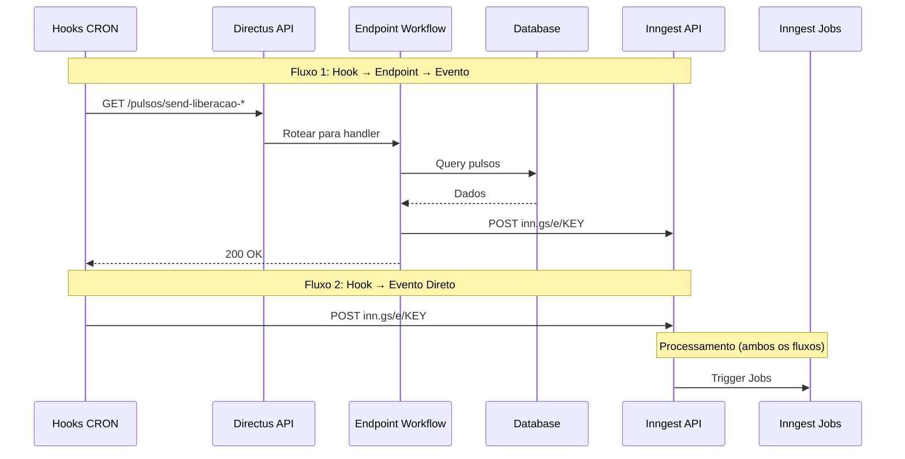

## Visão Geral

O sistema de Pulsos utiliza **Inngest** para gerenciar eventos assíncronos e automações. São 15 eventos principais que controlam criação, atualização, notificações e processamento de pulsos.

---

## Origem dos Eventos: Automação com Hooks CRON

Os eventos Inngest são disparados de duas formas principais:

1. **Hook CRON → Endpoint Workflow → Evento** (fluxo recomendado)
2. **Hook CRON → Evento Direto** (para eventos simples)

### Fluxo de Automação



### Mapeamento Hooks CRON → Eventos

| Hook CRON | Horário | Tipo de Fluxo | Endpoint/Evento | Descrição |
|-----------|---------|---------------|-----------------|-----------|
| `hook-cron-send-liberacao-pulsos-rh-to-rh` | 8:00 | Hook → Endpoint → Evento | `/pulsos/send-liberacao-pulsos-rh-to-rh` → `liberacao-to-rh.send` | Libera pulsos RH para gestores |
| `hook-cron-send-liberacao-pulsos-rh-to-jovens` | 8:05 | Hook → Endpoint → Evento | `/pulsos/send-liberacao-pulsos-rh-to-jovens` → `liberacao-to-jovens.send` | Libera pulsos RH para jovens |
| `hook-cron-send-lembrete-pulsos-rh-to-rh` | 8:00 | Hook → Endpoint → Evento | `/pulsos/send-lembrete-pulsos-rh-to-rh` → `lembrete-to-rh.send` | Envia lembretes para RH |
| `hook-cron-send-lembrete` | 5:00 | Hook → Endpoint → Evento | `/pulsos/send-lembrete` → `send-lembrete-pulsos.send` | Lembretes gerais |
| `hook-cron-update-pulsos-liderancas-to-pendente` | Diário | Hook → Evento Direto | `pulsos.change_status` | Atualiza status para pendente |
| `hook-cron-update-pulsos-jovens-to-pendente` | Diário | Hook → Evento Direto | `pulsos-jovens.update-to-pendente` | Atualiza pulsos jovens para pendente |
| `hook-cron-update-pulsos-jovens-to-vencidos` | Diário | Hook → Evento Direto | `pulsos-jovens.update-to-vencidos` | Marca pulsos jovens como vencidos |
| `hook-cron-update-pulsos-liderancas-to-vencidos` | Diário | Hook → Evento Direto | `pulsos.vencidos_lideranca` | Marca pulsos lideranças como vencidos |

### Exemplos de Código

**Fluxo 1: Hook chamando Endpoint**

```javascript
// extensions/hooks/src/hook-cron-send-liberacao-pulsos-rh-to-rh/index.js
export default ({ schedule }, { env }) => {
  schedule('0 8 * * *', async () => {
    const directusUrl = env.PUBLIC_URL || 'http://localhost:8055';
    const response = await fetch(
      `${directusUrl}/pulsos/send-liberacao-pulsos-rh-to-rh?status=agendado&send_event=true`,
      {
        method: 'GET',
        headers: {
          'Authorization': `Bearer ${env.DIRECTUS_STATIC_TOKEN}`
        }
      }
    );
    const result = await response.json();
    console.log(`✅ Liberação RH: ${result.data.pulsos_encontrados} pulsos`);
  });
};
```

**Fluxo 2: Hook disparando Evento Direto**

```javascript
// extensions/hooks/src/hook-cron-update-to-pendente/index.js
export default ({ schedule }, { env }) => {
  schedule('0 0 * * *', async () => {
    await fetch(env.INNGEST_EVENT_URL, {
      method: 'POST',
      headers: {
        'Authorization': `Bearer ${env.INNGEST_EVENT_KEY}`,
        'Content-Type': 'application/json'
      },
      body: JSON.stringify({
        name: 'backoffice/pulsos.change_status',
        data: { trigger: 'cron', timestamp: Date.now() }
      })
    });
  });
};
```

**Endpoint Workflow disparando Evento**

```javascript
// extensions/endpoints-workflows/src/pulsos/index.js
router.get('/send-liberacao-pulsos-rh-to-rh', async (req, res) => {
  const { status = 'agendado', send_event = true } = req.query;
  
  // 1. Consultar dados
  const pulsos = await services.ItemsService('pulsos_rh').readByQuery({
    filter: { status: { _eq: status } }
  });
  
  // 2. Disparar evento Inngest
  if (send_event && pulsos.length > 0) {
    await fetch(env.INNGEST_EVENT_URL, {
      method: 'POST',
      headers: {
        'Authorization': `Bearer ${env.INNGEST_EVENT_KEY}`,
        'Content-Type': 'application/json'
      },
      body: JSON.stringify({
        name: 'backoffice/pulsos_rh/liberacao-to-rh.send',
        data: {
          pulso_ids: pulsos.map(p => p.id),
          count: pulsos.length
        }
      })
    });
  }
  
  res.json({ data: { pulsos_encontrados: pulsos.length } });
});
```

### Quando Usar Cada Fluxo?

| Critério | Hook → Endpoint → Evento | Hook → Evento Direto |
|----------|-------------------------|---------------------|
| **Quando usar** | Precisa consultar dados, validar regras, processar lógica antes de disparar evento | Evento simples, sem necessidade de consultas |
| **Vantagens** | Controle fino, logging, validação, testável via HTTP | Simples, direto, menos overhead |
| **Desvantagens** | Mais complexo, mais código | Limitado, sem lógica customizada |
| **Exemplo** | Enviar notificações apenas para pulsos com status "agendado" | Atualizar status de todos os pulsos pendentes |

<Tip>
  Para mais detalhes sobre endpoints workflows, consulte [Endpoints Customizados - Workflows](/api-reference/backoffice/pulsos-endpoints-custom#workflows-operações-internas).
</Tip>

---

## Eventos de Criação

Eventos que disparam criação de novos pulsos.

### `backoffice/jovem.created`

Disparado quando um jovem (talento) é criado no sistema. Cria automaticamente 5 pulsos para o jovem e 5 pulsos para a liderança.

**Trigger**: Directus Hook `items.create` na collection `jovem`

**Payload:**

```json
{
  "event": "backoffice/jovem.created",
  "data": {
    "jovem_id": 789,
    "turma_id": 456,
    "lideranca_id": 123,
    "tenant_id": "uuid-da-empresa"
  },
  "ts": 1709470800000
}
```

**Jobs executados:**
- `createPulsosJovens` - Cria 5 pulsos para o jovem
- `createPulsosLiderancas` - Cria 5 pulsos para a liderança avaliar o jovem

### `backoffice/jovem.selected`

Disparado quando um jovem é selecionado/ativado. Processa e cria/atualiza pulsos conforme configuração.

**Trigger**: Directus Hook `items.update` na collection `jovem` (quando campo `status` muda para "selected")

**Payload:**

```json
{
  "event": "backoffice/jovem.selected",
  "data": {
    "jovem_id": 789,
    "turma_id": 456
  }
}
```

**Job executado:**
- `processaPulsosJovensOuLiderancas` - Processa criação/atualização de pulsos

### `backoffice-inngest-functions/pulsos-liderancas-leapy.create`

Disparado internamente para criar pulsos de avaliação da Leapy para lideranças.

**Trigger**: Inngest Job interno (chamado por outros jobs)

**Payload:**

```json
{
  "event": "backoffice-inngest-functions/pulsos-liderancas-leapy.create",
  "data": {
    "lideranca_id": 123,
    "empresa_id": 456,
    "email": "lideranca@empresa.com"
  }
}
```

**Job executado:**
- `createPulsosLiderancaAvaliacaoLeapy`

---

## Eventos de Atualização de Status

Eventos que atualizam o status dos pulsos.

### `backoffice/pulsos.change_status`

Disparado quando o status de um pulso de liderança muda.

**Trigger**: Hook CRON `hook-cron-update-pulsos-liderancas-to-pendente` (diário)

**Payload:**

```json
{
  "event": "backoffice/pulsos.change_status",
  "data": {
    "pulso_id": 5678,
    "new_status": "pendente",
    "old_status": "agendado"
  }
}
```

**Job executado:**
- `updateStatusPulsosLiderancasToPendente`

### `backoffice/pulsos.vencidos_lideranca`

Disparado para marcar pulsos de liderança como vencidos.

**Trigger**: Hook CRON `hook-cron-update-pulsos-liderancas-to-vencidos` (diário)

**Payload:**

```json
{
  "event": "backoffice/pulsos.vencidos_lideranca",
  "data": {
    "pulso_ids": [5678, 5679, 5680]
  }
}
```

**Jobs executados:**
- `updateStatusPulsosLiderancasToVencido`
- `updateStatusPulsosLiderancasAvaliacaoLeapyToVencido`

### `backoffice/pulsos-jovens.update-to-pendente`

Atualiza pulsos de jovens para status pendente.

**Trigger**: Hook CRON `hook-cron-update-pulsos-jovens-to-pendente` (diário)

**Payload:**

```json
{
  "event": "backoffice/pulsos-jovens.update-to-pendente",
  "data": {
    "pulso_ids": [12345, 12346]
  }
}
```

**Job executado:**
- `updateStatusPulsosJovensParaPendentes`

### `backoffice/pulsos-jovens.update-to-vencidos`

Atualiza pulsos de jovens para status vencido.

**Trigger**: Hook CRON `hook-cron-update-pulsos-jovens-to-vencidos` (diário)

**Payload:**

```json
{
  "event": "backoffice/pulsos-jovens.update-to-vencidos",
  "data": {
    "pulso_ids": [12347, 12348]
  }
}
```

**Job executado:**
- `updateStatusPulsosJovensParaVencidos`

---

## Eventos de Notificação

Eventos que disparam envio de notificações por email/WhatsApp.

### `backoffice/pulsos_jovens/lembrete-to-jovens.send`

Envia lembrete de pulso pendente para jovens via email.

**Trigger**: Endpoint Workflow `/pulsos/send-lembrete` (chamado por Hook CRON `hook-cron-send-lembrete` às 5:00)

**Payload:**

```json
{
  "event": "backoffice/pulsos_jovens/lembrete-to-jovens.send",
  "data": {
    "pulso_ids": [12345, 12346],
    "destinatarios": [
      {
        "jovem_id": 789,
        "email": "jovem@empresa.com",
        "nome": "João Silva"
      }
    ]
  }
}
```

**Job executado:**
- `sendPulsosLembretetoJovens`

**Template de email:** `pulsos-lembrete-jovens`

### `backoffice/pulsos_liderancas/lembrete-to-liderancas.send`

Envia lembrete de pulso pendente para lideranças.

**Trigger**: Endpoint Workflow `/pulsos/send-lembrete` (chamado por Hook CRON `hook-cron-send-lembrete` às 5:00)

**Payload:**

```json
{
  "event": "backoffice/pulsos_liderancas/lembrete-to-liderancas.send",
  "data": {
    "pulso_ids": [5678, 5679],
    "destinatarios": [
      {
        "lideranca_id": 123,
        "email": "lideranca@empresa.com",
        "nome": "Maria Santos"
      }
    ]
  }
}
```

**Job executado:**
- `sendPulsosLembretetoLiderancas`

**Template de email:** `pulsos-lembrete-liderancas`

### `backoffice/pulsos_jovens/pulsos_liderancas/lembrete-to-rh.send`

Envia lembrete para RH sobre pulsos pendentes (jovens ou lideranças).

**Trigger**: Endpoint Workflow `/pulsos/send-lembrete` (chamado por Hook CRON `hook-cron-send-lembrete` às 5:00)

**Payload:**

```json
{
  "event": "backoffice/pulsos_jovens/pulsos_liderancas/lembrete-to-rh.send",
  "data": {
    "tipo": "jovens",
    "pendentes_count": 15,
    "account_id": "uuid-da-empresa",
    "rh_emails": ["rh@empresa.com"]
  }
}
```

**Job executado:**
- `sendPulsosLembretetoRh`

**Templates de email:**
- `pulsos-lembrete-jovens-to-rh`
- `pulsos-lembrete-liderancas-to-rh`

### `backoffice/pulsos_jovens/liberacao-to-rh.send`

Notifica RH sobre liberação de novos pulsos de jovens.

**Trigger**: Agendamento automático (Inngest Scheduled Job) quando novos pulsos são criados

**Payload:**

```json
{
  "event": "backoffice/pulsos_jovens/liberacao-to-rh.send",
  "data": {
    "pulso_numero": 3,
    "jovens_count": 25,
    "data_vencimento": "2024-03-15",
    "rh_emails": ["rh@empresa.com"]
  }
}
```

**Job executado:**
- `sendLiberacaoPulsosJovensToRh`

**Template de email:** `pulsos-liberacao-jovens-to-rh`

### `backoffice/pulsos_liderancas/liberacao-to-rh.send`

Notifica RH sobre liberação de novos pulsos de lideranças.

**Trigger**: Agendamento automático (Inngest Scheduled Job) quando novos pulsos são criados

**Job executado:**
- `sendPulsosLiderancasLiberacaotoRh`

**Template de email:** `pulsos-liberacao-liderancas-to-rh`

### `backoffice/pulsos_rh/liberacao-to-rh.send`

Notifica RH sobre liberação de pulsos para o próprio RH.

**Trigger**: Endpoint Workflow `/pulsos/send-liberacao-pulsos-rh-to-rh` (chamado por Hook CRON `hook-cron-send-liberacao-pulsos-rh-to-rh` às 8:00)

**Job executado:**
- `sendLiberacaoPulsosRhToRh`

**Template de email:** `pulsos-liberacao-rh-to-rh`

### `backoffice/pulsos_rh/liberacao-to-jovens.send`

Notifica jovens sobre liberação de pulsos RH que eles devem responder.

**Trigger**: Endpoint Workflow `/pulsos/send-liberacao-pulsos-rh-to-jovens` (chamado por Hook CRON `hook-cron-send-liberacao-pulsos-rh-to-jovens` às 8:05)

**Payload:**

```json
{
  "event": "backoffice/pulsos_rh/liberacao-to-jovens.send",
  "data": {
    "pulso_ids": [123, 124, 125],
    "jovens_count": 15,
    "data_vencimento": "2024-03-15",
    "jovens_emails": ["jovem1@empresa.com", "jovem2@empresa.com"]
  }
}
```

**Job executado:**
- `sendLiberacaoPulsosRhToJovens`

**Template de email:** `pulsos-liberacao-rh-to-jovens`

### `backoffice/pulsos_rh/lembrete-rh.send`

Envia lembrete de pulsos de RH pendentes.

**Trigger**: Endpoint Workflow `/pulsos/send-lembrete-pulsos-rh-to-rh` (chamado por Hook CRON `hook-cron-send-lembrete-pulsos-rh-to-rh` às 8:00)

**Job executado:**
- `sendLembretePulsosRhToRh`

**Template de email:** `pulsos-lembrete-rh-to-rh`

---

## Evento de Email

### `emails/resend.send`

Evento genérico para envio de emails via Resend. Todos os jobs de notificação disparam este evento.

**Trigger**: Inngest Jobs internos (chamado por outros jobs de notificação)

**Payload:**

```json
{
  "event": "emails/resend.send",
  "data": {
    "template": "pulsos-lembrete-jovens",
    "to": "jovem@empresa.com",
    "from": "noreply@leapy.com",
    "subject": "Lembrete: Pulso pendente",
    "data": {
      "nome": "João Silva",
      "pulso_numero": 3,
      "data_vencimento": "2024-03-15",
      "link": "https://app.leapy.com/pulsos-jovens"
    }
  }
}
```

**Job executado:**
- `emailSendResend`

---

## Resumo de Eventos e Jobs

| Evento | Job | Descrição |
|--------|-----|-----------|
| `backoffice/jovem.created` | `createPulsosJovens` | Cria 5 pulsos para jovem |
| `backoffice/jovem.created` | `createPulsosLiderancas` | Cria 5 pulsos para liderança |
| `backoffice/jovem.selected` | `processaPulsosJovensOuLiderancas` | Processa criação/atualização |
| `backoffice/pulsos.change_status` | `updateStatusPulsosLiderancasToPendente` | Atualiza para pendente |
| `backoffice/pulsos.vencidos_lideranca` | `updateStatusPulsosLiderancasToVencido` | Marca como vencido |
| `backoffice/pulsos-jovens.update-to-pendente` | `updateStatusPulsosJovensParaPendentes` | Atualiza jovens pendente |
| `backoffice/pulsos-jovens.update-to-vencidos` | `updateStatusPulsosJovensParaVencidos` | Marca jovens vencido |
| `backoffice/pulsos_jovens/lembrete-to-jovens.send` | `sendPulsosLembretetoJovens` | Envia lembrete jovens |
| `backoffice/pulsos_liderancas/lembrete-to-liderancas.send` | `sendPulsosLembretetoLiderancas` | Envia lembrete lideranças |
| `backoffice/pulsos_jovens/liberacao-to-rh.send` | `sendLiberacaoPulsosJovensToRh` | Notifica liberação jovens |
| `backoffice/pulsos_liderancas/liberacao-to-rh.send` | `sendPulsosLiderancasLiberacaotoRh` | Notifica liberação lideranças |
| `backoffice/pulsos_rh/liberacao-to-rh.send` | `sendLiberacaoPulsosRhToRh` | Notifica liberação RH |
| `backoffice/pulsos_rh/liberacao-to-jovens.send` | `sendLiberacaoPulsosRhToJovens` | Notifica liberação RH jovens |
| `backoffice/pulsos_rh/lembrete-rh.send` | `sendLembretePulsosRhToRh` | Lembrete RH |
| `emails/resend.send` | `emailSendResend` | Envia email via Resend |

---

## Como Escutar Eventos

### Via Webhook do Directus

Configure webhooks em **Settings > Webhooks** no Directus para receber notificações:

```json
{
  "name": "Webhook Pulsos",
  "method": "POST",
  "url": "https://seu-servidor.com/webhook/pulsos",
  "status": "active",
  "data": true,
  "actions": ["items.create", "items.update"],
  "collections": ["pulsos_jovens", "Pulsos", "pulsos_rh"]
}
```

### Via Inngest (Para Desenvolvedores)

Criar uma function que escuta eventos:

```typescript
import { inngest } from './inngest/client';

export const myPulsoHandler = inngest.createFunction(
  { id: "my-pulso-handler" },
  { event: "backoffice/pulsos-jovens.update-to-pendente" },
  async ({ event, step }) => {
    const { pulso_ids } = event.data;
    
    await step.run("processar-pulsos", async () => {
      // Sua lógica aqui
      console.log(`Processando pulsos: ${pulso_ids.join(', ')}`);
    });
  }
);
```

---

## Queries GraphQL Úteis

### Buscar Pulsos com Relacionamentos

```graphql
query GetPulsosComRelacionamentos {
  pulsos_jovens(
    filter: { status: { _eq: "pendente" } }
    limit: 10
  ) {
    id
    pulso
    status
    data_vencimento
    jovem_id {
      id
      nome
      email
    }
  }
}
```

### Buscar Pulsos de Lideranças

```graphql
query GetPulsosLiderancas {
  Pulsos(
    filter: { lideranca_id: { _eq: 123 } }
  ) {
    id
    pulso
    jovem_id {
      nome
    }
    performance
    prob_efetivacao
    recontrataria
  }
}
```

### Subscrição (Real-time)

```graphql
subscription PulsosAtualizados {
  pulsos_jovens_mutated {
    event
    key
    data {
      id
      status
      data_resposta
    }
  }
}
```

---

## Boas Práticas

### 1. Retry Logic

<Tip>
  Implemente retry com exponential backoff ao consumir eventos. Jobs do Inngest já possuem retry automático.
</Tip>

### 2. Idempotência

<Warning>
  Garanta que seus handlers sejam idempotentes. Um mesmo evento pode ser processado múltiplas vezes.
</Warning>

### 3. Timeouts

Configure timeouts adequados:

```typescript
inngest.createFunction(
  { 
    id: "handler-pulsos",
    retries: 3,
    timeout: "5m"
  },
  { event: "backoffice/jovem.created" },
  async ({ event }) => {
    // Sua lógica
  }
);
```

### 4. Monitoramento

Monitore eventos no Inngest Dashboard:
- https://app.inngest.com

Métricas importantes:
- Taxa de sucesso/falha
- Tempo médio de execução
- Eventos pendentes na fila

---

## Próximos Passos

<CardGroup cols={2}>
  <Card title="Exemplos Práticos" icon="code" href="/api-reference/backoffice/pulsos-examples">
    Casos de uso completos com código
  </Card>
  <Card title="Jobs Inngest" icon="gear" href="/documentation/domains/pulses/jobs-inngest">
    Documentação técnica dos jobs
  </Card>
  <Card title="Operações" icon="wrench" href="/guides/backoffice/pulsos-operacoes">
    Guia de operações e troubleshooting
  </Card>
  <Card title="Plataforma" icon="server" href="/documentation/platform/events-jobs-inngest">
    Arquitetura de eventos
  </Card>
</CardGroup>
