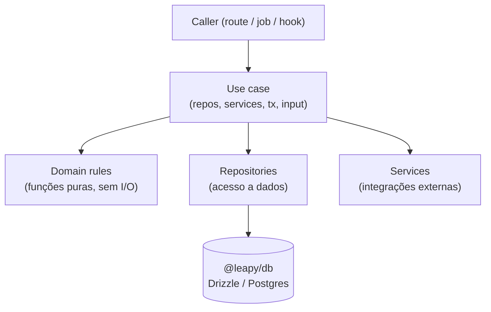

## Visão Geral

O monorepo `leapy` concentra a lógica de negócio nova em `packages/core`, seguindo uma
**arquitetura limpa**: regras de domínio puras, use cases que orquestram, e interfaces de
repositório/serviço que isolam o I/O. Isso substitui gradualmente a lógica espalhada entre
`leapy-rh` (Next.js) e as extensões do Directus.

<Info>
Esta é uma página **transversal**. Os domínios específicos (Pulsos, Turmas, Coletas, etc.)
têm suas próprias páginas; aqui descrevemos o padrão arquitetural comum a todos.
</Info>

## Packages

| Package | Propósito |
|---|---|
| `@leapy/core` | Domínio, use cases, repositórios e serviços (lógica de negócio) |
| `@leapy/db` | Schema Drizzle (PostgreSQL) e tipos derivados |
| `@leapy/api-contracts` | Contratos compartilhados (ex: `inngest-events.ts` / `LeapyEvents`) |
| `@leapy/config` | Configuração tipada |
| `@leapy/eslint-plugin-leapy` | Regras de lint internas |

## Camadas de `@leapy/core`



### Domain (`src/domain/`)

Regras puras de negócio em arquivos `*.rules.ts` — **sem I/O e sem dependência de
framework**. Recebem dados e retornam boolean/valor calculado; o caller decide se uma
violação vira erro. Arquivos atuais: `account`, `backoffice`, `candidato`, `empresa`,
`health`, `jovem`, `phone`, `plan`, `pulse-collection`, `talento`, `users`.

Além das regras, `domain/` exporta utilitários sensíveis: `pii-fields`, `logger-redact`
(redação de PII em logs), `generate-secure-password` e `document-types`.

### Use cases (`src/use-cases/`)

Orquestram uma operação de negócio. Assinatura padrão:

```ts
async function nomeDoUseCase(
  repos: Repos,
  services: Services,
  tx: Transaction,
  input: Input,
): Promise<UseCaseResult<Data>>
```

Organizados por domínio: `aprendizes/`, `backoffice/`, `candidatos/`, `coletas/`,
`cohorts-entrada/`, `talentos/`, `auth/`, `health/`. O use case valida (chamando domain
rules), aplica conflitos e efeitos, e roda dentro de uma `Transaction`.

### Repositories e Services (`src/repositories/`, `src/services/`)

Interfaces que isolam o I/O. `repositories` cuidam de acesso a dados (Drizzle/Directus);
`services` encapsulam integrações externas (email, Moodle, etc.). Os use cases dependem
das **interfaces** (`Repos`, `Services`), não das implementações.

## Erros de domínio

Definidos em `src/errors.ts` — o caller (route/job) mapeia para HTTP/log:

| Erro | Uso típico |
|---|---|
| `DomainError` | Base |
| `ValidationError` | Input inválido (→ 400) |
| `NotFoundError` | Recurso inexistente (→ 404) |
| `ForbiddenError` | Sem permissão (→ 403) |
| `ConflictError` | Violação de unicidade/estado (→ 409) |

Transações são gerenciadas por `transaction.ts`; autorização por `permissions.ts`.

## Referências de código

| Arquivo | Propósito |
|---|---|
| `packages/core/src/domain/index.ts` | Surface das regras de domínio |
| `packages/core/src/use-cases/` | Use cases por domínio |
| `packages/core/src/errors.ts` | Hierarquia de erros |
| `packages/core/src/transaction.ts` | Abstração de transação |
| `packages/db/src/schema/` | Schema Drizzle |

## Veja também

<CardGroup cols={2}>
  <Card title="Coletas de Pulso" icon="layer-group" href="/documentation/domains/pulse-collections/index">
    Exemplo completo de domínio na arquitetura nova (regras + use cases + schema)
  </Card>
  <Card title="Turmas" icon="users-class" href="/documentation/domains/turmas/index">
    CRUD de turmas com use cases backoffice e integração Moodle
  </Card>
  <Card title="Events Outbox" icon="inbox" href="/documentation/platform/events-outbox">
    Padrão transactional outbox para entrega confiável de eventos
  </Card>
</CardGroup>
