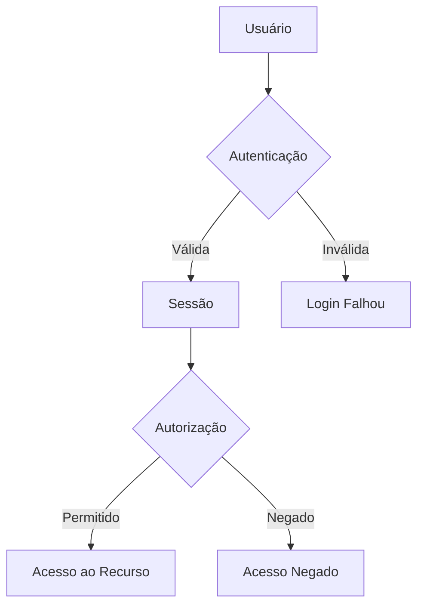

## Visão Geral

O módulo Admin é responsável pela gestão de usuários, controle de acesso, configurações de segurança e auditoria da plataforma.

## Funcionalidades Principais

<CardGroup cols={2}>
  <Card title="Gestão de Usuários" icon="users-gear">
    Crie, edite e gerencie usuários e seus acessos.
  </Card>
  <Card title="Papéis e Permissões" icon="shield-halved">
    Configure papéis e permissões granulares.
  </Card>
  <Card title="Auditoria" icon="clipboard-list">
    Rastreie todas as ações realizadas na plataforma.
  </Card>
  <Card title="Configurações" icon="gear">
    Gerencie configurações do tenant e integrações.
  </Card>
</CardGroup>

## Estrutura de Acesso

## Camadas de Controle

| Camada | Descrição |
|--------|-----------|
| **Autenticação** | Verifica identidade do usuário |
| **Autorização** | Verifica permissões para ação |
| **Escopo** | Define visibilidade de dados |
| **Auditoria** | Registra ações realizadas |

## Configurações do Tenant

- Informações da empresa
- Logo e branding
- Configurações de autenticação
- Integrações habilitadas
- Políticas de segurança

## Próximos Passos

<Cards>
  <Card title="Papéis e Permissões" href="/documentation/domains/admin/roles-permissions">
    Configure controle de acesso
  </Card>
  <Card title="Ciclo de Vida do Usuário" href="/documentation/domains/admin/user-lifecycle">
    Gerencie usuários
  </Card>
  <Card title="Auditoria e Segurança" href="/documentation/domains/admin/audit-security">
    Monitore e proteja
  </Card>
</Cards>
