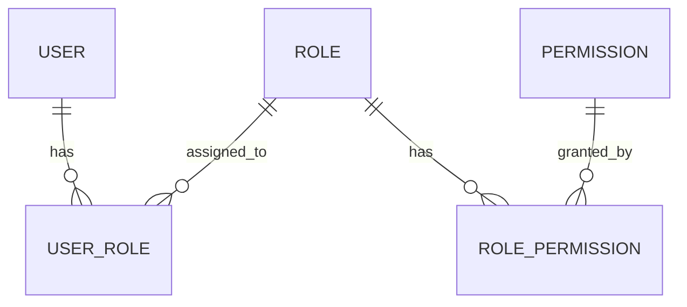

## Modelo RBAC

A plataforma utiliza Role-Based Access Control (RBAC) para gerenciar acessos.



## Papéis Padrão

### Super Admin

Acesso total ao sistema, incluindo configurações sensíveis.

| Recurso | Criar | Ler | Editar | Deletar |
|---------|:-----:|:---:|:------:|:-------:|
| Tenants | ✅ | ✅ | ✅ | ✅ |
| Usuários | ✅ | ✅ | ✅ | ✅ |
| Configurações | ✅ | ✅ | ✅ | ✅ |
| Auditoria | ❌ | ✅ | ❌ | ❌ |

### Admin

Administrador do tenant com acesso amplo.

| Recurso | Criar | Ler | Editar | Deletar |
|---------|:-----:|:---:|:------:|:-------:|
| Usuários do Tenant | ✅ | ✅ | ✅ | ✅ |
| Configurações do Tenant | ✅ | ✅ | ✅ | ❌ |
| Todos os Módulos | ✅ | ✅ | ✅ | ✅ |
| Auditoria | ❌ | ✅ | ❌ | ❌ |

### RH

Acesso às funcionalidades de gestão de pessoas.

| Recurso | Criar | Ler | Editar | Deletar |
|---------|:-----:|:---:|:------:|:-------:|
| Talentos | ✅ | ✅ | ✅ | ❌ |
| Pulsos | ✅ | ✅ | ✅ | ✅ |
| Matchmaker | ✅ | ✅ | ✅ | ✅ |
| Dashboards | ❌ | ✅ | ❌ | ❌ |

### Liderança

Acesso aos dados da equipe.

| Recurso | Criar | Ler | Editar | Deletar |
|---------|:-----:|:---:|:------:|:-------:|
| Equipe | ❌ | ✅ | ❌ | ❌ |
| Pulsos (Equipe) | ❌ | ✅ | ❌ | ❌ |
| Matchmaker | ✅ | ✅ | ✅ | ❌ |
| Dashboards (Equipe) | ❌ | ✅ | ❌ | ❌ |

### Talento

Acesso ao autoatendimento.

| Recurso | Criar | Ler | Editar | Deletar |
|---------|:-----:|:---:|:------:|:-------:|
| Perfil Próprio | ❌ | ✅ | ✅ | ❌ |
| Respostas | ✅ | ✅ | ❌ | ❌ |
| Candidaturas | ✅ | ✅ | ✅ | ✅ |

## Permissões Granulares

Além dos papéis, permissões específicas podem ser atribuídas:

```json
{
  "permissions": [
    "pulse:create",
    "pulse:read",
    "pulse:update",
    "pulse:delete",
    "pulse:activate",
    "pulse:close",
    "talent:read",
    "talent:read:team",
    "dashboard:read:global",
    "dashboard:read:team"
  ]
}
```

## Escopos de Dados

Permissões podem ter escopos diferentes:

| Escopo | Descrição |
|--------|-----------|
| `global` | Todos os dados do tenant |
| `area` | Dados da área do usuário |
| `team` | Dados da equipe direta |
| `self` | Apenas dados próprios |

### Exemplo de Aplicação

```typescript
// Verificação de acesso com escopo
const canAccess = checkPermission({
  user: currentUser,
  permission: "talent:read",
  scope: "team",
  resource: targetTalent
});
```

## Papéis Customizados

Admins podem criar papéis personalizados:

1. Acesse **Admin > Papéis**
2. Clique em **+ Novo Papel**
3. Defina nome e descrição
4. Selecione as permissões
5. Configure os escopos
6. Salve o papel

<Note>
  Papéis customizados são específicos do tenant e não afetam outros clientes.
</Note>
