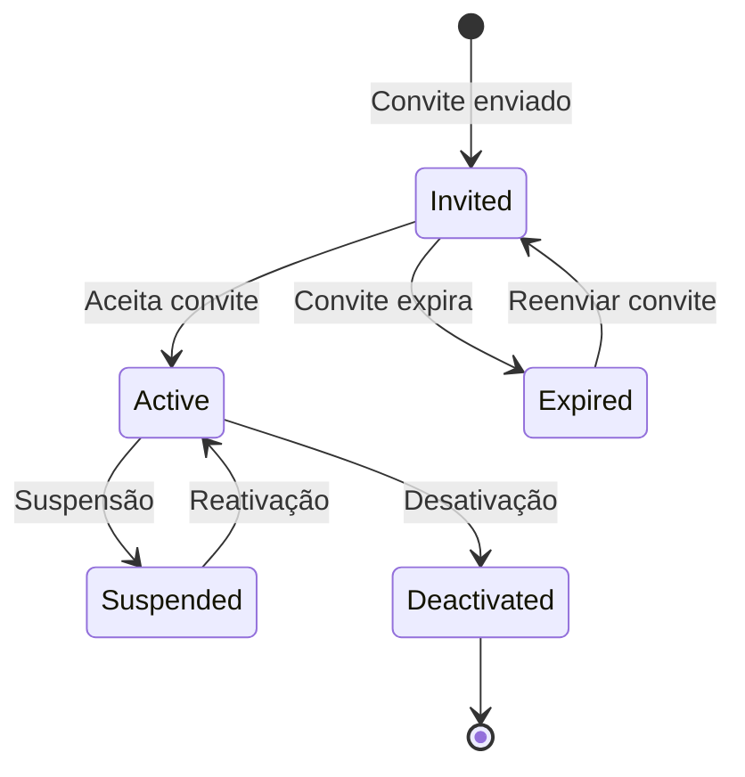
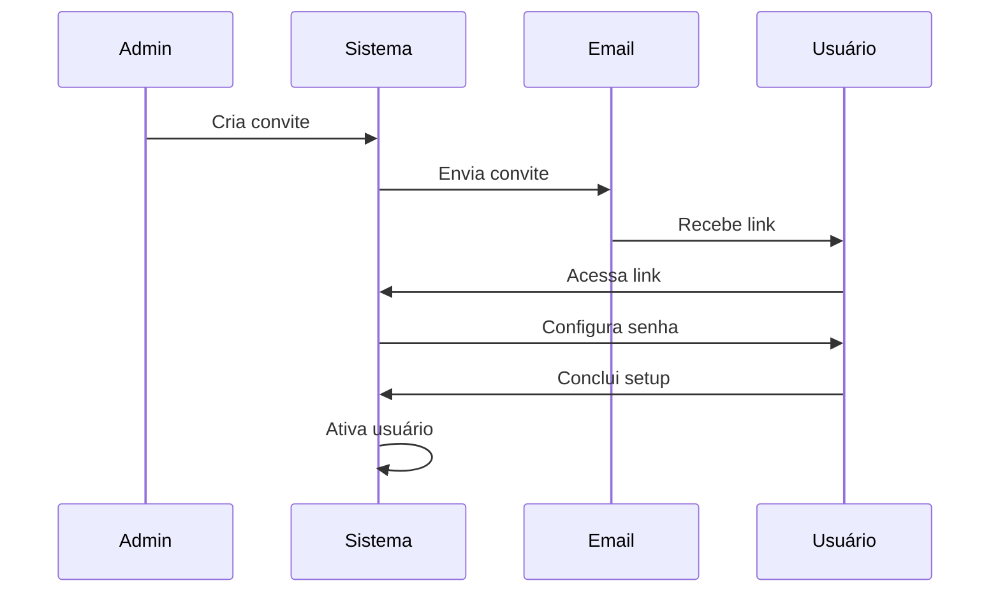

## Ciclo de Vida



## Estados do Usuário

| Estado | Descrição | Pode acessar? |
|--------|-----------|:-------------:|
| `invited` | Convite enviado, aguardando aceite | ❌ |
| `active` | Usuário ativo com acesso | ✅ |
| `suspended` | Temporariamente suspenso | ❌ |
| `deactivated` | Desativado permanentemente | ❌ |

## Fluxos de Gestão

### Convidar Novo Usuário



**Passos:**

1. Admin acessa **Admin > Usuários**
2. Clica em **+ Convidar Usuário**
3. Preenche email e seleciona papel
4. Opcionalmente, vincula a um talento existente
5. Sistema envia email de convite

### Vincular Usuário a Talento

Um usuário pode ser vinculado a um registro de talento:

```json
{
  "user_id": "uuid",
  "talent_id": "uuid",
  "linked_at": "2024-01-15T10:00:00Z"
}
```

**Benefícios da vinculação:**

- Perfil unificado
- Permissões baseadas em hierarquia
- Dados contextuais nos módulos

### Suspender Usuário

Suspensão temporária sem perda de dados:

1. Acesse o usuário em **Admin > Usuários**
2. Clique em **Suspender**
3. Informe o motivo
4. Confirme a ação

<Warning>
  Sessões ativas são encerradas imediatamente.
</Warning>

### Reativar Usuário

1. Acesse o usuário suspenso
2. Clique em **Reativar**
3. Confirme a ação
4. Usuário pode fazer login novamente

### Desativar Usuário

Desativação permanente (soft delete):

1. Acesse o usuário
2. Clique em **Desativar**
3. Confirme a ação
4. Dados são preservados mas usuário não pode acessar

## Gestão de Sessões

### Sessões Ativas

Admins podem visualizar e gerenciar sessões:

| Informação | Descrição |
|------------|-----------|
| Dispositivo | Browser/App usado |
| IP | Endereço IP |
| Localização | Geolocalização aproximada |
| Último acesso | Data/hora do último acesso |

### Encerrar Sessões

Para encerrar uma sessão específica:

1. Acesse o usuário
2. Vá para **Sessões**
3. Clique em **Encerrar** na sessão desejada

Para encerrar todas as sessões:

1. Clique em **Encerrar Todas**
2. Confirme a ação

## Autoatendimento

Usuários podem gerenciar aspectos do próprio acesso:

- **Alterar senha**: Via perfil ou "Esqueci minha senha"
- **Configurar 2FA**: Ativar autenticação em dois fatores
- **Gerenciar sessões**: Ver e encerrar próprias sessões
- **Preferências**: Idioma, notificações, etc.

## Políticas de Senha

Configuráveis por tenant:

| Política | Padrão |
|----------|--------|
| Comprimento mínimo | 8 caracteres |
| Exigir maiúsculas | Sim |
| Exigir números | Sim |
| Exigir especiais | Não |
| Histórico | Últimas 3 senhas |
| Expiração | Nunca |
