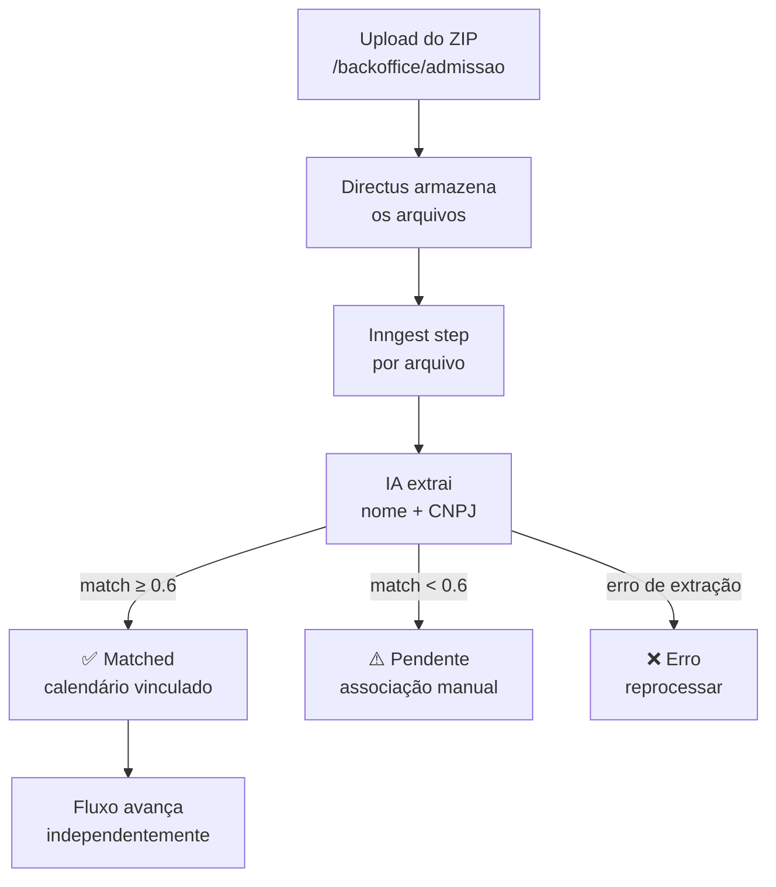

## Dois Segmentos, Dois Fluxos

| | LeapyGO / Instituto | Ecossistema |
|---|---|---|
| **Origem** | Gerado automaticamente pelo produto | Carregado via upload |
| **Formatos aceitos** | — | PDF, JPG, PNG, WebP, CSV, XLSX |
| **IA** | Não | Sim (Haiku, ~$0,006/calendário) |
| **Lote** | Uma janela = uma geração para todos | ZIP com N arquivos, processamento assíncrono |
| **Gate** | Automático após coleta concluída | Manual após upload + match |
| **Compartilhado** | Sim (todos da turma compartilham) | Não (um por jovem) |

---

## LeapyGO — Calendário Automático

**Use-case:** `generate-leapygo-calendar` · `packages/core/src/use-cases/admissao/generate-leapygo-calendar.ts`

### Fluxo

1. Ops clica "Gerar calendário" na tela de admissão (tab Calendário)
2. O produto gera a partir dos dados da janela: carga horária, dia de curso, feriados de SP
3. Ops confere o summary: término previsto, duração, feriados contemplados, fechamento de CH
4. Baixa **PDF (Anexo I)** + **XLS (Plano de Aula)** — o PDF é nomeado `calendario-{nome-slug}.pdf` (derivado do nome do jovem)
5. Usa o XLS para criar o cronograma no backoffice e anota o `cronograma_id`

### Resultado e status

| Situação | `calendar_status` | O que Ops pode fazer |
|---|---|---|
| Gerado sem divergências | `validado` | Avança para contrato |
| Gerado com avisos (não bloqueante) | `divergencias` | Aprovar com ressalvas ou corrigir parâmetros da janela |
| Erro bloqueante | — | Corrigir parâmetros da janela e gerar novamente |

### Campos validados automaticamente

- CNPJ da entidade
- Datas de início e término
- Dia de curso configurado
- Carga horária: `CH_prática + CH_teórica = CH_total`

### Atualização da janela

Quando o calendário é gerado, o produto deriva e persiste em `janelas_admissao`: `diaCurso` e `dataTermino`. A janela começa sem `data_fim` — o calendário é quem a define.

### Auto-geração na conclusão da coleta

Quando o cliente marca a coleta como concluída e a janela é modelo `leapy` com turma vinculada, o produto tenta gerar o calendário automaticamente como efeito colateral de `complete-admission-collection`. Falha silenciosa — se não conseguir, Ops gera manualmente.

---

## Ecossistema — Upload Individual

**Use-case:** `upload-ecossistema-calendar` · `packages/core/src/use-cases/admissao/upload-ecossistema-calendar.ts`

### Fluxo

1. Ops acessa o drawer do jovem → aba Calendário → "Upload de calendário"
2. Upload de um arquivo: **PDF, imagem (JPG, PNG, WebP) ou planilha (CSV, XLSX)** — o sistema detecta o formato automaticamente
3. O arquivo é enviado para o modelo de IA (**`claude-haiku-4-5-20251001`**, ~$0,006/calendário), que extrai:
   - Datas de cada entrada
   - Tipo de dia: aula / feriado / recesso / imersão
   - Carga horária
4. Ops confere as entradas, corrige se necessário
5. Clica "Validar calendário" → `validate-calendar` avalia contra as regras da janela
6. Se houver divergências: "Aprovar com ressalvas" (notas obrigatórias) ou corrigir e re-upload
7. Calendário aprovado (`validado` ou `aprovado_com_ressalvas`) libera a geração de contrato

---

## Ecossistema — Upload em Lote (ZIP)

**Use-case:** `upload-ecossistema-calendar` com payload de lote · processamento via Inngest

### Quando usar

Fê precisa processar calendários de N jovens da mesma janela Ecossistema de uma vez. Prepara um ZIP com um arquivo por jovem (formatos aceitos: mix livre de PDF, JPG, PNG, WebP, CSV, XLSX).

### Fluxo

### Algoritmo de match

Score = `0.3 × similaridade_cnpj + 0.7 × jaccard_bigrams(nome_pdf, nome_jovem)`. Threshold de 0.6 para match automático. Desempate por data de nascimento quando dois jovens da mesma entidade têm nomes similares.

### Histórico do upload

Após processamento, Ops vê na aba Histórico:
- ✅ **Matched:** associados automaticamente, prontos para validação
- ⚠️ **Pendentes:** não matcharam — nome + CNPJ extraídos são exibidos para ajudar na associação manual
- ❌ **Erro:** falha na extração — reprocessar individualmente

### Associação manual de pendentes

Para cada item pendente: Ops vê o nome e CNPJ extraídos do arquivo → seleciona a admissão correspondente na lista → clica "Associar". O calendário é salvo e o fluxo avança para validação.

O fluxo dos matchados **não espera** a resolução dos pendentes — cada calendário avança independentemente.

---

## Validação e Aprovação

**Use-cases:** `validate-calendar` e `approve-calendar-with-ressalvas`

### `validate-calendar`

Avalia o `CalendarJson` contra as regras de negócio da janela:
- Período de formação (datas dentro da janela)
- Imersões obrigatórias
- Mínimo de aulas semanais
- Fechamento correto da CH

Ao validar, atualiza o `calendar_status` em `calendars` e o `calendarValidationStatus` em `admissions` para **todas as admissões da janela**. Deriva e persiste `diaCurso` e `dataTermino` na janela.

**Efeito colateral:** dispara `verifyAndGenerateContract(force=false)` em fire-and-forget para todas as admissões elegíveis da janela (`coleta_concluida`). Cada admissão avança ou falha individualmente.

### `approve-calendar-with-ressalvas`

Quando `calendar_status === "divergencias"`: Ops aprova registrando ressalvas em texto livre (`validationNotes`). Satisfaz o gate de geração de contrato. Dispara o mesmo fire-and-forget de contratos.

---

## Download do Calendário em PDF

O calendário gerado pode ser baixado como PDF tanto por OPS quanto pelo cliente.

| Ator | Rota |
|---|---|
| OPS | `GET /api/backoffice/admissao/[id]/calendar` (parâmetro `?format=pdf`) |
| Cliente | `GET /api/client/admissao/[id]/calendar/download-pdf` |

O nome do arquivo é `calendario-{nome-slug}.pdf`, derivado do nome do jovem.

**Período de férias na aba Calendário:** os Marcos do programa exibem o "Período de férias" usando o override da admissão individual (`admissions.inicio_ferias`/`fim_ferias`) com prioridade sobre o período padrão da janela (`janelas_admissao.inicio_ferias`/`fim_ferias`).

---

## Exportar Dados por Entidade (US-OPS-13)

**Use-case:** `export-admissions` · rota `GET /api/backoffice/admissao/export`

Após a coleta ser concluída, Fê exporta os dados dos jovens para enviar a cada entidade formadora. Substitui o processo manual via Apps Script.

**Como usar:** filtrar a grid por entidade → "Exportar visualização" → XLSX com 66 colunas, uma aba por entidade.

**Estrutura do XLSX (66 colunas):**

| Grupo | Colunas |
|---|---|
| Admissão | 6 |
| Jovem | 3 |
| Dados pessoais | 13 |
| Dados coletados | 9 |
| Responsável legal | 8 |
| Empresa / Contrato | 12 |
| Turma | 7 |
| Janela | 7 |
| URL contrato assinado | 1 |

<Note>
Colunas de responsável legal aparecem preenchidas apenas para jovens menores de 18 anos. A URL do contrato assinado só está disponível quando o envelope foi concluído.
</Note>

## Veja Também

<CardGroup cols={2}>
  <Card title="Contratos e ClickSign" icon="file-signature" href="/documentation/domains/admissao/contratos-clicksign">
    O que acontece após o calendário ser aprovado
  </Card>
  <Card title="Jornadas por Ator" icon="route" href="/documentation/domains/admissao/journeys">
    Contexto do calendário dentro do fluxo completo
  </Card>
</CardGroup>
