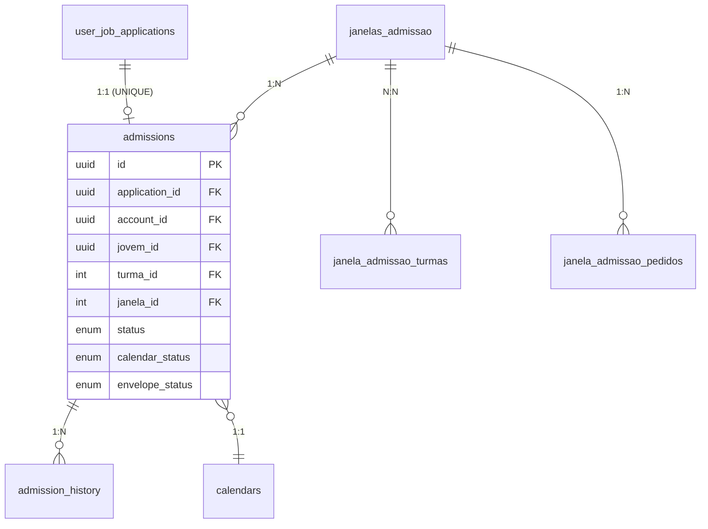

## Tabela Principal: `admissions`

`packages/db/src/schema/admissions.ts`

| Campo | Tipo | Descrição |
|---|---|---|
| `id` | uuid PK | Identificador único da admissão |
| `application_id` | uuid FK **UNIQUE** | Candidatura de origem (`user_job_applications`). Garante 1 admissão por candidatura |
| `account_id` | uuid FK | Conta/empresa contratante |
| `jovem_id` | uuid FK | Candidato (`directus_users`) |
| `turma_id` | integer FK | Turma associada (ON DELETE SET NULL) |
| `janela_id` | integer FK | Janela de admissão (ON DELETE SET NULL) |
| `status` | enum `admission_status` | Estado principal — ver máquina de estados abaixo |
| `calendar_status` | enum `calendar_status` | Estado do calendário de formação |
| `validation_notes` | text | Notas livres da validação do calendário |
| `collected_at` | timestamp | Quando o cliente marcou a coleta como concluída |
| `contract_template_id` | uuid | Template de contrato ClickSign selecionado |
| `envelope_id` | string | ID do envelope no ClickSign |
| `envelope_status` | enum `envelope_status` | Estado do envelope ClickSign |
| `signed_contract_url` | string | URL do PDF assinado (cache denormalizado do ClickSign) |
| `leader_name` | string | Nome da liderança direta do jovem |
| `leader_email` | string | Email da liderança direta |
| `corporate_email` | string | Email corporativo do jovem |
| `salary_in_words` | string | Salário por extenso (gerado via lib `extenso` a partir de `vagas.salario`) |
| `legal_guardian_name` | string | Nome do responsável legal |
| `legal_guardian_cpf` | string | CPF do responsável legal |
| `legal_guardian_rg` | string | RG do responsável legal |
| `legal_guardian_email` | string | Email do responsável legal |
| `legal_guardian_phone` | string | Telefone do responsável legal |
| `legal_guardian_marital_status` | string | Estado civil do responsável legal |
| `legal_guardian_occupation` | string | Profissão do responsável legal |
| `legal_guardian_gender` | string | Gênero do responsável legal |
| `legal_guardian_nationality` | string | Nacionalidade do responsável legal |
| `company_responsible_phone` | string | Telefone do responsável da empresa |
| `concluded_at` | timestamp | Quando a admissão foi concluída |
| `created_at` | timestamp | — |
| `updated_at` | timestamp | — |

<Note>
Os campos de responsável legal são obrigatórios quando o jovem tem menos de 18 anos. O gate `canMarkCollectionComplete` verifica isso antes de permitir a conclusão da coleta.
</Note>

## Enums

### `admission_status` — Máquina de estados principal

```
aguardando_dados
    ↓
coleta_concluida
    ↓
contrato_gerado
    ↓
envelope_enviado ←──── envelope_expirado (reenvia → volta para envelope_enviado)
    ↓
admissao_concluida  (terminal)

admissao_cancelada  (terminal, de qualquer estado anterior à conclusão)
```

| Status | Descrição |
|---|---|
| `aguardando_dados` | Admissão criada; cliente ainda não preencheu todos os dados |
| `coleta_concluida` | Cliente finalizou a coleta; Ops pode gerar calendário e contrato |
| `contrato_gerado` | Envelope criado no ClickSign; aguardando envio |
| `envelope_enviado` | Envelope enviado; signatários sendo notificados pelo ClickSign |
| `envelope_expirado` | Prazo de assinatura esgotado; pode ser reenviado |
| `admissao_concluida` | Todos assinaram; jovem promovido a aprendiz (terminal) |
| `admissao_cancelada` | Admissão cancelada antes ou após conclusão (terminal) |

### `envelope_status`

`rascunho | enviado | assinado | cancelado | expirado`

### `calendar_status`

| Status | Descrição |
|---|---|
| `pendente` | Calendário carregado mas ainda não validado |
| `validado` | Ops aprovou sem ressalvas |
| `divergencias` | Validação encontrou problemas |
| `aprovado_com_ressalvas` | Ops aprovou apesar das divergências (com notas) |

## Tabela de Auditoria: `admission_history`

`packages/db/src/schema/admission-history.ts`

Log append-only e imutável. Cada evento registra: `admissionId`, `eventType`, timestamp, ator (userId ou `system`), e metadados opcionais (ex: `signatarioId`, `oldEnvelopeId`).

**Enum `admission_event_type`** (14 tipos):

| Evento | Quando é registrado |
|---|---|
| `admission_created` | Admissão criada via trigger de Hiring |
| `collection_finalized` | Cliente marca coleta como concluída |
| `collection_reopened` | Ops reabre a coleta para correção |
| `calendar_validated` | Ops valida ou aprova o calendário |
| `contract_generated` | Envelope criado no ClickSign |
| `envelope_sent` | Envelope enviado para assinatura |
| `signatory_signed` | Um signatário assinou (registra nome/email) |
| `envelope_closed` | Todos os signatários assinaram |
| `admission_concluded` | Jovem promovido a aprendiz |
| `admission_cancelled` | Admissão cancelada |
| `envelope_cancelled` | Envelope invalidado no ClickSign |
| `envelope_expired` | Prazo de assinatura esgotado |
| `envelope_resent` | Envelope reenviado após expiração (registra `oldEnvelopeId`) |
| `reminder_sent` | Lembrete de assinatura enviado (registra `signatarioId` e `source`) |

## Tabelas de Janelas

### `janelas_admissao`

`packages/db/src/schema/janelas-admissao.ts` — Tabela legada do Directus, com PK serial.

| Campo | Tipo | Descrição |
|---|---|---|
| `id` | integer PK | — |
| `janela_admissao` | string | Nome da janela |
| `modelo` | string | `leapy \| ecossistema \| Própria` (normalizado → `leapy`) |
| `status` | string | `rascunho \| confirmada \| iniciada \| encerrada \| cancelada` |
| `entidade_id` | FK | Entidade formadora |
| `curso_id`, `arco_id` | FK | Curso e arco de formação |
| `cidade` | string | Cidade da janela |
| `horario_curso`, `dia_curso` | string | Horário e dia semanal do curso |
| `data_entrada` | timestamp | Data de início da janela |
| `data_corte_admissao` | timestamp | Prazo para admissões |
| `vagas_totais` | integer | Total de vagas disponíveis |
| `modalidade_ensino` | string | Modalidade de ensino |
| `modalidade_formacao_pratica` | string | Modalidade da formação prática |
| `deleted_at`, `deleted_by`, `purge_after` | — | Soft-delete LGPD |

### `janela_admissao_turmas`

`packages/db/src/schema/janela-admissao-turmas.ts` — Associação N:N entre janelas e turmas. Apenas para janelas modelo `leapy`.

### `janela_admissao_pedidos`

`packages/db/src/schema/janela-admissao-pedidos.ts` — Pedidos de janela em cidades sem cobertura.

| Campo | Tipo | Descrição |
|---|---|---|
| `id` | uuid PK | — |
| `account_id` | uuid FK | Conta que fez o pedido |
| `requested_by` | uuid FK | Usuário que criou o pedido |
| `empresa_id` | FK | Empresa |
| `estado`, `cidade` | string | Localização solicitada |
| `cidade_key` | string | Cidade normalizada (sem acentos, para deduplicação) |
| `posicoes` | integer | Número de posições solicitadas |
| `status` | string | `aberto \| atendido \| cancelado \| recusado` |
| `janela_admissao_id` | FK | Janela criada em resposta (quando atendido) |
| `resolved_at`, `resolved_by` | — | Resolução |

**Índice único parcial** em `(account_id, estado, cidade_key)` where `status = 'aberto'` — impede pedido duplicado da mesma conta na mesma cidade.

## Relações



## Veja Também

<CardGroup cols={2}>
  <Card title="Regras de Negócio" icon="book" href="/documentation/domains/admissao/business-rules">
    Máquina de estados, gates e transições válidas
  </Card>
  <Card title="Janelas de Admissão" icon="door-open" href="/documentation/domains/admissao/janelas-admissao">
    Gestão completa de janelas e pedidos
  </Card>
  <Card title="PII e LGPD" icon="shield-halved" href="/documentation/platform/pii-lgpd">
    Como os dados pessoais do jovem são protegidos
  </Card>
  <Card title="Soft Delete e Purga" icon="trash" href="/documentation/platform/soft-delete-purga">
    Política de exclusão lógica nas janelas de admissão
  </Card>
</CardGroup>
