## Contexto de Produto

A Admissão gerencia tudo que acontece após um candidato ser selecionado no Hiring e antes de se tornar um aprendiz ativo. O módulo coordena a coleta de dados do jovem, a geração de calendário de formação, a assinatura eletrônica do contrato via ClickSign e a conclusão automática que promove o candidato a aprendiz.

A admissão nasce automaticamente quando um candidato atinge o step `in_admission` no pipeline de Hiring — o cliente nunca cria admissões diretamente.

## Dois Atores

<CardGroup cols={2}>
  <Card title="Ops (Backoffice)" icon="shield-halved">
    Acessa `/backoffice/admissao`. Visão global de todas as contas. Gera calendários, contratos e envelopes ClickSign. Valida dados e conclui admissões. Pode cancelar em qualquer etapa.
  </Card>
  <Card title="Cliente (RH da empresa)" icon="building">
    Acessa `/[account]/admissao`. Visão restrita à própria conta. Preenche dados dos jovens, marca coleta como concluída e acompanha o status de assinaturas.
  </Card>
</CardGroup>

## Fluxo Macro

```mermaid
flowchart LR
    A["Hiring\n(in_admission)"] -->|"Inngest\non-candidatura-in-admission"| B["Admissão criada\nauardando_dados"]
    B --> C["Cliente preenche dados\n28+ campos"]
    C --> D["Coleta concluída\n(gate: campos obrigatórios)"]
    D --> E["Ops gera calendário\nLeapyGO ou Ecossistema"]
    E --> F["Ops gera contrato\nClickSign Modelos"]
    F --> G["ClickSign coleta\nassinaturas"]
    G -->|"webhook\ndocument_closed"| H["concludeAdmission\ntransação atômica"]
    H --> I["Aprendiz ativo\nrole-swap + carreira"]
```

## Escopo Funcional

<CardGroup cols={2}>
  <Card title="Coleta de Dados" icon="clipboard-list">
    28+ campos por jovem. Pré-preenchido com dados do Hub e Hiring. Edição individual ou em lote. Gate de completude valida campos obrigatórios e responsável legal para menores de 18.
  </Card>
  <Card title="Calendário de Formação" icon="calendar">
    LeapyGO: geração automática. Ecossistema: upload individual (PDF/imagem/planilha) ou em lote via ZIP com match por IA. Validação com aprovação com ressalvas.
  </Card>
  <Card title="Contrato e Assinaturas" icon="file-signature">
    Templates DOCX no ClickSign auto-resolvidos por segmento. Calendário como 2º documento assinável. Gestão de signatários, cobranças e reemissão.
  </Card>
  <Card title="Conclusão Automática" icon="circle-check">
    Webhook ClickSign dispara `concludeAdmission`: role-swap, carreira, benefícios, matrícula em formação — tudo em uma única transação atômica.
  </Card>
  <Card title="Cancelamento" icon="ban">
    Cenário A (pré-conclusão): OPS ou Cliente. Cenário B (pós-conclusão): OPS apenas, com rollback completo. Candidato liberado para nova admissão em outra vaga.
  </Card>
  <Card title="Exportação e Histórico" icon="table">
    Export XLSX de 66 colunas por entidade. Log de auditoria append-only com 14 tipos de eventos. Notificações Slack e email por etapa.
  </Card>
</CardGroup>

## Feature Flag

O módulo é controlado pela feature flag `monorepo_features.admissao` no PostHog, por account. Quando inativa para uma conta, o use-case `ensure-admissions-for-approved-applications` não cria admissões ao mover vagas para status `admissao`.

## Veja Também

<CardGroup cols={2}>
  <Card title="Modelo de Dados" icon="database" href="/documentation/domains/admissao/data-model">
    Tabelas, enums e relações do módulo de admissão
  </Card>
  <Card title="Jornadas por Ator" icon="route" href="/documentation/domains/admissao/journeys">
    Fluxo completo Ops × Cliente com gates, regras e exceções
  </Card>
  <Card title="Calendários" icon="calendar-days" href="/documentation/domains/admissao/calendarios">
    LeapyGO automático e upload Ecossistema (individual + lote)
  </Card>
  <Card title="Contratos e ClickSign" icon="file-signature" href="/documentation/domains/admissao/contratos-clicksign">
    Templates, geração, assinaturas e reemissão
  </Card>
  <Card title="Regras de Negócio" icon="book" href="/documentation/domains/admissao/business-rules">
    Máquina de estados, conclusão e cancelamentos
  </Card>
  <Card title="Regras de Comunicação" icon="bell" href="/documentation/domains/admissao/comunicacoes">
    Mapa de eventos × email × Slack
  </Card>
  <Card title="Hiring — Vagas" icon="briefcase" href="/documentation/domains/hiring/index">
    Origem da admissão: vagas e candidaturas
  </Card>
</CardGroup>
