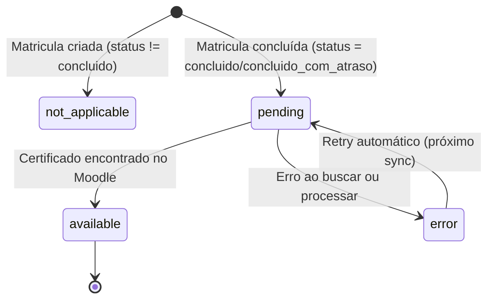

## Contexto de Produto

Quando um jovem conclui um módulo no Moodle (status `concluido` ou `concluido_com_atraso`), o Moodle emite um certificado. O sistema Leapy sincroniza esses certificados de volta para a tabela `Matriculas` para que o App RH e o próprio jovem possam acessar a URL do certificado.

## Escopo Funcional

- Sincronização automática de certificados por curso via Inngest (diária + por demanda)
- Consulta à API Moodle por email corporativo ou pessoal do jovem
- Persistência de `certificate_url`, `certificate_status` e `certificate_issued_at` em `Matriculas`
- Endpoint de atualização em batch no Directus
- Índices otimizados para candidatos pendentes

## Arquitetura Técnica

```mermaid
flowchart LR
    subgraph Triggers
        CRON[Cron diário]
        EVENT[Evento on-demand]
    end

    subgraph Inngest
        JOB[sync-certificates-by-course]
        UTILS[certificate-sync-utils]
    end

    subgraph Moodle
        MAPI[Certificates API]
    end

    subgraph Directus
        BATCH[/batch-update endpoint]
        DB[(Matriculas - PostgreSQL)]
    end

    CRON --> JOB
    EVENT --> JOB
    JOB --> UTILS
    JOB --> MAPI
    MAPI --> JOB
    JOB --> BATCH
    BATCH --> DB
```

## Modelo de Dados — `Matriculas`

A tabela `Matriculas` recebeu os seguintes campos para controle de certificados (migration `20260323100000_matriculas_certificados.sql`):

| Campo | Tipo | Valores possíveis | Descrição |
|-------|------|------------------|-----------|
| `certificate_status` | `varchar(32)` | `not_applicable`, `pending`, `available`, `error` | Status do certificado |
| `certificate_url` | `text` | URL ou `null` | Link direto para o certificado no Moodle |
| `certificate_issued_at` | `timestamp` | Datetime ou `null` | Quando o certificado foi emitido |
| `certificate_synced_at` | `timestamp` | Datetime | Última vez que o sync foi executado |
| `certificate_error` | `text` | Mensagem ou `null` | Detalhes do erro caso status seja `error` |

### Status do Certificado



| Status | Quando ocorre |
|--------|--------------|
| `not_applicable` | Módulo sem certificado ou jovem não concluiu |
| `pending` | Matrícula concluída mas certificado ainda não sincronizado |
| `available` | Certificado encontrado e URL salva |
| `error` | Falha ao buscar no Moodle (detalhes em `certificate_error`) |

## Fluxos e Regras de Negócio

### Fluxo do Pipeline de Sync

**Job:** `sync-certificates-by-course` (`backoffice-inngest-functions`)

**Escopos de execução (`SyncScope`):**

| Escopo | Quando usar |
|--------|------------|
| `daily` | Execução padrão diária — só processa `pending` e `error` |
| `full_backfill` | Re-processa todas as matrículas de um curso |
| `refresh_available` | Atualiza URLs de certificados já disponíveis |

**Passos do job:**

1. Carregar matrículas candidatas do curso filtradas por `certificate_status` (conforme escopo).
2. Para cada matrícula, buscar email corporativo ou pessoal do jovem.
3. Consultar a Moodle Certificates API por curso e email.
4. Mapear resultado: se certificado encontrado → `available` com URL e data de emissão.
5. Persistir via endpoint `/batch-update` do Directus em lotes de até 500 itens.
6. Em caso de falha na gravação: até 2 retries com backoff (400ms, 1000ms).
7. Retornar contadores por razão de sync (`CertificateReasonCounters`).

### Regras de Busca por Email

1. Tentar primeiro com `email_corporativo` (campo `E-mail corporativo` em `Jovens_id`).
2. Se não encontrar ou `email_corporativo` for nulo, usar `email_pessoal`.
3. Job identifica `QueryCapabilities.supportsCorporateEmail` para decidir a estratégia.

### Paginação

O job opera com paginação para evitar timeout em cursos grandes:
- `page_size` configurável (padrão conservador, máximo 500 por página)
- `after_id` para continuar de onde parou em execuções longas
- `max_pages_per_run` limita execuções parciais e usa continuação via Inngest

## Contratos e Integrações

### Eventos Inngest

| Evento | Tipo | Quando |
|--------|------|--------|
| `certificates/sync-by-course` | Cron diário | Sync automático por curso |
| `certificates/sync-by-course` | On-demand | Reprocessamento manual |

### Endpoint Directus (batch update)

```http
PATCH /api/batch-certificates-update
Authorization: Bearer <token>

{
  "updates": [
    {
      "id": 12345,
      "certificate_status": "available",
      "certificate_url": "https://moodle.leapy.com/mod/certificate/...",
      "certificate_issued_at": "2026-04-10T14:00:00Z",
      "certificate_synced_at": "2026-04-28T09:00:00Z",
      "certificate_error": null
    }
  ]
}
```

### Índices de Performance

```sql
-- Candidatos pendentes por curso (consulta principal do pipeline)
idx_matriculas_cert_candidates_by_modulo_id
  WHERE status IN ('concluido', 'concluido_com_atraso')
    AND (certificate_status IS NULL OR certificate_status IN ('pending', 'error'))

-- Certificados disponíveis por curso
idx_matriculas_cert_available_by_modulo_id
  WHERE status IN ('concluido', 'concluido_com_atraso')
    AND certificate_status = 'available'

-- Módulos com moodle_id (requerido para sync)
idx_modulos_moodle_id_not_null ON Modulos WHERE moodle_id IS NOT NULL

-- Jovens com moodle_id
idx_jovens_moodle_id_not_null ON Jovens WHERE moodle_id IS NOT NULL
```

## Segurança e Permissões

- O endpoint de batch update requer autenticação com token de serviço Directus (não token de usuário).
- URLs de certificados são do domínio Moodle — acessíveis apenas por usuários autenticados no Moodle.
- O pipeline não expõe emails no log; usa IDs internos para correlação.

## Observabilidade e Operação

### Diagnóstico

```sql
-- Ver contagem de certificados por status
SELECT certificate_status, COUNT(*)
FROM "public"."Matriculas"
WHERE status IN ('concluido', 'concluido_com_atraso')
GROUP BY certificate_status;

-- Matrículas com erro
SELECT id, "Jovens_id", "Modulos_id", certificate_error, certificate_synced_at
FROM "public"."Matriculas"
WHERE certificate_status = 'error'
ORDER BY certificate_synced_at DESC
LIMIT 50;

-- Matrículas concluídas sem certificado há mais de 7 dias
SELECT COUNT(*)
FROM "public"."Matriculas"
WHERE status IN ('concluido', 'concluido_com_atraso')
  AND certificate_status = 'pending'
  AND certificate_synced_at < NOW() - INTERVAL '7 days';
```

### Reprocessamento Manual

Para reprocessar certificados de um curso específico via Inngest Dashboard:

```json
{
  "name": "certificates/sync-by-course",
  "data": {
    "course_id": 123,
    "scope": "full_backfill"
  }
}
```

## Riscos, Limites e Trade-offs

| Risco | Mitigação |
|-------|-----------|
| Moodle API lenta | Paginação + `max_pages_per_run` evita timeout |
| Email não encontrado no Moodle | Fallback para email pessoal; se falhar → status `error` |
| Módulo sem `moodle_id` | Não entra no pipeline; índice garante exclusão |
| Batch de gravação falha | Retry com backoff; falhas individuais logadas sem interromper o lote |
| URL de certificado expirada | Escopo `refresh_available` para renovação periódica |

## Referências de Código

| Arquivo | Repo | Descrição |
|---------|------|-----------|
| `src/inngest/functions/matriculas/sync-certificates-by-course.ts` | `backoffice-inngest-functions` | Job principal de sync |
| `src/inngest/functions/matriculas/certificate-sync-utils.ts` | `backoffice-inngest-functions` | Utilitários: status, mapeamento |
| `src/services/moodle.ts` | `backoffice-inngest-functions` | `MoodleService.getCertificatesByCourse()` |
| `extensions/endpoints/src/matriculas/` | `directus-backoffice-with-extensions` | Endpoint batch update |
| `supabase/migrations/20260323100000_matriculas_certificados.sql` | `directus-backoffice-with-extensions` | Migration de certificados |
| `supabase/migrations/20260326171000_matriculas_certificate_sync_indexes.sql` | `directus-backoffice-with-extensions` | Índices de performance |

<CardGroup cols={2}>
  <Card title="Integração Moodle" icon="plug" href="/documentation/domains/courses-content/moodle-integration">
    SSO, criação de usuários e cohorts
  </Card>
  <Card title="Modelo de Dados" icon="database" href="/documentation/domains/courses-content/data-model">
    Estrutura de Matriculas e Modulos
  </Card>
  <Card title="Operações" icon="gears" href="/documentation/domains/courses-content/operations">
    Guia operacional do módulo
  </Card>
  <Card title="Runbook: Job Travado" icon="wrench" href="/documentation/operations/runbooks/job-stuck-inngest">
    Resolver jobs Inngest travados
  </Card>
</CardGroup>
