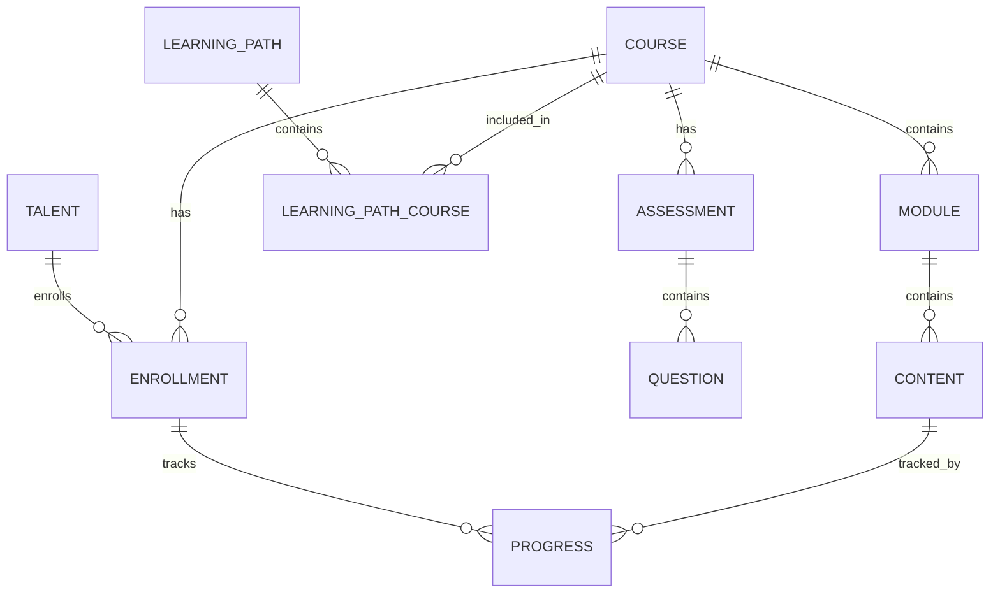
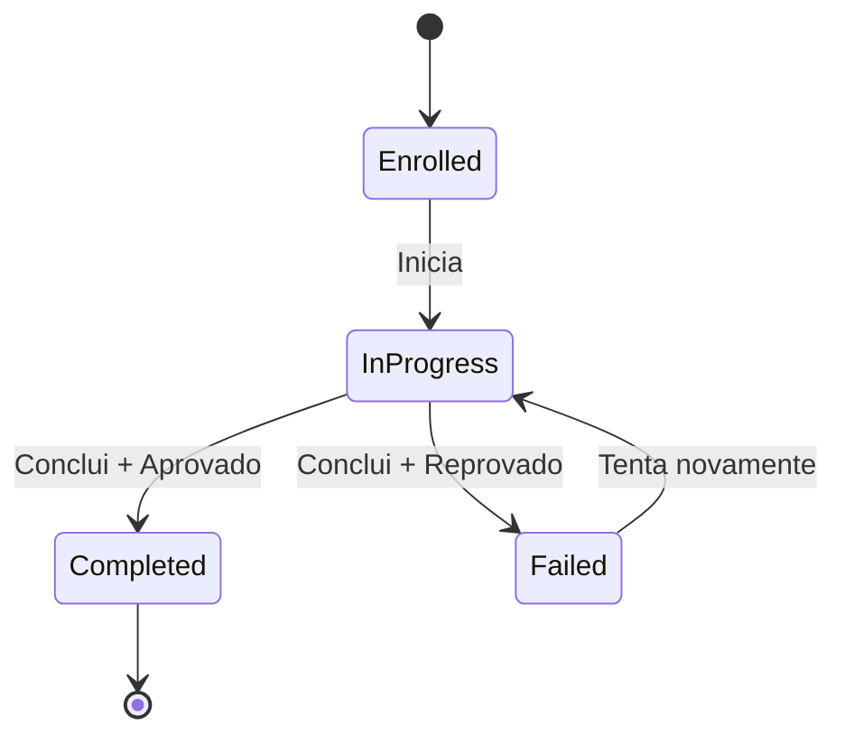

## Diagrama de Entidades

## Entidades Principais

### Course (Curso)

Representa um curso de aprendizagem.

| Campo | Tipo | Descrição |
|-------|------|-----------|
| `id` | UUID | Identificador único |
| `tenant_id` | UUID | Tenant proprietário |
| `title` | string | Título do curso |
| `description` | text | Descrição |
| `thumbnail_url` | string | Imagem de capa |
| `status` | enum | Status (draft, published, archived) |
| `level` | enum | Nível (beginner, intermediate, advanced) |
| `duration_minutes` | integer | Duração estimada |
| `passing_score` | integer | Nota mínima de aprovação |
| `max_attempts` | integer | Tentativas de avaliação |
| `is_sequential` | boolean | Se módulos são sequenciais |
| `category_id` | UUID | Categoria |
| `tags` | array | Tags para busca |

### Module (Módulo)

Representa um módulo dentro de um curso.

| Campo | Tipo | Descrição |
|-------|------|-----------|
| `id` | UUID | Identificador único |
| `course_id` | UUID | Curso pai |
| `title` | string | Título do módulo |
| `description` | text | Descrição |
| `order` | integer | Ordem no curso |
| `is_mandatory` | boolean | Se é obrigatório |

### Content (Conteúdo)

Representa um conteúdo dentro de um módulo.

| Campo | Tipo | Descrição |
|-------|------|-----------|
| `id` | UUID | Identificador único |
| `module_id` | UUID | Módulo pai |
| `title` | string | Título do conteúdo |
| `type` | enum | Tipo (video, text, file, link) |
| `url` | string | URL do conteúdo |
| `duration_minutes` | integer | Duração (vídeos) |
| `order` | integer | Ordem no módulo |

### Enrollment (Matrícula)

Representa a inscrição de um talento em um curso.

| Campo | Tipo | Descrição |
|-------|------|-----------|
| `id` | UUID | Identificador único |
| `talent_id` | UUID | Talento |
| `course_id` | UUID | Curso |
| `status` | enum | Status (enrolled, in_progress, completed, failed) |
| `enrolled_at` | datetime | Data de inscrição |
| `started_at` | datetime | Data de início |
| `completed_at` | datetime | Data de conclusão |
| `due_date` | date | Prazo (se atribuído) |
| `assignment_id` | UUID | Atribuição (se houver) |
| `final_score` | integer | Nota final |
| `certificate_url` | string | URL do certificado |

### Progress (Progresso)

Registra o progresso em cada conteúdo.

| Campo | Tipo | Descrição |
|-------|------|-----------|
| `id` | UUID | Identificador único |
| `enrollment_id` | UUID | Matrícula |
| `content_id` | UUID | Conteúdo |
| `status` | enum | Status (not_started, in_progress, completed) |
| `progress_percent` | integer | Percentual de progresso |
| `started_at` | datetime | Quando iniciou |
| `completed_at` | datetime | Quando concluiu |
| `time_spent_seconds` | integer | Tempo gasto |

## Status da Matrícula

| Status | Descrição |
|--------|-----------|
| `enrolled` | Inscrito, ainda não iniciou |
| `in_progress` | Em andamento |
| `completed` | Concluído com aprovação |
| `failed` | Concluído sem aprovação |
| `expired` | Prazo expirado sem conclusão |
