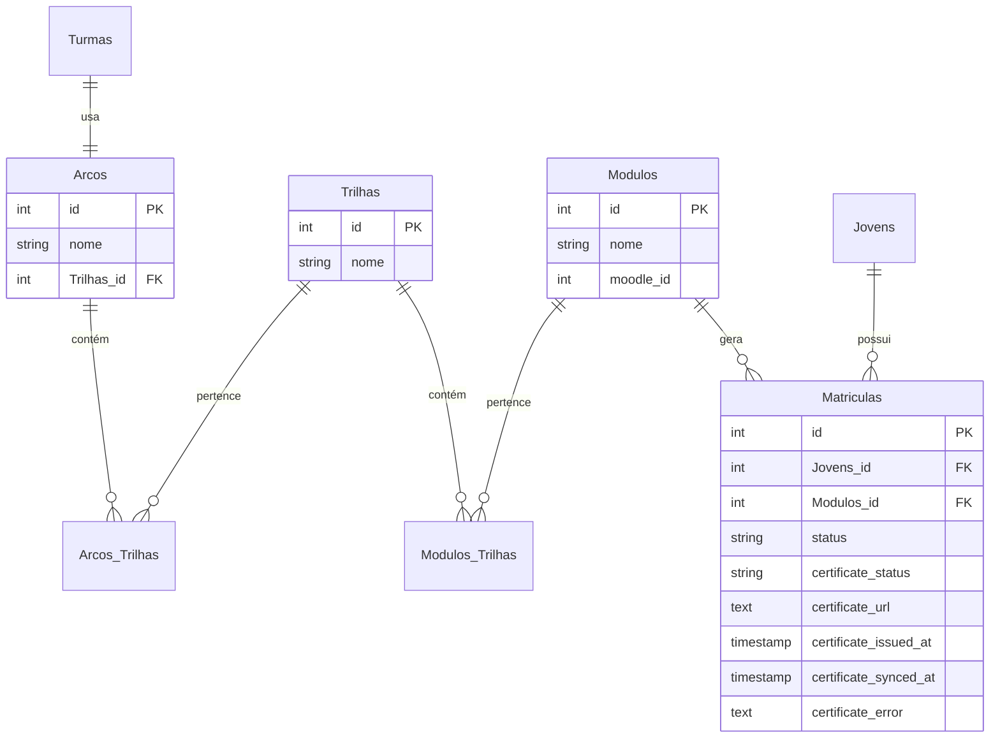
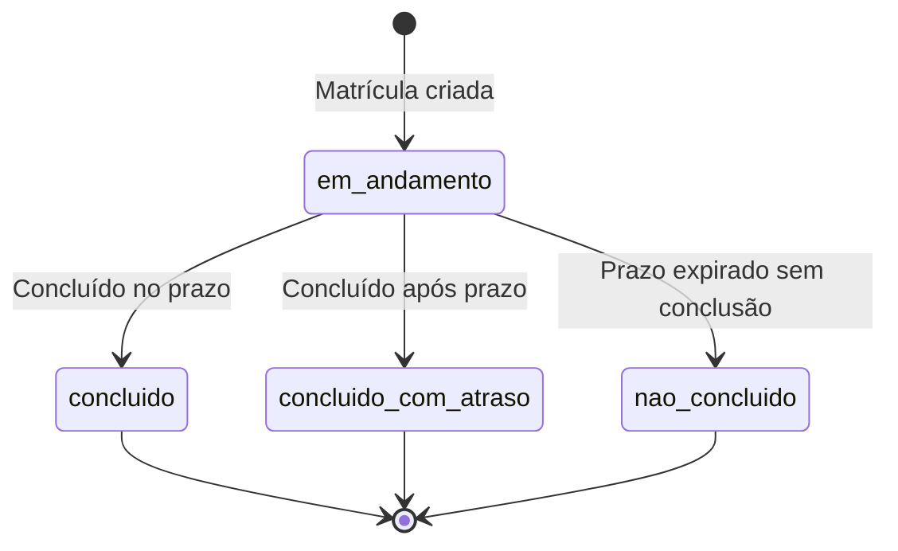

## Visão Geral

O módulo de Cursos e Conteúdos é organizado em uma hierarquia de 4 níveis: **Arco → Trilha → Módulo → Matrícula**. Os cursos são hospedados no Moodle; o Directus armazena a estrutura e as matrículas dos jovens.

## Diagrama de Entidades


```mermaid
erDiagram
    Arcos ||--o{ Arcos_Trilhas : contém
    Trilhas ||--o{ Arcos_Trilhas : pertence
    Trilhas ||--o{ Modulos_Trilhas : contém
    Modulos ||--o{ Modulos_Trilhas : pertence
    Jovens ||--o{ Matriculas : possui
    Modulos ||--o{ Matriculas : gera
    Turmas ||--|| Arcos : usa

    Arcos {
        int id PK
        string nome
        int Trilhas_id FK
    }

    Trilhas {
        int id PK
        string nome
    }

    Modulos {
        int id PK
        string nome
        int moodle_id
    }

    Matriculas {
        int id PK
        int Jovens_id FK
        int Modulos_id FK
        string status
        string certificate_status
        text certificate_url
        timestamp certificate_issued_at
        timestamp certificate_synced_at
        text certificate_error
    }
```

## Entidades Principais

### `Arcos`

Agrupa trilhas de aprendizagem em um programa. Cada `Turmas` está associada a um `Arcos`.

| Campo | Tipo | Descrição |
|-------|------|-----------|
| `id` | integer | Identificador único |
| `nome` | string | Nome do arco |
| `Trilhas_id` | integer | Trilha principal do arco |

### `Trilhas`

Representa uma sequência de módulos de aprendizagem.

| Campo | Tipo | Descrição |
|-------|------|-----------|
| `id` | integer | Identificador único |
| `nome` | string | Nome da trilha |

### `Modulos`

Representa um módulo de curso, normalmente um curso no Moodle.

| Campo | Tipo | Descrição |
|-------|------|-----------|
| `id` | integer | Identificador único |
| `nome` | string | Nome do módulo |
| `moodle_id` | integer | ID do curso correspondente no Moodle |

### `Matriculas`

Representa a matrícula de um jovem em um módulo. É a principal tabela de progresso e certificação.

| Campo | Tipo | Valores | Descrição |
|-------|------|---------|-----------|
| `id` | integer | — | Identificador único |
| `Jovens_id` | integer | FK → `Jovens` | Jovem matriculado |
| `Modulos_id` | integer | FK → `Modulos` | Módulo do curso |
| `status` | string | ver abaixo | Status do progresso |
| `certificate_status` | varchar(32) | `not_applicable`, `pending`, `available`, `error` | Status do certificado Moodle |
| `certificate_url` | text | URL ou `null` | Link para o certificado |
| `certificate_issued_at` | timestamp | — | Data de emissão do certificado |
| `certificate_synced_at` | timestamp | — | Última sincronização com Moodle |
| `certificate_error` | text | — | Detalhes de erro no sync |

### Status da Matrícula


```mermaid
stateDiagram-v2
    [*] --> em_andamento : Matrícula criada
    em_andamento --> concluido : Concluído no prazo
    em_andamento --> concluido_com_atraso : Concluído após prazo
    em_andamento --> nao_concluido : Prazo expirado sem conclusão
    concluido --> [*]
    concluido_com_atraso --> [*]
    nao_concluido --> [*]
```

| Status | Descrição |
|--------|-----------|
| `em_andamento` | Em progresso no Moodle |
| `concluido` | Módulo concluído dentro do prazo |
| `concluido_com_atraso` | Módulo concluído após o prazo |
| `nao_concluido` | Prazo expirado sem conclusão |

### Status do Certificado

| Status | Quando ocorre |
|--------|--------------|
| `not_applicable` | Módulo sem certificado ou não concluído |
| `pending` | Matrícula concluída, sync ainda não rodou |
| `available` | Certificado encontrado e URL disponível |
| `error` | Erro no sync com Moodle (ver `certificate_error`) |

## Tabelas de Relacionamento N-M

### `Arcos_Trilhas`

Liga `Arcos` a `Trilhas` (N-M).

| Campo | Tipo | Descrição |
|-------|------|-----------|
| `id` | integer | — |
| `Trilhas_id` | integer | FK → `Trilhas` |
| `Arcos_id` | integer | FK → `Arcos` |

### `Modulos_Trilhas`

Liga `Modulos` a `Trilhas` (N-M).

| Campo | Tipo | Descrição |
|-------|------|-----------|
| `id` | integer | — |
| `Modulos_id` | integer | FK → `Modulos` |
| `Trilhas_id` | integer | FK → `Trilhas` |

## Consultas Comuns

```sql
-- Matrículas de um jovem com status do certificado
SELECT m.id, mod.nome, m.status, m.certificate_status, m.certificate_url
FROM "public"."Matriculas" m
JOIN "public"."Modulos" mod ON m."Modulos_id" = mod.id
WHERE m."Jovens_id" = 123;

-- Módulos de uma trilha
SELECT m.id, m.nome, m.moodle_id
FROM "public"."Modulos" m
JOIN "public"."Modulos_Trilhas" mt ON mt."Modulos_id" = m.id
WHERE mt."Trilhas_id" = 5;

-- Arcos de um programa (via turma)
SELECT a.id, a.nome, t.id as turma_id
FROM "public"."Arcos" a
JOIN "public"."Turmas" t ON t.arco_id = a.id
WHERE t.id = 42;
```

<CardGroup cols={2}>
  <Card title="Integração Moodle" icon="plug" href="/documentation/domains/courses-content/moodle-integration">
    Como Modulos e Matriculas se conectam ao Moodle
  </Card>
  <Card title="Certificados" icon="certificate" href="/documentation/domains/courses-content/certificates">
    Pipeline de sync de certificados
  </Card>
  <Card title="Regras de Negócio" icon="book" href="/documentation/domains/courses-content/business-rules">
    Regras de matrículas e progresso
  </Card>
  <Card title="Operações" icon="gears" href="/documentation/domains/courses-content/operations">
    Guia operacional
  </Card>
</CardGroup>
