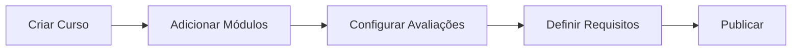
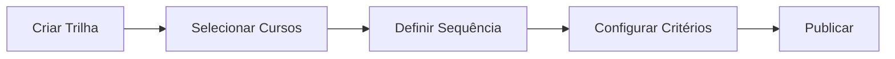
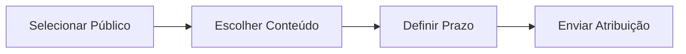
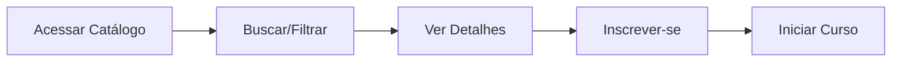
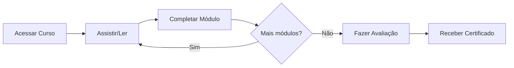
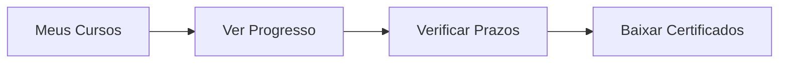
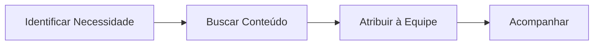
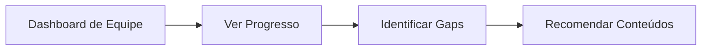

## Jornada do RH

### Criar e Publicar Curso

**Passos detalhados:**

1. **Criar curso** em Cursos > Novo Curso
2. **Adicionar módulos** com conteúdos (vídeos, textos, etc)
3. **Configurar avaliações** (quizzes, tarefas)
4. **Definir requisitos** (competências, público-alvo)
5. **Publicar** para disponibilizar no catálogo

### Criar Trilha de Aprendizagem

**Configurações da trilha:**

- Cursos obrigatórios vs opcionais
- Ordem de realização (sequencial ou livre)
- Prazo para conclusão
- Certificação final

### Atribuir Treinamentos

## Jornada do Talento

### Explorar e Aprender

**Funcionalidades:**

- Busca por palavra-chave
- Filtros por tema, duração, nível
- Recomendações personalizadas
- Lista de desejos

### Consumir Conteúdo

**Durante o curso:**

- Marcação de progresso automática
- Anotações pessoais
- Download de materiais
- Retomar de onde parou

### Acompanhar Progresso

## Jornada da Liderança

### Atribuir para Equipe

### Monitorar Desenvolvimento

**Informações disponíveis:**

- Taxa de conclusão por colaborador
- Cursos em andamento
- Competências desenvolvidas
- Comparativo com outras equipes

<Note>
  Líderes podem fazer recomendações mas não podem obrigar a realização de cursos fora de atribuições formais do RH.
</Note>
