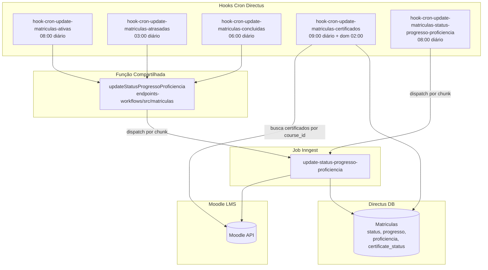

## Contexto de Produto

As Matrículas passam por um ciclo de vida definido pelas datas do cronograma e pelo progresso real no Moodle. Cinco hooks cron no Directus executam diariamente para manter os status sincronizados — sem intervenção manual. Esses crons são a fonte de verdade de "quantos jovens estão em atraso" e "quantos já concluíram" que alimentam dashboards e alertas do RH.

## Escopo Funcional

<CardGroup cols={2}>
  <Card title="Matrículas Ativas" icon="play">
    Diariamente às 08:00, matrículas elegíveis têm seu status e progresso atualizados via Moodle.
  </Card>
  <Card title="Matrículas Atrasadas" icon="clock">
    Às 03:00, matrículas com prazo ultrapassado são identificadas e marcadas como `atrasado`.
  </Card>
  <Card title="Matrículas Concluídas" icon="check">
    Às 06:00, matrículas com 100% de progresso no Moodle são marcadas como `concluido`.
  </Card>
  <Card title="Certificados" icon="certificate">
    Diariamente às 09:00 e semanalmente (domingo às 02:00), certificates pendentes ou com erro são buscados no Moodle.
  </Card>
  <Card title="Status/Progresso/Proficiência" icon="chart-line">
    Às 08:00, matrículas com cronograma iniciado têm progresso e proficiência sincronizados do Moodle via Inngest.
  </Card>
</CardGroup>

## Arquitetura Técnica



## Fluxos por Cron

### 1. Matrículas Ativas (`hook-cron-update-matriculas-ativas`)

**Schedule:** `0 8 * * *` — diário às 08:00

**Filtros de elegibilidade:**
- `cronograma_id.Data de início <= agora`
- `Jovens_id.Status_formacao = "em_andamento"`
- `Jovens_id.ativo = true`
- Jovem tem `moodle_id` (conta criada no Moodle)

Para cada matrícula elegível, chama `updateStatusProgressoProficiencia` que despacha um job Inngest para sincronizar com o Moodle.

### 2. Matrículas Atrasadas (`hook-cron-update-matriculas-atrasadas`)

**Schedule:** `0 3 * * *` — diário às 03:00

**Filtros de elegibilidade:**
- `Jovens_id.Status_formacao = "em_andamento"`
- `Jovens_id.ativo = true`
- `Jovens_id.moodle_id IS NOT NULL`

Identifica matrículas cujo prazo passou e marca como `atrasado` ao chamar `updateStatusProgressoProficiencia`.

### 3. Matrículas Concluídas (`hook-cron-update-matriculas-concluidas`)

**Schedule:** `0 6 * * *` — diário às 06:00

Mesmos filtros do hook de atrasadas. Verifica no Moodle se o progresso atingiu 100% e atualiza o status para `concluido`.

### 4. Certificados (`hook-cron-update-matriculas-certificados`)

**Schedule:** `0 9 * * *` (diário) + `0 2 * * 0` (domingo)

**Filtros base:**
- `Matriculas.status IN ("concluido", "concluido_com_atraso")`
- `Jovens.Status_formacao = "em_andamento"`
- `Jovens.ativo = true`
- `Modulos.moodle_id IS NOT NULL`

**Dois modos de execução (scope):**
- **Padrão:** Matriculas com `certificate_status IN ("pending", "error")` ou sem URL/status.
- **Refresh:** Matriculas com `certificate_status = "available"` com URL (re-verifica certificados disponíveis).

**Controle de volume:**
- `PAGE_SIZE = 50` cursos por run
- `MAX_PAGES_PER_RUN = 1` — processa no máximo 50 cursos por execução
- `DISPATCH_DELAY_MS = 250` ms entre dispatches para não sobrecarregar o Moodle

### 5. Status/Progresso/Proficiência (`hook-cron-update-matriculas-status-progresso-proficiencia`)

**Schedule:** `0 8 * * *` — diário às 08:00

**Filtros de elegibilidade:**
- `cronograma_id.Data de início <= agora`
- `Jovens_id.Status_formacao = "em_andamento"`
- `Jovens_id.ativo = true`
- `Jovens_id.moodle_id IS NOT NULL`
- `Modulos_id.moodle_id IS NOT NULL`
- Matrícula em condição de atualização (status/progresso desatualizado)

Usa a mesma função compartilhada `updateStatusProgressoProficiencia` e despacha para o job Inngest em chunks via `divideEmChunks`.

## Padrão de Execução: Chunks + Inngest

Todos os crons que usam `updateStatusProgressoProficiencia` seguem este padrão:

```javascript
// 1. Buscar IDs das Matrículas elegíveis
const matriculas = await matriculasService.readByQuery({ fields: ["id"], filter: {...} });

// 2. Dividir em chunks para não sobrecarregar o Inngest
const chunks = divideEmChunks(matriculas, CHUNK_SIZE);

// 3. Despachar um evento Inngest por chunk
for (const chunk of chunks) {
  await sendInngestEvent({ name: "backoffice/moodle-users.update", data: { ids: chunk } });
}
```

O job Inngest `update-status-progresso-proficiencia` então busca cada Matrícula no Moodle e atualiza `status`, `progresso` e `proficiencia` no Directus.

## Schedules de Crons

| Hook | Schedule | Frequência |
|------|----------|------------|
| `hook-cron-update-matriculas-atrasadas` | `0 3 * * *` | Diário 03:00 |
| `hook-cron-update-matriculas-concluidas` | `0 6 * * *` | Diário 06:00 |
| `hook-cron-update-matriculas-ativas` | `0 8 * * *` | Diário 08:00 |
| `hook-cron-update-matriculas-status-progresso-proficiencia` | `0 8 * * *` | Diário 08:00 |
| `hook-cron-update-matriculas-certificados` | `0 9 * * *` + `0 2 * * 0` | Diário 09:00 + Dom 02:00 |

## Campos de Matrícula Atualizados

| Campo | Atualizado por |
|-------|----------------|
| `status` | ativas, atrasadas, concluídas, status-progresso |
| `progresso` | ativas, status-progresso |
| `proficiencia` | status-progresso |
| `certificate_status` | certificados |
| `certificate_url` | certificados |

## Controle de Feature Flags

| Hook | Constant |
|------|----------|
| `hook-cron-update-matriculas-ativas` | `HOOK_CRON_UPDATE_MATRICULAS_ATIVAS` |
| `hook-cron-update-matriculas-atrasadas` | `HOOK_CRON_UPDATE_MATRICULAS_ATRASADAS` |
| `hook-cron-update-matriculas-concluidas` | `HOOK_CRON_UPDATE_MATRICULAS_CONCLUIDAS` |
| `hook-cron-update-matriculas-certificados` | `HOOK_CRON_UPDATE_MATRICULAS_CERTIFICADOS` |
| `hook-cron-update-matriculas-status-progresso-proficiencia` | `HOOK_CRON_UPDATE_MATRICULAS` |

## Observabilidade e Operação

```sql
-- Matrículas atrasadas sem atualização (status ainda não marcado)
SELECT m.id, m.status, j."Status_formacao", j.moodle_id
FROM "Matriculas" m
JOIN "Jovens" j ON j.id = m."Jovens_id"
WHERE m.status NOT IN ('atrasado', 'concluido', 'concluido_com_atraso')
  AND j."Status_formacao" = 'em_andamento'
  AND j.ativo = true
  AND j.moodle_id IS NOT NULL
ORDER BY m.id DESC
LIMIT 30;

-- Certificados pendentes
SELECT m.id, m.certificate_status, m.certificate_url, mo.moodle_id as course_moodle_id
FROM "Matriculas" m
JOIN "Modulos" mo ON mo.id = m."Modulos_id"
WHERE m.status IN ('concluido', 'concluido_com_atraso')
  AND (m.certificate_status IN ('pending', 'error') OR m.certificate_status IS NULL)
  AND mo.moodle_id IS NOT NULL
LIMIT 50;
```

**Forçar atualização de uma Matrícula específica:**
```bash
# Via Inngest dashboard — enviar evento para processar IDs específicos
{
  "name": "backoffice/moodle-users.update",
  "data": { "ids": [<MATRICULA_ID>] }
}
```

## Riscos e Limites

| Risco | Impacto | Mitigação |
|-------|---------|-----------|
| Moodle API indisponível | Jobs falham; status não atualiza | Inngest faz retry automático com backoff |
| Volume alto de Matrículas | Timeout no hook | Chunking + `DISPATCH_DELAY_MS` mitiga sobrecarga |
| Certificados limitados a 50/run | Backlog cresce se volume alto | Ajustar `PAGE_SIZE` ou aumentar `MAX_PAGES_PER_RUN` conforme necessário |
| Dois crons às 08:00 (ativas + status-progresso) | Dispatch duplicado para mesma Matrícula | Os filtros diferem ligeiramente; verificar se há overlap de IDs |
| Hook desabilitado | Status para de atualizar | Monitorar constants nas variáveis de ambiente do Directus |

## Referências de Código (Multirepo)

| Arquivo | Repositório | Descrição |
|---------|-------------|-----------|
| `extensions/hooks/src/hook-cron-update-matriculas-ativas/index.js` | `directus-backoffice-with-extensions` | Cron ativas |
| `extensions/hooks/src/hook-cron-update-matriculas-atrasadas/index.js` | `directus-backoffice-with-extensions` | Cron atrasadas |
| `extensions/hooks/src/hook-cron-update-matriculas-concluidas/index.js` | `directus-backoffice-with-extensions` | Cron concluídas |
| `extensions/hooks/src/hook-cron-update-matriculas-certificados/index.js` | `directus-backoffice-with-extensions` | Cron certificados |
| `extensions/hooks/src/hook-cron-update-matriculas-status-progresso-proficiencia/index.js` | `directus-backoffice-with-extensions` | Cron status/progresso |
| `extensions/endpoints-workflows/src/matriculas.js` | `directus-backoffice-with-extensions` | Função `updateStatusProgressoProficiencia` |
| `src/inngest/functions/moodle/update-status-progresso-proficiencia.ts` | `backoffice-inngest-functions` | Job Inngest de atualização |

## Veja Também

<CardGroup cols={2}>
  <Card title="Modelo de Dados de Cursos" icon="database" href="/documentation/domains/courses-content/data-model">
    Estrutura completa de Matrículas, Módulos, Trilhas e Arcos
  </Card>
  <Card title="Integração Moodle" icon="plug" href="/documentation/domains/courses-content/moodle-integration">
    Como Matrículas são criadas e sincronizadas com o Moodle
  </Card>
  <Card title="Cronogramas" icon="calendar" href="/documentation/domains/cronogramas/index">
    Cronogramas que definem as datas de início e encerramento das Matrículas
  </Card>
  <Card title="Jovens — Visão Geral" icon="user" href="/documentation/domains/jovens/index">
    Entidade Jovem vinculada a cada Matrícula
  </Card>
</CardGroup>
