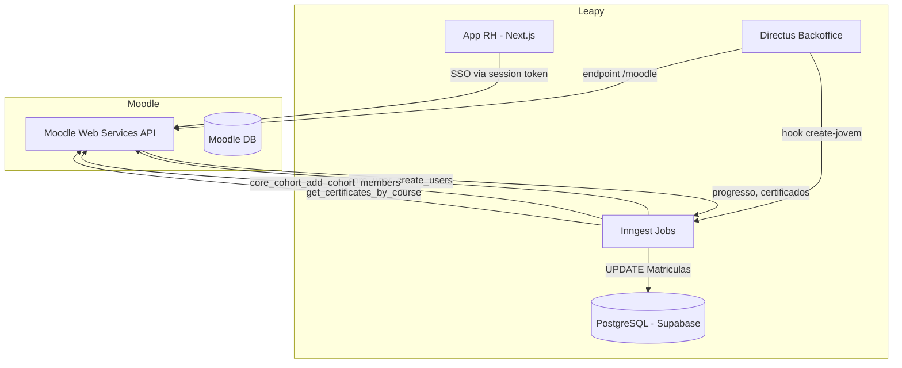

## Contexto de Produto

O Moodle é o LMS (Learning Management System) externo usado pela Leapy para hospedar os conteúdos de cursos dos jovens aprendizes e estagiários. A integração conecta o sistema interno (`Jovens`, `Turmas`, `Matriculas`) com o Moodle para sincronizar usuários, cohorts, progresso e certificados.

## Escopo Funcional

<CardGroup cols={2}>
  <Card title="Criação de Usuários" icon="user-plus">
    Quando um jovem é cadastrado, um usuário correspondente é criado no Moodle via Web Services API.
  </Card>
  <Card title="Cohort Management" icon="users">
    Jovens são automaticamente adicionados ao cohort Moodle da sua turma, liberando acesso aos cursos.
  </Card>
  <Card title="SSO (moodle_auth_v2)" icon="key">
    Acesso autenticado ao Moodle via sessão controlada pelo App RH, sem necessidade de novo login.
  </Card>
  <Card title="Sync de Progresso" icon="chart-line">
    Jobs consultam o Moodle API para sincronizar progresso e NPS por curso, atualizando `Matriculas`.
  </Card>
  <Card title="Sync de Certificados" icon="certificate">
    Pipeline automático sincroniza certificados emitidos pelo Moodle de volta para `Matriculas`.
  </Card>
  <Card title="Health Check de Links" icon="stethoscope">
    Pipeline semanal verifica a saúde de links externos nos cursos do Moodle.
  </Card>
</CardGroup>

## Arquitetura Técnica



## Fluxos e Regras de Negócio

### Fluxo 1: Criação de Usuário no Moodle

**Trigger:** Evento `backoffice/jovem.created` com `create_moodle_user: true`

**Job:** `create-moodle-user` (Inngest, `backoffice-inngest-functions`)

**Payload do evento:**
```typescript
{
  id: number;          // ID do jovem em Jovens
  moodle_id?: number;  // Se já tiver, job aborta
  turma_id: number;    // ID da turma (para buscar cohort_id)
  create_moodle_user: true;
}
```

**Passos:**

1. Verificar se jovem já possui `moodle_id` — se sim, abortar (idempotência).
2. Buscar identidade do jovem via `getJovemIdentity(id)`:
   - Lê `first_name`, `last_name` de `directus_users` (filtro `jovem = id`)
   - Lê `personal_email` da tabela `user_personal_data` (FK `user_id`)
3. Verificar que `fullName` e `personal_email` existem — abortar se ausentes.
4. Buscar `cohort_id` da turma via `Turmas` — abortar se turma sem `cohort_id`.
5. Verificar se usuário com esse e-mail ou username já existe no Moodle (`core_user_get_users`).
6. **Se existe:** adicionar ao cohort e salvar `moodle_id` em `Jovens`.
7. **Se não existe:** criar novo usuário (`core_user_create_users`) com senha padrão (`leapy@12345`) forçando troca no primeiro acesso; adicionar ao cohort.
8. Atualizar `Jovens.moodle_id` com o ID retornado pelo Moodle.

**Campos mapeados:**
- `username` = `fullName` normalizado (sem acentos, espaços viram ponto, minúsculo)
- `email` = `user_personal_data.personal_email` (lido de `directus_users` → `user_personal_data`)
- `firstname` / `lastname` = `directus_users.first_name` / `directus_users.last_name`

**Fonte de identidade (`JovemIdentity`):**
```typescript
interface JovemIdentity {
  user_id: string;        // UUID do directus_users
  first_name: string | null;
  last_name: string | null;
  personal_email: string | null;  // lido de user_personal_data
}
```

### Fluxo 2: SSO — Acesso Autenticado ao Moodle (moodle_auth_v2)

O App RH possui integração de SSO com o Moodle controlada pela feature flag `moodle_auth_v2` (PostHog, por `user_id`).

**Componentes envolvidos (leapy-rh):**
- `MoodleActionButton` — botão de acesso ao Moodle no perfil do jovem
- Session management com heartbeat para manter sessão ativa em background
- Fallback interativo quando sessão expira

**Comportamento:**
- Com `moodle_auth_v2` **ativo**: SSO via token de sessão Moodle, heartbeat em background mantém sessão viva.
- Com `moodle_auth_v2` **inativo**: acesso legado (link direto).

**Resiliência:** Sessão reinicia automaticamente ao detectar expiração. Em caso de falha no SSO, exibe fallback de login manual.

### Fluxo 3: Sync de Progresso

**Jobs:** `get-progresso-by-user-by-course`, `get-nps-by-user-by-course`

Consultam a Moodle API para cada jovem e atualizam `Matriculas` com:
- `status` (em_andamento, concluido, concluido_com_atraso)
- NPS por curso

### Regras de Negócio

| Regra | Detalhe |
|-------|---------|
| `moodle_id` é idempotente | Se jovem já tem `moodle_id`, criação de usuário é pulada |
| Username é normalizado | Acentos removidos, espaços viram ponto, tudo minúsculo |
| Cohort = Turma | Cada `Turmas` tem um `cohort_id` Moodle único |
| Senha padrão forçada | Troca obrigatória no primeiro login (`auth_forcepasswordchange: 1`) |

## Contratos e Integrações

### Moodle Web Services API

| Função WS | Uso |
|-----------|-----|
| `core_user_get_users` | Buscar usuário por email ou username |
| `core_user_create_users` | Criar novo usuário |
| `core_cohort_add_cohort_members` | Adicionar ao cohort da turma |
| `mod_assign_get_submissions` | Progresso de atividades |
| Certificates API | Buscar certificados por curso |

**Autenticação:** `wstoken` via variável de ambiente `MOODLE_TOKEN`.

**Base URL:** Variável `MOODLE_API_URL`.

### Fluxo 4: Atualização de Dados no Moodle (`update-moodle-user`)

Quando os dados de um jovem mudam (ex: email corporativo), o job `update-moodle-user` sincroniza com o Moodle.

**Evento:** `backoffice/moodle-users.update`
**Arquivo:** `src/inngest/functions/moodle/update-moodle-user.ts`

**Payload do evento:**
```json
{
  "jovens": [{ "jovem_id": 123 }]
}
```

**Lógica:**
1. Para cada `jovem_id` no array, busca `moodle_id` e `email_corporativo` no Directus.
2. Busca o usuário no Moodle pelo `moodle_id`.
3. Atualiza os dados via `core_user_update_users`.
4. Se o jovem não tiver `moodle_id` ou `email_corporativo`, pula silenciosamente.

**Disparado por:** `hook-update-matriculas-jovem` quando dados do jovem são alterados no Directus.

### Eventos Inngest

| Evento | Descrição |
|--------|-----------|
| `backoffice/jovem.created` | Aciona criação de usuário Moodle e matrículas |
| `backoffice/moodle-users.update` | Aciona atualização de dados do usuário Moodle |

## Segurança e Permissões

- `MOODLE_TOKEN` é um Web Service token com escopo limitado. Nunca expor no frontend.
- Senha padrão `leapy@12345` é gerada apenas na criação, com flag de troca obrigatória.
- SSO session token não é compartilhado com o cliente — o App RH faz proxy.

## Observabilidade e Operação

### Logs

Cada step do Inngest loga início e resultado. Para jobs que falharam:

1. Acesse **Inngest Dashboard** > Functions > `create-moodle-user`
2. Filtre por status "Failed"
3. Inspecione o step com erro

### Diagnóstico Rápido

```sql
-- Jovens sem moodle_id (não sincronizados)
SELECT id, "Name", email_pessoal, turma_id
FROM "public"."Jovens"
WHERE moodle_id IS NULL
  AND email_pessoal IS NOT NULL
  AND status = 'ativo';

-- Turmas sem cohort_id (bloqueiam criação de usuário)
SELECT id, nome, cohort_id
FROM "public"."Turmas"
WHERE cohort_id IS NULL;
```

## Riscos, Limites e Trade-offs

| Risco | Mitigação |
|-------|-----------|
| Email duplicado no Moodle | Job verifica por email E username antes de criar |
| Turma sem cohort_id | Job aborta e loga erro — resolver antes de criar jovem |
| Sessão SSO expirada | Heartbeat em background + fallback de login |
| Moodle API indisponível | Inngest faz retry automático nos jobs |

## Referências de Código

| Arquivo | Repo | Descrição |
|---------|------|-----------|
| `src/inngest/functions/moodle/create-moodle-users.ts` | `backoffice-inngest-functions` | Job de criação de usuário |
| `src/inngest/functions/moodle/get-progresso-by-user-by-course.ts` | `backoffice-inngest-functions` | Sync de progresso |
| `src/inngest/functions/moodle/get-nps-by-user-by-course.ts` | `backoffice-inngest-functions` | Sync de NPS |
| `src/inngest/functions/moodle/update-moodle-user.ts` | `backoffice-inngest-functions` | Atualização de dados do usuário |
| `src/services/moodle.ts` | `backoffice-inngest-functions` | MoodleService (getCertificatesByCourse) |
| `extensions/endpoints/src/moodle/` | `directus-backoffice-with-extensions` | Endpoints custom Moodle |
| `src/app/(authenticated)/.../MoodleActionButton` | `leapy-rh` | Componente SSO frontend |

<CardGroup cols={2}>
  <Card title="Certificados Moodle" icon="certificate" href="/documentation/domains/courses-content/certificates">
    Entenda o pipeline de sync de certificados
  </Card>
  <Card title="Cursos e Conteúdos" icon="graduation-cap" href="/documentation/domains/courses-content/index">
    Visão geral do domínio
  </Card>
  <Card title="Modelo de Dados" icon="database" href="/documentation/domains/courses-content/data-model">
    Estrutura de Matriculas, Modulos e Turmas
  </Card>
  <Card title="Inngest" icon="gear" href="/documentation/platform/events-jobs-inngest">
    Jobs e eventos assíncronos
  </Card>
</CardGroup>
