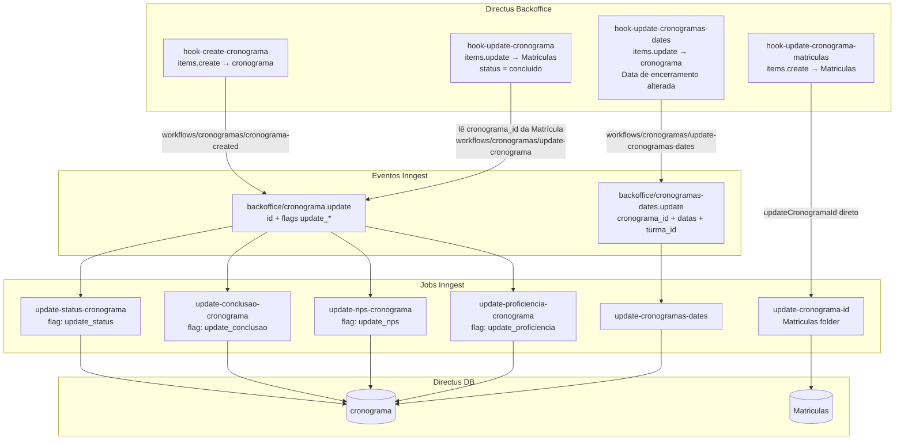

## Contexto de Produto

Um cronograma representa o período de execução de uma turma — da data de início ao encerramento. É a entidade que consolida o progresso coletivo: status da turma, taxa de conclusão, NPS médio e taxa de absorção (proficiência). O RH e as lideranças usam essas métricas para acompanhar a saúde de cada turma em tempo real.

## Escopo Funcional

<CardGroup cols={2}>
  <Card title="Status Automático" icon="circle-check">
    O status do cronograma (ativo, em andamento, concluído) é calculado automaticamente a partir das datas e atualizado por job Inngest.
  </Card>
  <Card title="Taxa de Conclusão" icon="chart-pie">
    Percentual de Matrículas com status `concluido` ou `concluido_com_atraso` em relação ao total do cronograma.
  </Card>
  <Card title="NPS do Cronograma" icon="star">
    Média do NPS coletado via Pulsos das Matrículas vinculadas ao cronograma.
  </Card>
  <Card title="Taxa de Absorção" icon="brain">
    Média de proficiência (campo `proficiencia`) das Matrículas do cronograma — mede aprendizado real.
  </Card>
  <Card title="Cálculo de Datas" icon="calendar">
    Quando a data de encerramento muda, o job recalcula todas as datas intermediárias da turma com base no `dia_de_curso`.
  </Card>
  <Card title="Vinculação de Matrículas" icon="link">
    Ao criar uma Matrícula, o hook vincula automaticamente o `cronograma_id` correto a ela.
  </Card>
</CardGroup>

## Arquitetura Técnica



## Fluxos e Regras de Negócio

### Fluxo 1 — Criação de Cronograma

1. RH cria um item na coleção `cronograma` no Directus.
2. `hook-create-cronograma` dispara (`items.create`, collection = `cronograma`).
3. Hook chama `workflows/cronogramas/cronograma-created` com o item como parâmetro.
4. Workflow envia o evento `backoffice/cronograma.update` com todos os flags de atualização habilitados.
5. Os 4 jobs (`update-status-cronograma`, `update-conclusao-cronograma`, `update-nps-cronograma`, `update-proficiencia-cronograma`) executam em paralelo via Inngest.

### Fluxo 2 — Matrícula Concluída Atualiza Cronograma

1. Uma Matrícula tem seu status atualizado para `concluido` ou `concluido_com_atraso`.
2. `hook-update-cronograma` detecta a mudança (`items.update`, collection = `Matriculas`).
3. Hook lê o `cronograma_id` da Matrícula atualizada.
4. Chama `workflows/cronogramas/update-cronograma` com o cronograma_id.
5. Job `update-conclusao-cronograma` recalcula a taxa de conclusão do cronograma.

### Fluxo 3 — Atualização de Data de Encerramento

1. Operador altera o campo `Data de encerramento` no cronograma.
2. `hook-update-cronogramas-dates` detecta (`items.update`, cronograma, campo presente).
3. Hook lê os dados completos: `Data de início`, `turma_id`, `dia_de_curso`.
4. Envia `backoffice/cronogramas-dates.update` com todos os parâmetros.
5. Job `update-cronogramas-dates` recalcula as datas intermediárias da turma usando `addDays` e o `dia_de_curso`.

### Fluxo 4 — Vinculação de Matrícula Criada

1. Nova Matrícula é criada (`items.create`, collection = `Matriculas`).
2. `hook-update-cronograma-matriculas` chama `updateCronogramaId([item.key])` diretamente.
3. A função localiza o cronograma correto para a Matrícula e atualiza o campo `cronograma_id`.

## Contratos de Eventos

### `backoffice/cronograma.update`

| Campo | Tipo | Descrição |
|-------|------|-----------|
| `id` | `number` | ID do cronograma no Directus |
| `update_status` | `boolean` | Acionar job de status |
| `update_conclusao` | `boolean` | Acionar job de conclusão |
| `update_nps` | `boolean` | Acionar job de NPS |
| `update_proficiencia` | `boolean` | Acionar job de proficiência |

Cada job verifica seu próprio flag antes de executar. Se o flag não estiver presente (`true`), o job retorna sem fazer nada.

### `backoffice/cronogramas-dates.update`

| Campo | Tipo | Descrição |
|-------|------|-----------|
| `cronograma_id` | `number` | ID do cronograma |
| `data_inicio` | `string` | Data de início (ISO) |
| `data_encerramento` | `string` | Nova data de encerramento (ISO) |
| `turma_id` | `number` | ID da turma vinculada |
| `dia_de_curso` | `string` | Dia da semana de aula (ex: `"quarta"`) |

## Modelo de Dados

| Campo | Tipo | Descrição |
|-------|------|-----------|
| `id` | `number` | Identificador único |
| `Status` | `string` | Status calculado automaticamente |
| `Data de início` | `datetime` | Início do período |
| `Data de encerramento` | `datetime` | Fim do período |
| `taxa_de_conclusao` | `number` | % de Matrículas concluídas (0–100) |
| `nps` | `number` | NPS médio das Matrículas |
| `taxa_de_absorcao` | `number` | Proficiência média das Matrículas |
| `turma_id` | `M2O` | Turma à qual o cronograma pertence |

## Observabilidade e Operação

**Verificar jobs travados em cronograma:**
```sql
-- Jobs do cronograma que não concluíram
SELECT id, "Status", "taxa_de_conclusao", nps, "taxa_de_absorcao"
FROM cronograma
WHERE "Status" IS NULL OR "taxa_de_conclusao" IS NULL
ORDER BY id DESC
LIMIT 20;
```

**Reprocessar cronograma manualmente:**
```bash
# Via Inngest dashboard — enviar backoffice/cronograma.update
# com id do cronograma e todos os flags = true
{
  "name": "backoffice/cronograma.update",
  "data": {
    "id": <CRONOGRAMA_ID>,
    "update_status": true,
    "update_conclusao": true,
    "update_nps": true,
    "update_proficiencia": true
  }
}
```

**Hook desabilitado:**
Cada hook verifica uma constant em `directus-backoffice-with-extensions/constants`. Se a constant for falsa, o hook loga e não executa. Verifique as variáveis de ambiente do Directus:
- `HOOK_CREATE_CRONOGRAMA`
- `HOOK_UPDATE_CRONOGRAMA`

## Riscos e Limites

| Risco | Impacto | Mitigação |
|-------|---------|-----------|
| Evento enviado sem `id` | Jobs falham silenciosamente | Jobs validam presença do `id` e retornam erro com log |
| Matrícula criada sem cronograma disponível | `cronograma_id` fica nulo | `updateCronogramaId` retorna sem erro; campo pode ser corrigido manualmente |
| Hook desabilitado em ambiente de staging | Métricas não atualizam | Verificar constants no painel de configuração do Directus |
| Cronograma sem `turma_id` | `update-cronogramas-dates` não executa atualização | Validação no job; log de erro explícito |

## Referências de Código (Multirepo)

| Arquivo | Repositório | Descrição |
|---------|-------------|-----------|
| `extensions/hooks/src/hook-create-cronograma/index.js` | `directus-backoffice-with-extensions` | Hook de criação |
| `extensions/hooks/src/hook-update-cronograma/index.js` | `directus-backoffice-with-extensions` | Hook dispara ao concluir Matrícula |
| `extensions/hooks/src/hook-update-cronogramas-dates/index.js` | `directus-backoffice-with-extensions` | Hook de data de encerramento |
| `extensions/hooks/src/hook-update-cronograma-matriculas/index.js` | `directus-backoffice-with-extensions` | Hook de vinculação de Matrícula |
| `src/inngest/functions/cronogramas/update-status-cronograma.ts` | `backoffice-inngest-functions` | Job: status |
| `src/inngest/functions/cronogramas/update-conclusao-cronograma.ts` | `backoffice-inngest-functions` | Job: taxa de conclusão |
| `src/inngest/functions/cronogramas/update-nps-cronograma.ts` | `backoffice-inngest-functions` | Job: NPS |
| `src/inngest/functions/cronogramas/update-proficiencia-cronograma.ts` | `backoffice-inngest-functions` | Job: taxa de absorção |
| `src/inngest/functions/cronogramas/update-cronogramas-dates.ts` | `backoffice-inngest-functions` | Job: datas |
| `src/inngest/functions/matriculas/update-cronograma-id.ts` | `backoffice-inngest-functions` | Job: vinculação |

## Veja Também

<CardGroup cols={2}>
  <Card title="Modelo de Dados de Cursos" icon="database" href="/documentation/domains/courses-content/data-model">
    Estrutura das coleções Arcos, Trilhas, Módulos e Matrículas que se relacionam com cronogramas
  </Card>
  <Card title="Eventos e Jobs Inngest" icon="gear" href="/documentation/platform/events-jobs-inngest">
    Arquitetura de eventos assíncronos usada pelos jobs de cronograma
  </Card>
  <Card title="Backoffice Directus" icon="server" href="/documentation/platform/backoffice-directus">
    Hooks Directus que iniciam os fluxos do domínio cronograma
  </Card>
  <Card title="Integração Moodle" icon="plug" href="/documentation/domains/courses-content/moodle-integration">
    Como Matrículas são criadas e concluídas via integração Moodle
  </Card>
</CardGroup>
