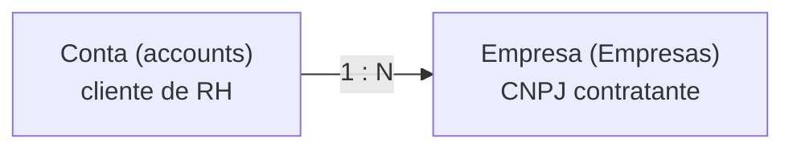

## Visão Geral

Uma **Empresa** (`Empresas`) é um **CNPJ contratante** vinculado a uma [Conta](/documentation/domains/accounts/index)
cliente. Uma conta pode ter várias empresas (os diferentes CNPJs do mesmo cliente de RH).
O CRUD vive no monorepo `leapy/packages/core` (use-cases `backoffice/empresas/*`).

## Modelo de dados

Tabela `Empresas` (`leapy/packages/db/src/schema/empresas.ts`). Campos principais:

| Coluna | Tipo | Descrição |
|---|---|---|
| `id` | `integer` (identity) | PK |
| `Empresa` | `varchar(255)` | Nome da empresa |
| `account` | `uuid` | FK → `accounts.id` (a conta dona) |
| `cnpj` | `varchar(255)` | CNPJ (armazenado normalizado, só dígitos) — **unique global** |
| `razao_social` | `varchar(255)` | Razão social |
| `endereco` / `cidade` / `estado` / `cep` | `varchar(255)` | Endereço |
| `deleted_at` / `deleted_by` / `purge_after` | — | Soft-delete |

<Warning>
**CNPJ não é reciclável** (a Receita Federal não recicla CNPJ), então o unique global
`empresas_cnpj_unique` é **mantido** — diferente do `slug` de contas, que é reciclável. O
`findByCnpj` inclui registros soft-deleted: quando um CNPJ reaparece já arquivado, o use case
retorna `ConflictError` orientando o uso de um endpoint de restore (futuro), em vez de criar
duplicata.
</Warning>

## Regras de negócio

Funções puras em `empresa.rules.ts`. A validação de CNPJ é **delegada** à biblioteca
`@brazilian-utils/brazilian-utils` (checksum mod-11 da Receita, mantido pela comunidade) — não
reimplementada.

| Função | Regra |
|---|---|
| `normalizeCnpj` | Remove tudo que não for dígito (normaliza para storage; não valida) |
| `formatCnpj` | `"12345678000190"` → `"12.345.678/0001-90"`; fallback para o input se inválido |
| `isValidCnpj` | Valida 14 dígitos + dígitos verificadores. Roda on-blur na UI e revalida em `create`/`update` quando o campo `cnpj` muda |
| `canSoftDeleteEmpresa` | Só arquiva empresa ativa (`deleted_at === null`) — espelha `canSoftDeleteAccount` |

<Note>
Registros pré-existentes em produção **não** são revalidados, para evitar falso positivo em
CNPJ legado. A validação só dispara quando o campo muda.
</Note>

## Use cases

Em `leapy/packages/core/src/use-cases/backoffice/empresas/`:

| Use case | Propósito |
|---|---|
| `create-empresa` / `update-empresa` | CRUD com validação/normalização de CNPJ |
| `delete-empresa` | Soft-delete |
| `get-empresa` | Leitura individual |
| `list-empresas-by-account` | Lista as empresas de uma conta |

## Referências de código (multirepo)

| Repo | Arquivo | Propósito |
|---|---|---|
| `leapy` | `packages/db/src/schema/empresas.ts` | Schema da tabela `Empresas` |
| `leapy` | `packages/core/src/domain/empresa.rules.ts` | Validação de CNPJ e soft-delete |
| `leapy` | `packages/core/src/use-cases/backoffice/empresas/*` | CRUD |

## Veja também

<CardGroup cols={2}>
  <Card title="Contas" icon="building-user" href="/documentation/domains/accounts/index">
    A conta cliente dona das empresas
  </Card>
  <Card title="Arquitetura do Monorepo" icon="cubes" href="/documentation/architecture/monorepo-core">
    A camada packages/core onde empresas são modeladas
  </Card>
</CardGroup>
