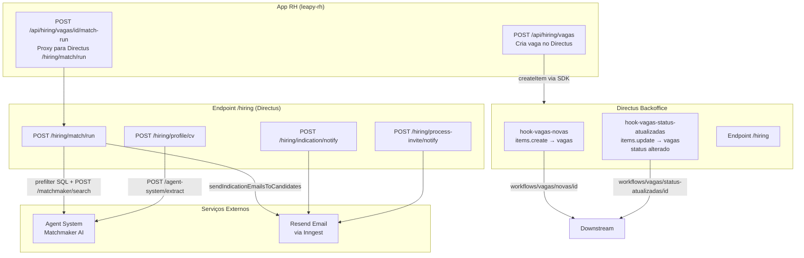

## Contexto de Produto

O módulo de Hiring permite que empresas clientes publiquem vagas de jovens aprendizes e estagiários e recebam candidatos rankeados automaticamente via Matchmaker AI. O fluxo vai da criação da vaga até a indicação de candidatos com notificações automáticas via WhatsApp e e-mail.

## Escopo Funcional

<CardGroup cols={2}>
  <Card title="Criação de Vagas" icon="file-plus">
    RH cria vagas via app com descrição, área, requisitos e quantidade de posições. A vaga é armazenada no Directus e pode ser aberta para match.
  </Card>
  <Card title="Match Automático" icon="magnifying-glass">
    O endpoint `/hiring/match/run` chama o Matchmaker AI para rankear candidatos elegíveis. Pré-filtro SQL por idade, cidade, área e candidaturas existentes.
  </Card>
  <Card title="Notificação de Indicação" icon="envelope">
    Candidatos selecionados recebem e-mail automático de indicação. O envio usa Inngest (emails/resend.send).
  </Card>
  <Card title="Convite ao Processo" icon="paper-plane">
    Após triagem manual, candidatos são convidados formalmente via e-mail de processo.
  </Card>
  <Card title="Extração de CV" icon="file-text">
    Endpoint proxy para o agent-system: extrai skills e perfil de um arquivo de CV enviado.
  </Card>
  <Card title="Webhooks de Status" icon="webhook">
    Hooks Directus monitoram criação e mudança de status de vagas para notificar sistemas downstream.
  </Card>
</CardGroup>

## Arquitetura Técnica



## Fluxos e Regras de Negócio

### Fluxo 1 — Criar Vaga

1. RH preenche formulário no app (nome, descrição, área, cidade, modelo de trabalho, quantidade de vagas, requisitos).
2. `POST /api/hiring/vagas` no leapy-rh valida a sessão e mapeia o payload para o formato Directus.
3. Cria item na coleção `vagas` via SDK do Directus.
4. `hook-vagas-novas` detecta a criação e notifica `workflows/vagas/novas/${id}`.

**Mapeamento de campos:**
- `nome_da_vaga`, `descricao`, `descricao_da_area`
- `quantidade_de_vagas` (mín. 1)
- `area_da_vaga`
- `local_trabalho` — construído de city + neighborhood + workModel
- `requisitos` — objeto JSON de requisitos booleanos
- `status` — mapeado de UI value para Directus (default: `1_triagem`)
- `janela_de_admissao_id` — janela de admissão opcional

### Fluxo 2 — Match Automático de Candidatos

1. RH clica em "Iniciar match" na vaga.
2. `POST /api/hiring/vagas/[id]/match-run` faz proxy para Directus `POST /hiring/match/run`.
3. Endpoint verifica autorização (Bearer do usuário).
4. **Pré-filtro SQL:** seleciona candidatos elegíveis filtrando por idade, cidade, área da vaga e candidaturas existentes.
5. Envia a query para o Matchmaker AI: `buildMatchQueryFromVaga(vaga)` usa nome, descrição e área para montar a query de busca.
6. Limite: `3 × quantidade_de_vagas` candidatos retornados.
7. Candidatos selecionados recebem e-mail automático de indicação via `sendIndicationEmailsToCandidates`.
8. Resultado salvo na tabela `user_job_applications`.

### Fluxo 3 — Mudança de Status da Vaga

1. Status da vaga é alterado no Directus (ex: `1_triagem` → `2_entrevista`).
2. `hook-vagas-status-atualizadas` detecta a mudança (`items.update`, campo `status` no payload).
3. Chama `workflows/vagas/status-atualizadas/${id}` para notificar sistemas downstream.

### Fluxo 4 — Notificações Manuais

- `POST /hiring/indication/notify`: reenvia e-mail de indicação para um candidato específico (retry manual).
- `POST /hiring/process-invite/notify`: envia e-mail de convite formal ao processo após triagem.

Ambos buscam o `nome_da_vaga` da vaga antes de enviar para personalizar o e-mail.

## Contratos de API

### `POST /hiring/match/run` (Directus Endpoint)

**Autenticação:** Bearer token (usuário) ou header `X-Internal-Secret` com `HIRING_INTERNAL_SECRET`.

| Campo | Tipo | Obrigatório | Descrição |
|-------|------|-------------|-----------|
| `vaga_id` | `number` | Sim | ID da vaga |
| `exclude_candidate_ids` | `string[]` | Não | IDs a excluir do match |
| `match_run_id` | `string` | Não | UUID customizado do run |
| `started_by_user_id` | `string` | Não | ID do usuário (modo interno) |

**Resposta de sucesso (200):**
```json
{
  "match_run_id": "uuid",
  "applications_created": 3,
  "picked_count": 3,
  "target_count": 9
}
```

### `POST /hiring/profile/cv` (Directus Endpoint)

| Campo | Tipo | Obrigatório | Descrição |
|-------|------|-------------|-----------|
| `user_id` | `string` | Sim | ID do usuário |
| `file_id` | `string` | Sim | ID do arquivo no Directus |

Requer `AGENT_SYSTEM_URL` configurada. Retorna 503 se agent system não disponível.

## Modelo de Dados — Vagas

| Campo | Tipo | Descrição |
|-------|------|-----------|
| `id` | `number` | Identificador único |
| `nome_da_vaga` | `string` | Título da vaga |
| `descricao` | `text` | Descrição completa |
| `descricao_da_area` | `text` | Descrição da área |
| `area_da_vaga` | `string` | Área funcional |
| `quantidade_de_vagas` | `number` | Número de posições |
| `status` | `string` | Status do processo (`1_triagem`, `2_entrevista`, etc.) |
| `local_trabalho` | `string` | Localização + modelo de trabalho |
| `requisitos` | `JSON` | Requisitos booleanos |
| `janela_de_admissao_id` | `M2O` | Janela de admissão |
| `empresa_id` | `M2O` | Empresa da vaga |

## Segurança

O endpoint `/hiring` usa autenticação dupla:
- **Modo usuário:** Bearer token do Directus — verifica se a vaga pertence à conta do usuário.
- **Modo interno:** Header `X-Internal-Secret` com `HIRING_INTERNAL_SECRET` — para integrações servidor-a-servidor.

Roles com acesso ao módulo de hiring: verificar `documentation/domains/admin/roles-permissions`.

## Observabilidade

```sql
-- Vagas abertas sem match executado
SELECT v.id, v.nome_da_vaga, v.status, v.quantidade_de_vagas
FROM vagas v
WHERE v.status = '1_triagem'
ORDER BY v.id DESC;

-- Candidatos indicados por vaga
SELECT vaga_id, COUNT(*) as total_candidatos
FROM user_job_applications
GROUP BY vaga_id
ORDER BY total_candidatos DESC;
```

**GET `/hiring/health`:** retorna status do serviço e se o agent system está configurado. Usar para healthcheck da integração com Matchmaker.

## Riscos e Limites

| Risco | Impacto | Mitigação |
|-------|---------|-----------|
| `AGENT_SYSTEM_URL` não configurada | Match não executa, retorna 503 | Verificar var em produção; `/hiring/health` reporta `agent_configured: false` |
| Pré-filtro SQL retorna zero candidatos | Match ignorado, sem candidaturas criadas | Resposta 200 com `applications_created: 0` e msg explicativa |
| `HIRING_INTERNAL_SECRET` exposta | Acesso não autorizado | Rotacionar via variáveis de ambiente; não commitar |
| Hook de vagas-novas sem downstream configurado | Vagas não processadas em sistemas integrados | Verificar constant `HOOK_VAGAS_NOVAS` |

## Referências de Código (Multirepo)

| Arquivo | Repositório | Descrição |
|---------|-------------|-----------|
| `extensions/hooks/src/hook-vagas-novas/index.js` | `directus-backoffice-with-extensions` | Hook de criação de vaga |
| `extensions/hooks/src/hook-vagas-status-atualizadas/index.js` | `directus-backoffice-with-extensions` | Hook de status de vaga |
| `extensions/endpoints/src/hiring/index.js` | `directus-backoffice-with-extensions` | Endpoint principal de hiring |
| `extensions/endpoints/src/hiring/lib/match-run.js` | `directus-backoffice-with-extensions` | Lógica de match run |
| `extensions/endpoints/src/hiring/lib/vaga-query.js` | `directus-backoffice-with-extensions` | Monta query para Matchmaker |
| `src/app/api/hiring/vagas/route.ts` | `leapy-rh` | API route: criar vaga |
| `src/app/api/hiring/vagas/[id]/match-run/route.ts` | `leapy-rh` | API route: trigger match |

## Veja Também

<CardGroup cols={2}>
  <Card title="Matchmaker" icon="magnifying-glass" href="/documentation/domains/matchmaker/index">
    Motor de busca e ranking de candidatos usado pelo match de vagas
  </Card>
  <Card title="Matchmaker — Integrações" icon="plug" href="/documentation/domains/matchmaker/integrations">
    Como vagas são usadas como input para o Matchmaker AI
  </Card>
  <Card title="Jovens — Visão Geral" icon="user" href="/documentation/domains/jovens/index">
    Entidade candidato/jovem que é rankeada pelo match de vagas
  </Card>
  <Card title="Backoffice Directus" icon="server" href="/documentation/platform/backoffice-directus">
    Onde vagas são armazenadas e os hooks de status são configurados
  </Card>
</CardGroup>
