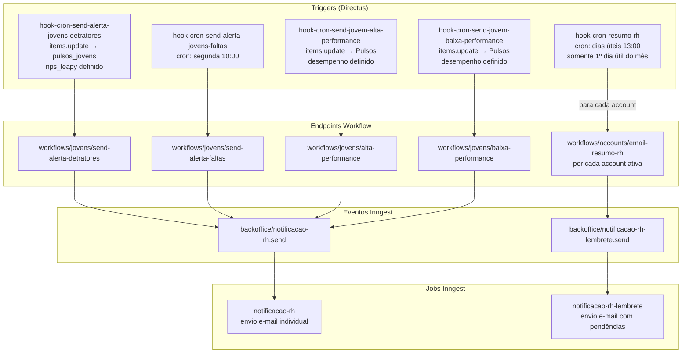

## Contexto de Produto

O sistema de alertas notifica o RH das empresas clientes sobre comportamentos que precisam de atenção: jovens detratores em pulsos, faltas recorrentes, e jovens com performance excepcional ou crítica. Além dos alertas pontuais, o RH recebe um resumo mensal consolidado no primeiro dia útil de cada mês.

## Escopo Funcional

<CardGroup cols={2}>
  <Card title="Alerta de Detratores" icon="face-frown">
    Quando um pulso de jovem registra NPS negativo (`nps_leapy`), o RH é alertado imediatamente.
  </Card>
  <Card title="Alerta de Faltas" icon="calendar-xmark">
    Toda segunda-feira às 10:00, jovens com faltas identificadas têm alertas enviados para o RH.
  </Card>
  <Card title="Alta Performance" icon="arrow-trend-up">
    Quando o campo `desempenho` de um pulso é atualizado para alto, o RH recebe notificação de reconhecimento.
  </Card>
  <Card title="Baixa Performance" icon="arrow-trend-down">
    Quando o campo `desempenho` de um pulso indica baixo desempenho, o RH é alertado para intervenção.
  </Card>
  <Card title="Resumo Mensal" icon="file-chart-column">
    No primeiro dia útil de cada mês às 13:00, cada empresa ativa recebe um e-mail de resumo com notificações pendentes.
  </Card>
  <Card title="Notificação por E-mail" icon="envelope">
    Jobs Inngest enviam e-mails individuais para usuários RH com título, corpo e data da notificação.
  </Card>
</CardGroup>

## Arquitetura Técnica



## Fluxos por Hook

### 1. Alerta de Detratores (`hook-cron-send-alerta-jovens-detratores`)

**Tipo:** `items.update` (reativo, não cron)
**Gatilho:** Campo `nps_leapy` atualizado na coleção `pulsos_jovens`

Quando um pulso de jovem é respondido e o NPS calculado é registrado em `nps_leapy`, o hook verifica se o jovem é detrator (NPS baixo). Se sim, chama `workflows/jovens/send-alerta-detratores` com o ID do pulso.

### 2. Alerta de Faltas (`hook-cron-send-alerta-jovens-faltas`)

**Tipo:** Cron
**Schedule:** `0 10 * * 1` — toda segunda-feira às 10:00

Chama `workflows/jovens/send-alerta-faltas` que identifica jovens com faltas registradas e envia alertas para as lideranças e RH correspondentes.

### 3. Alta Performance (`hook-cron-send-jovem-alta-performance`)

**Tipo:** `items.update` (reativo)
**Gatilho:** Campo `desempenho` atualizado na coleção `Pulsos`

Quando o campo `desempenho` é definido, o hook verifica se o valor indica alta performance e chama `workflows/jovens/alta-performance` com o ID do pulso.

### 4. Baixa Performance (`hook-cron-send-jovem-baixa-performance`)

**Tipo:** `items.update` (reativo)
**Gatilho:** Campo `desempenho` atualizado na coleção `Pulsos`

Mesmo gatilho do alerta de alta performance, mas para valores indicando baixa performance. Chama `workflows/jovens/baixa-performance`.

### 5. Resumo Mensal de RH (`hook-cron-resumo-rh`)

**Tipo:** Cron com lógica condicional
**Schedule:** `0 13 * * 1-5` — dias úteis às 13:00, mas **executa apenas no primeiro dia útil do mês**

A lógica:
1. Verifica se hoje é o primeiro dia útil do mês (`isFirstBusinessDayOfMonth`).
2. Se não for, o hook retorna sem fazer nada.
3. Se for, busca todas as `accounts` com `ativo = true`.
4. Para cada account, chama `workflows/accounts/email-resumo-rh` com os dados da account.
5. Workflow envia evento `backoffice/notificacao-rh-lembrete.send`.

## Contratos de Eventos

### `backoffice/notificacao-rh.send`

```typescript
{
  notificacao_id: number,
  item: {
    title: string,
    body: string,
    user_id: number,
    sent_at: string
  }
}
```

Job `notificacao-rh` busca os dados do usuário (nome, email, account) e envia e-mail com o título e corpo da notificação.

### `backoffice/notificacao-rh-lembrete.send`

```typescript
{
  item: {
    user_id: number,
    first_name: string,
    last_name: string,
    email: string,
    account_name: string
  }
}
```

Job `notificacao-rh-lembrete` busca as notificações pendentes do usuário (`notificacoes` em aberto) e envia e-mail de lembrete.

## Schedules e Tipos de Trigger

| Hook | Tipo | Schedule / Gatilho |
|------|------|--------------------|
| `hook-cron-send-alerta-jovens-detratores` | `items.update` | `pulsos_jovens.nps_leapy` definido |
| `hook-cron-send-alerta-jovens-faltas` | cron | Segunda 10:00 |
| `hook-cron-send-jovem-alta-performance` | `items.update` | `Pulsos.desempenho` definido |
| `hook-cron-send-jovem-baixa-performance` | `items.update` | `Pulsos.desempenho` definido |
| `hook-cron-resumo-rh` | cron condicional | Dias úteis 13:00 (1º dia útil/mês) |

## Feature Flags

| Hook | Constant |
|------|----------|
| `hook-cron-send-alerta-jovens-detratores` | `HOOK_CRON_SEND_ALERTA_JOVENS_DETRATORES` |
| `hook-cron-send-alerta-jovens-faltas` | `HOOK_CRON_SEND_ALERTA_JOVENS_FALTAS` |
| `hook-cron-send-jovem-alta-performance` | `HOOK_CRON_SEND_JOVENS_ALTA_PERFORMANCE` |
| `hook-cron-send-jovem-baixa-performance` | `HOOK_CRON_SEND_JOVENS_BAIXA_PERFORMANCE` |
| `hook-cron-resumo-rh` | `HOOK_RESUMO_RH` |

## Observabilidade e Operação

```sql
-- Notificações pendentes de RH
SELECT n.id, n.title, n.user_id, n.sent_at
FROM notificacoes n
WHERE n.read_at IS NULL
ORDER BY n.sent_at DESC
LIMIT 20;

-- Accounts que receberão resumo no próximo 1º dia útil
SELECT id, name, slug
FROM accounts
WHERE ativo = true
ORDER BY name;
```

**Disparar notificação manual:**
```bash
# Via Inngest dashboard
{
  "name": "backoffice/notificacao-rh.send",
  "data": {
    "notificacao_id": 123,
    "item": {
      "title": "Alerta Manual",
      "body": "Mensagem do alerta",
      "user_id": 456,
      "sent_at": "2026-05-04T13:00:00Z"
    }
  }
}
```

## Riscos e Limites

| Risco | Impacto | Mitigação |
|-------|---------|-----------|
| Alta performance e baixa performance sem discriminação clara | Hook dispara para qualquer `desempenho` definido | O workflow decide se o valor qualifica como alta ou baixa |
| Resumo mensal para muitas accounts | Múltiplas requisições sequenciais ao workflow | Loop síncrono — monitorar tempo total; considerar paralelismo se volume crescer |
| Usuário sem email | Notificação não enviada, job retorna erro | Job valida dados antes; log de `success: false` |
| Cron de resumo rodando diariamente (sem enviar) | Overhead leve mas seguro | Verificação `isFirstBusinessDayOfMonth` evita envio; custo mínimo |

## Referências de Código (Multirepo)

| Arquivo | Repositório | Descrição |
|---------|-------------|-----------|
| `extensions/hooks/src/hook-cron-send-alerta-jovens-detratores/index.js` | `directus-backoffice-with-extensions` | Hook detratores |
| `extensions/hooks/src/hook-cron-send-alerta-jovens-faltas/index.js` | `directus-backoffice-with-extensions` | Cron faltas |
| `extensions/hooks/src/hook-cron-send-jovem-alta-performance/index.js` | `directus-backoffice-with-extensions` | Hook alta performance |
| `extensions/hooks/src/hook-cron-send-jovem-baixa-performance/index.js` | `directus-backoffice-with-extensions` | Hook baixa performance |
| `extensions/hooks/src/hook-cron-resumo-rh/index.js` | `directus-backoffice-with-extensions` | Cron resumo mensal |
| `src/inngest/functions/notificacoes/notificacao-rh-created.ts` | `backoffice-inngest-functions` | Job notificação |
| `src/inngest/functions/notificacoes/notificacao-rh-lembrete.ts` | `backoffice-inngest-functions` | Job lembrete |

## Veja Também

<CardGroup cols={2}>
  <Card title="Métricas de Pulsos" icon="chart-bar" href="/documentation/domains/pulses/metrics">
    NPS e métricas de pulso que alimentam os alertas de detratores
  </Card>
  <Card title="Jobs Inngest de Pulsos" icon="gear" href="/documentation/domains/pulses/jobs-inngest">
    Jobs de ciclo de vida de pulsos que atualizam os campos monitorados pelos alertas
  </Card>
  <Card title="Insights — Visão Geral" icon="magnifying-glass" href="/documentation/domains/insights/index">
    Visão geral do domínio de métricas e insights da plataforma
  </Card>
  <Card title="Régua de Comunicação" icon="message" href="/documentation/platform/communications-fup">
    Sistema de comunicação mais amplo que inclui lembretes de pulso e régua de RH
  </Card>
</CardGroup>
