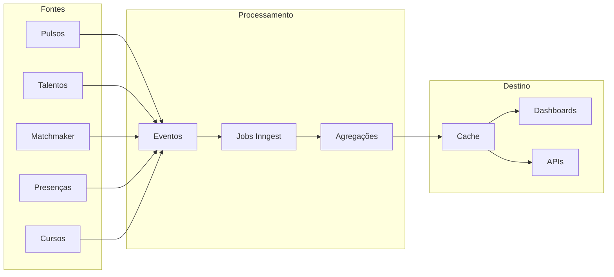
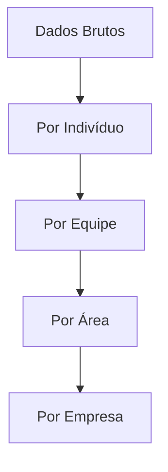
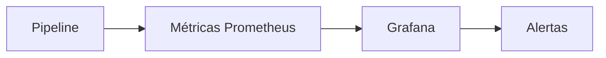

## Arquitetura do Pipeline



## Fluxo de Dados

### 1. Coleta de Eventos

Cada módulo emite eventos quando dados são criados ou alterados:

```typescript
// Exemplo de evento emitido
{
  name: "talent.updated",
  data: {
    talent_id: "uuid",
    changes: ["area_id", "position_id"],
    timestamp: "2024-01-15T10:00:00Z"
  }
}
```

### 2. Processamento

Jobs do Inngest processam os eventos e calculam métricas:

| Job | Trigger | Descrição |
|-----|---------|-----------|
| `insights/process-pulse-response` | `pulse.response.submitted` | Atualiza métricas do pulso |
| `insights/process-talent-change` | `talent.*` | Recalcula headcount e turnover |
| `insights/process-application` | `matchmaker.application.*` | Atualiza métricas de mobilidade |
| `insights/aggregate-daily` | Cron 1h | Consolida métricas diárias |

### 3. Agregação

Métricas são agregadas em diferentes níveis:



### 4. Cache e Disponibilização

- **Cache**: Redis para métricas em tempo real
- **Persistência**: PostgreSQL para histórico
- **API**: Endpoints para consumo pelos dashboards

## Frequência de Atualização

| Tipo de Métrica | Frequência |
|-----------------|------------|
| Tempo real | Evento a evento |
| Near real-time | A cada 5 minutos |
| Consolidada | A cada hora |
| Histórica | Diária (batch noturno) |

## Retenção de Dados

| Granularidade | Retenção |
|---------------|----------|
| Dados brutos | 90 dias |
| Agregados diários | 2 anos |
| Agregados mensais | 5 anos |
| Snapshots anuais | Indefinido |

## Qualidade de Dados

### Validações

- **Completude**: Verificação de campos obrigatórios
- **Consistência**: Cross-check entre módulos
- **Atualidade**: Alertas para dados desatualizados

### Monitoramento



| Métrica | Alerta |
|---------|--------|
| Lag de processamento | > 5 minutos |
| Erros de processamento | > 1% |
| Jobs falhados | Qualquer |
