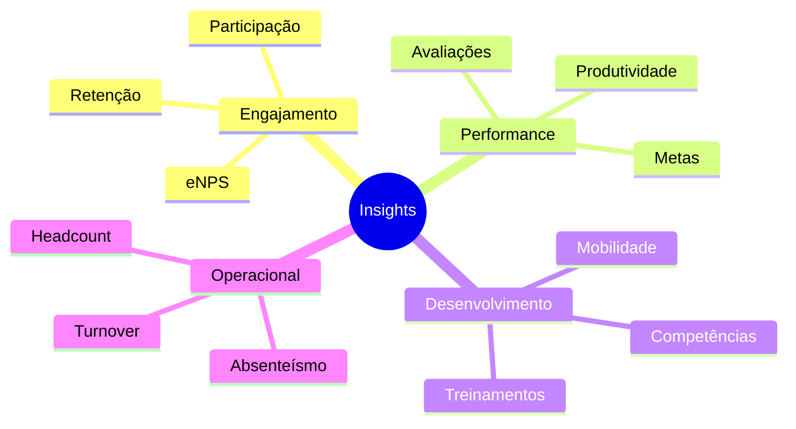

## Visão Geral

O módulo de Insights fornece dashboards interativos e ferramentas de análise para transformar dados em informações acionáveis.

## Funcionalidades Principais

<CardGroup cols={2}>
  <Card title="Dashboards Interativos" icon="chart-mixed">
    Visualizações dinâmicas com filtros e drill-down.
  </Card>
  <Card title="Métricas em Tempo Real" icon="gauge">
    Indicadores atualizados continuamente.
  </Card>
  <Card title="Alertas Inteligentes" icon="bell">
    Notificações quando métricas atingem limites.
  </Card>
  <Card title="Exportação de Dados" icon="file-export">
    Exporte relatórios em diversos formatos.
  </Card>
</CardGroup>

## Tipos de Dashboard

| Dashboard | Descrição | Público |
|-----------|-----------|---------|
| **Executivo** | Visão consolidada dos principais KPIs | C-Level, Diretoria |
| **RH** | Métricas detalhadas de pessoas | Time de RH |
| **Liderança** | Indicadores da equipe | Gestores |
| **Operacional** | Dados técnicos e de sistema | Tech/Ops |

## Principais Indicadores

## Próximos Passos

<Cards>
  <Card title="Catálogo de Métricas" href="/documentation/domains/insights/metric-catalog">
    Explore todas as métricas disponíveis
  </Card>
  <Card title="Pipeline de Dados" href="/documentation/domains/insights/data-pipeline">
    Entenda como os dados são processados
  </Card>
  <Card title="Operações" href="/documentation/domains/insights/operations">
    Guia operacional do módulo
  </Card>
</Cards>
