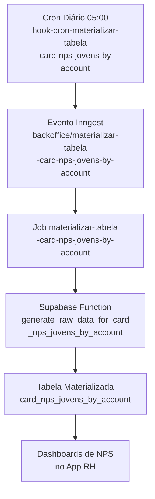

## Contexto de Produto

Os dashboards de NPS e satisfação de jovens por empresa (account) dependem de uma tabela pré-calculada para garantir performance de leitura. Em vez de calcular NPS em tempo real a cada requisição de dashboard, o sistema materializa os dados diariamente em `card_nps_jovens_by_account` via uma função PostgreSQL no Supabase.

Esse pipeline é a camada de transformação entre os dados brutos de pulsos e os cards de insight exibidos para o RH.

## Fluxo Técnico



## Hook — `hook-cron-materializar-tabela-card-nps-jovens-by-account`

**Tipo:** cron  
**Schedule:** `0 5 * * *` (diariamente às 05:00)  
**Feature flag:** `HOOK_CRON_MATERIALIZAR_TABELA_CARD_NPS_JOVENS_BY_ACCOUNT`  
**Localização:** `extensions/hooks/src/tabelas-materializadas/hook-cron-materializar-tabela-card-nps-jovens-by-account/index.js`

O hook emite o evento Inngest:

```json
{
  "name": "backoffice/materializar-tabela-card-nps-jovens-by-account",
  "data": {
    "message": "Send call function materializar tabela 'card_nps_jovens_by_account'"
  }
}
```

## Job Inngest — `materializar-tabela-card-nps-jovens-by-account`

**ID:** `materializar-tabela-card-nps-jovens-by-account`  
**Evento:** `backoffice/materializar-tabela-card-nps-jovens-by-account`  
**Arquivo:** `src/inngest/functions/supabase-functions/tabelas-materializadas/card-nps-jovens-by-account.ts`

O job chama a função Supabase via SDK:

```ts
callSupabaseFunction("generate_raw_data_for_card_nps_jovens_by_account")
```

A função PostgreSQL `generate_raw_data_for_card_nps_jovens_by_account`:
- Lê dados de NPS (respostas de pulsos com tipo NPS) agregados por account
- Recalcula médias, distribuições e tendências
- Trunca e repopula a tabela `card_nps_jovens_by_account`

## Tabela Materializada — `card_nps_jovens_by_account`

Tabela de leitura rápida usada pelos dashboards. Estrutura esperada (baseada no nome):

| Campo (inferido) | Tipo | Descrição |
|------------------|------|-----------|
| `account_id` | `uuid` | ID da empresa cliente |
| `nps_score` | `numeric` | Score NPS calculado |
| Campos de contagem e distribuição | `integer` | Detratores, neutros, promotores |
| `updated_at` | `timestamptz` | Timestamp da última materialização |

> A definição exata das colunas está na migration do Supabase — verificar `generate_raw_data_for_card_nps_jovens_by_account` no schema PostgreSQL.

## Operação

**Verificar última materialização:**

```sql
SELECT MAX(updated_at) as ultima_materializacao
FROM card_nps_jovens_by_account;
```

**Verificar se há dados por account:**

```sql
SELECT account_id, COUNT(*) as registros
FROM card_nps_jovens_by_account
GROUP BY account_id
ORDER BY registros DESC;
```

**Disparar materialização manualmente:**

Se o dashboard estiver mostrando dados desatualizados:

1. Inngest Dashboard → "Send Event"
2. Payload:
   ```json
   {
     "name": "backoffice/materializar-tabela-card-nps-jovens-by-account",
     "data": { "message": "manual trigger" }
   }
   ```

**Verificar feature flag:**

```bash
grep "HOOK_CRON_MATERIALIZAR_TABELA" extensions/constants.js
```

## Contexto do Pipeline de Dados

Este job faz parte de um padrão mais amplo de materialização no sistema. Outros exemplos:

| Job | Supabase Function | Tabela |
|-----|-------------------|--------|
| `materializar-tabela-card-nps-jovens-by-account` | `generate_raw_data_for_card_nps_jovens_by_account` | `card_nps_jovens_by_account` |
| `atualizar-classificacao-automatica` | `call-supabase-function` | (classificação matchmaker) |

O padrão consiste em: cron hook → evento Inngest → job → função Supabase → tabela materializada → dashboard.

## Riscos e Limites

| Risco | Impacto | Mitigação |
|-------|---------|-----------|
| Supabase indisponível às 05:00 | Tabela com dados do dia anterior | Inngest retenta automaticamente; verificar Sentry |
| Feature flag desabilitada | Dashboard sem atualização diária | Verificar `HOOK_CRON_MATERIALIZAR_TABELA_CARD_NPS_JOVENS_BY_ACCOUNT` |
| Função Supabase lenta com volume alto | Job timeout | Monitorar tempo de execução no Inngest Dashboard |
| Dados de pulsos ausentes | Tabela pode ficar vazia ou com scores zerados | Verificar integridade dos dados de pulsos antes de investigar NPS |

## Referências de Código

| Arquivo | Repositório |
|---------|-------------|
| `extensions/hooks/src/tabelas-materializadas/hook-cron-materializar-tabela-card-nps-jovens-by-account/index.js` | `directus-backoffice-with-extensions` |
| `src/inngest/functions/supabase-functions/tabelas-materializadas/card-nps-jovens-by-account.ts` | `backoffice-inngest-functions` |
| `extensions/constants.js` (`HOOK_CRON_MATERIALIZAR_TABELA_CARD_NPS_JOVENS_BY_ACCOUNT`) | `directus-backoffice-with-extensions` |

## Veja Também

<CardGroup cols={2}>
  <Card title="Insights — Pipeline de Dados" icon="arrow-right-arrow-left" href="/documentation/domains/insights/data-pipeline">
    Visão geral do pipeline de dados e views materializadas do módulo de insights
  </Card>
  <Card title="Insights — Catálogo de Métricas" icon="chart-bar" href="/documentation/domains/insights/metric-catalog">
    Definições de métricas NPS, engajamento e performance exibidas nos dashboards
  </Card>
  <Card title="Pulsos — Modelo de Dados" icon="database" href="/documentation/domains/pulses/data-model">
    Estrutura dos dados de pulso que alimentam o cálculo de NPS
  </Card>
  <Card title="Insights — Operações" icon="wrench" href="/documentation/domains/insights/operations">
    Runbooks para diagnóstico de dashboards com dados incorretos ou desatualizados
  </Card>
</CardGroup>
