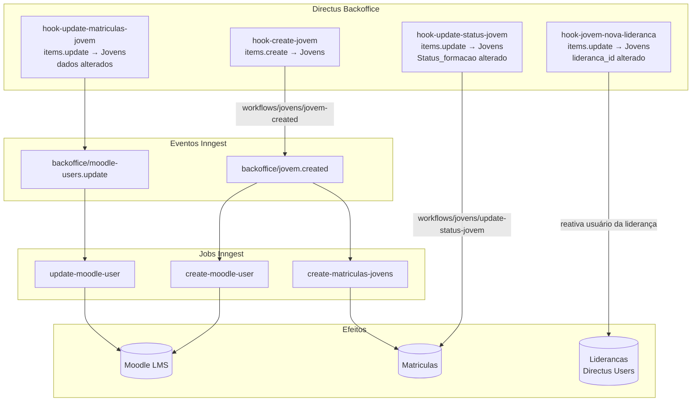

## Contexto de Produto

Jovens são a entidade central da Leapy. Cada jovem representa um aprendiz ou estagiário vinculado a uma empresa cliente. O fluxo completo começa na criação — que dispara integração automática com o Moodle e geração de Matrículas — e vai até o encerramento do contrato (desligamento ou efetivação). O RH visualiza e gerencia todos os jovens via backoffice e app RH.

## Escopo Funcional

<CardGroup cols={2}>
  <Card title="Criação Automática" icon="user-plus">
    Ao criar um Jovem no Directus, o sistema cria automaticamente a conta no Moodle e gera as Matrículas nos cursos do cronograma.
  </Card>
  <Card title="Gestão de Status" icon="toggle-on">
    `Status_formacao` controla o estado ativo do jovem: `em_andamento` é o estado operacional. Mudanças disparam atualizações em todo o sistema.
  </Card>
  <Card title="Troca de Liderança" icon="user-group">
    Ao atribuir uma nova liderança ao jovem, o hook reativa o usuário da liderança no Directus caso esteja inativo.
  </Card>
  <Card title="Listagem Segmentada" icon="list">
    O endpoint custom `/jovens/list` retorna jovens filtrados por perfil: liderança vê somente seus jovens, RH vê toda a empresa.
  </Card>
  <Card title="Classificação Automática" icon="star">
    O campo `classificacao_automatica` é atualizado periodicamente com base em métricas de NPS e engajamento.
  </Card>
  <Card title="Ciclo de Vida" icon="arrow-right-arrow-left">
    Desligamentos, efetivações, matrículas atrasadas e transições de status são gerenciados por hooks cron dedicados.
  </Card>
</CardGroup>

## Arquitetura Técnica



## Fluxos e Regras de Negócio

### Fluxo 1 — Criação de Jovem

1. RH cria um item na coleção `Jovens` no Directus.
2. `hook-create-jovem` dispara (`items.create`, collection = `Jovens`).
3. Hook chama `workflows/jovens/jovem-created` com o item completo.
4. Workflow envia `backoffice/jovem.created`.
5. **Em paralelo:**
   - `create-moodle-user`: cria conta do jovem no Moodle LMS.
   - `create-matriculas-jovens`: cria Matrículas nos módulos do cronograma da turma.

### Fluxo 2 — Atualização de Status

1. Campo `Status_formacao` do jovem é alterado no Directus.
2. `hook-update-status-jovem` detecta a mudança.
3. Hook chama `workflows/jovens/update-status-jovem` com `id` e novo `status`.
4. Workflow propaga a atualização para as Matrículas vinculadas ao jovem.

### Fluxo 3 — Troca de Liderança

1. `lideranca_id` do jovem é alterado no Directus.
2. `hook-jovem-nova-lideranca` detecta a mudança (campo lideranca_id no payload).
3. Hook busca o usuário Directus vinculado à nova liderança.
4. Se o usuário estiver inativo (`status != "active"`), o hook o reativa para que possa acessar o app.
5. Utiliza cache interno para evitar múltiplas consultas ao banco para o mesmo `user-leadership` role.

### Fluxo 4 — Atualização de Dados no Moodle

1. Dados do jovem são alterados (ex: email, nome) via `items.update` na coleção `Jovens`.
2. `hook-update-matriculas-jovem` detecta a mudança.
3. Envia evento `backoffice/moodle-users.update`.
4. Job `update-moodle-user` sincroniza os dados no Moodle.

## Endpoint Custom `/jovens`

O endpoint `GET /jovens/list` retorna jovens agrupados por inicial do nome, com controle de acesso por role:

| Role | Visualização |
|------|-------------|
| `user-leadership` | Somente jovens da sua liderança |
| `rh-account-manager` | Jovens de todas as empresas da conta |
| `rh-account-admin` | Idem ao account-manager |
| Outros roles | Todos os jovens (admin) |

**Parâmetros de query:**
- `search`: filtra por nome (ILIKE)
- `status`: filtra por `classificacao_automatica`
- `active_only`: se `true`, filtra apenas `Status_formacao = em_andamento`

**Resposta:** array de objetos com `Initial` (primeira letra) e `data` (lista de jovens com id, nome, liderança, avatar e classificação).

## Modelo de Dados

| Campo | Tipo | Descrição |
|-------|------|-----------|
| `id` | `number` | Identificador único |
| `Status_formacao` | `string` | Estado do jovem: `em_andamento`, `concluido`, `desligado`, `efetivado` |
| `ativo` | `boolean` | Se o jovem está ativo no sistema |
| `moodle_id` | `number` | ID da conta no Moodle (null até criação) |
| `lideranca_id` | `M2O` | Liderança responsável |
| `empresa_id` | `M2O` | Empresa contratante |
| `classificacao_automatica` | `string` | Classificação por NPS/engajamento |

## Relação com Outros Domínios

- **Matrículas**: criadas automaticamente na criação do jovem; status controlam o progresso.
- **Cronograma**: as Matrículas do jovem estão vinculadas ao cronograma da turma.
- **Pulsos**: `pulsos_jovens` registra as respostas de pulso do jovem.
- **Moodle**: conta criada via job; `moodle_id` é necessário para hooks de matriculas.
- **Talentos** (`talents`): entidade separada para o módulo de desenvolvimento de talentos (PDI).

## Observabilidade

```sql
-- Jovens sem moodle_id (criação pendente)
SELECT id, status_formacao
FROM "Jovens"
WHERE moodle_id IS NULL
  AND status_formacao = 'em_andamento'
ORDER BY id DESC;

-- Jovens com Matrículas sem cronograma_id
SELECT m.id, m."Jovens_id"
FROM "Matriculas" m
WHERE m.cronograma_id IS NULL
  AND m."Jovens_id" IN (
    SELECT id FROM "Jovens" WHERE ativo = true
  );
```

## Referências de Código (Multirepo)

| Arquivo | Repositório | Descrição |
|---------|-------------|-----------|
| `extensions/hooks/src/hook-create-jovem/index.js` | `directus-backoffice-with-extensions` | Hook de criação |
| `extensions/hooks/src/hook-update-status-jovem/index.js` | `directus-backoffice-with-extensions` | Hook de status |
| `extensions/hooks/src/hook-update-matriculas-jovem/index.js` | `directus-backoffice-with-extensions` | Hook de dados para Moodle |
| `extensions/hooks/src/hook-jovem-nova-lideranca/index.js` | `directus-backoffice-with-extensions` | Hook de troca de liderança |
| `extensions/endpoints/src/jovens/index.js` | `directus-backoffice-with-extensions` | Endpoint `/jovens/list` |

## Veja Também

<CardGroup cols={2}>
  <Card title="Ciclo de Vida de Jovens" icon="arrow-right-arrow-left" href="/documentation/domains/jovens/lifecycle">
    Desligamentos, efetivações, matrículas atrasadas e eventos cron do ciclo completo
  </Card>
  <Card title="Integração Moodle" icon="plug" href="/documentation/domains/courses-content/moodle-integration">
    Como a conta no Moodle é criada e sincronizada ao criar um jovem
  </Card>
  <Card title="Modelo de Dados de Cursos" icon="database" href="/documentation/domains/courses-content/data-model">
    Estrutura de Matrículas, Módulos e Arcos vinculados ao jovem
  </Card>
  <Card title="Cronogramas" icon="calendar" href="/documentation/domains/cronogramas/index">
    Cronogramas das turmas que organizam as Matrículas dos jovens
  </Card>
</CardGroup>
