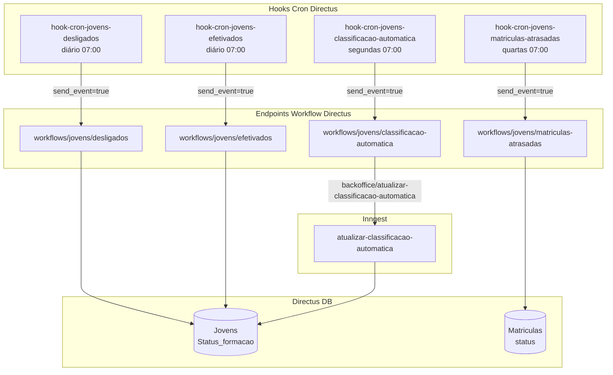

## Contexto de Produto

Ao longo do contrato, jovens passam por eventos de ciclo de vida que impactam diretamente o RH: fim de contrato (desligamento), conversão para funcionário efetivo (efetivação) e identificação de matrículas com progresso atrasado. Esses processos são automatizados via hooks cron no Directus — sem intervenção manual do time de produto.

## Escopo Funcional

<CardGroup cols={2}>
  <Card title="Desligamentos Automáticos" icon="user-minus">
    Jovens cujo contrato encerrou são identificados diariamente e têm status atualizado para `desligado`.
  </Card>
  <Card title="Efetivações" icon="user-check">
    Jovens que completaram o programa e foram efetivados têm status atualizado para `efetivado`.
  </Card>
  <Card title="Matrículas Atrasadas" icon="clock">
    Semanalmente, jovens com matrículas em atraso são identificados e a equipe de RH é notificada.
  </Card>
  <Card title="Classificação por Engajamento" icon="chart-bar">
    Toda segunda-feira, a classificação automática de jovens é recalculada com base em NPS e engajamento.
  </Card>
</CardGroup>

## Arquitetura Técnica



## Fluxos e Regras de Negócio

### Fluxo 1 — Desligamento de Jovens (diário 07:00)

**Hook:** `hook-cron-jovens-desligados`
**Schedule:** `0 7 * * *` — todos os dias às 07:00

O workflow `workflows/jovens/desligados` identifica jovens com contrato encerrado (data fim <= hoje) e ainda com `Status_formacao != "desligado"`. Para cada jovem:
1. Atualiza `Status_formacao` para `desligado`.
2. Marca `ativo = false`.
3. Pode disparar comunicações de encerramento para o RH.

### Fluxo 2 — Efetivação de Jovens (diário 07:00)

**Hook:** `hook-cron-jovens-efetivados`
**Schedule:** `0 7 * * *` — todos os dias às 07:00

O workflow `workflows/jovens/efetivados` identifica jovens marcados para efetivação. Para cada jovem identificado:
1. Atualiza `Status_formacao` para `efetivado`.
2. Registra data de efetivação.
3. Pode disparar comunicação ao RH informando a efetivação.

> **Nota:** Desligamento e efetivação correm no mesmo horário (07:00). O Directus executa hooks em paralelo — não há dependência de ordem entre eles.

### Fluxo 3 — Matrículas Atrasadas (quartas 07:00)

**Hook:** `hook-cron-jovens-matriculas-atrasadas`
**Schedule:** `0 7 * * 3` — toda quarta-feira às 07:00

O workflow `workflows/jovens/matriculas-atrasadas` identifica jovens com Matrículas no status `atrasado` e `ativo = true`. Para cada jovem com atraso:
1. Notifica a liderança e/ou o RH via comunicação automatizada.
2. Pode atualizar campos de monitoramento na Matrícula.

### Fluxo 4 — Classificação Automática (segundas 07:00)

**Hook:** `hook-cron-jovens-classificacao-automatica`
**Schedule:** `0 7 * * 1` — toda segunda-feira às 07:00

1. Hook chama `workflows/jovens/classificacao-automatica`.
2. Workflow envia `backoffice/atualizar-classificacao-automatica.call-supabase-function`.
3. Job Inngest `atualizar-classificacao-automatica` recalcula a classificação de cada jovem ativo baseada em NPS de pulsos e métricas de engajamento.
4. Atualiza o campo `classificacao_automatica` em `Jovens`.

## Schedules de Crons

| Hook | Schedule | Frequência | Ação |
|------|----------|------------|------|
| `hook-cron-jovens-desligados` | `0 7 * * *` | Diário 07:00 | Desliga jovens com contrato encerrado |
| `hook-cron-jovens-efetivados` | `0 7 * * *` | Diário 07:00 | Efetiva jovens marcados |
| `hook-cron-jovens-matriculas-atrasadas` | `0 7 * * 3` | Quarta 07:00 | Alerta matrículas atrasadas |
| `hook-cron-jovens-classificacao-automatica` | `0 7 * * 1` | Segunda 07:00 | Reclassifica jovens por NPS |

## Controle de Feature Flag

Todos os hooks verificam uma constant de habilitação antes de executar:

| Hook | Constant |
|------|----------|
| `hook-cron-jovens-desligados` | `HOOK_CRON_JOVENS_DESLIGADOS` |
| `hook-cron-jovens-efetivados` | `HOOK_CRON_JOVENS_EFETIVADOS` |
| `hook-cron-jovens-matriculas-atrasadas` | `HOOK_CRON_JOVENS_MATRICULAS_ATRASADAS` |
| `hook-cron-jovens-classificacao-automatica` | `HOOK_CRON_JOVENS_CLASSIFICACAO_AUTOMATICA` |

Se a constant for `false`, o hook loga `"<HOOK_NAME> is disabled"` e retorna sem executar.

## Observabilidade e Operação

**Verificar jovens que deveriam ter sido desligados:**
```sql
-- Jovens com contrato encerrado mas ainda em_andamento
SELECT id, "Status_formacao", ativo
FROM "Jovens"
WHERE ativo = true
  AND "Status_formacao" = 'em_andamento'
  -- Adicionar filtro de data fim quando campo disponível
ORDER BY id DESC
LIMIT 20;
```

**Verificar classificação desatualizada:**
```sql
-- Jovens ativos sem classificação
SELECT id, "Status_formacao", classificacao_automatica
FROM "Jovens"
WHERE "Status_formacao" = 'em_andamento'
  AND ativo = true
  AND classificacao_automatica IS NULL;
```

**Forçar reprocessamento de classificação:**
```bash
# Via Inngest dashboard
{
  "name": "backoffice/atualizar-classificacao-automatica.call-supabase-function",
  "data": {}
}
```

## Riscos e Limites

| Risco | Impacto | Mitigação |
|-------|---------|-----------|
| Hook de desligamento e efetivação no mesmo horário | Conflito se jovem marcado para os dois | Lógica do workflow prioriza efetivação sobre desligamento |
| Workflow não retorna erro explícito | Falha silenciosa | Monitorar logs do Directus e Inngest dashboard |
| Jovem sem `lideranca_id` | Notificação de matrículas atrasadas não chega à liderança | Validar no workflow; log de alerta para ops |
| Hook desabilitado em produção | Desligamentos atrasam | Verificar constants via variável de ambiente do Directus |

## Referências de Código (Multirepo)

| Arquivo | Repositório | Descrição |
|---------|-------------|-----------|
| `extensions/hooks/src/hook-cron-jovens-desligados/index.js` | `directus-backoffice-with-extensions` | Cron desligamentos |
| `extensions/hooks/src/hook-cron-jovens-efetivados/index.js` | `directus-backoffice-with-extensions` | Cron efetivações |
| `extensions/hooks/src/hook-cron-jovens-matriculas-atrasadas/index.js` | `directus-backoffice-with-extensions` | Cron matrículas atrasadas |
| `extensions/hooks/src/hook-cron-jovens-classificacao-automatica/index.js` | `directus-backoffice-with-extensions` | Cron classificação |
| `extensions/hooks/src/hook-update-status-jovem/index.js` | `directus-backoffice-with-extensions` | Hook de mudança manual de status |

## Veja Também

<CardGroup cols={2}>
  <Card title="Jovens — Visão Geral" icon="user" href="/documentation/domains/jovens/index">
    Criação de jovens, integração Moodle e gestão geral do domínio
  </Card>
  <Card title="Classificação Automática" icon="star" href="/documentation/domains/matchmaker/classificacao-automatica">
    Detalhes do algoritmo de classificação automática por NPS e engajamento
  </Card>
  <Card title="Matrículas — Crons de Ciclo de Vida" icon="clock" href="/documentation/domains/courses-content/matriculas-lifecycle-crons">
    Crons que controlam status de Matrículas (ativas, atrasadas, concluídas)
  </Card>
  <Card title="Backoffice Directus" icon="server" href="/documentation/platform/backoffice-directus">
    Como hooks cron são configurados e habilitados no Directus
  </Card>
</CardGroup>
