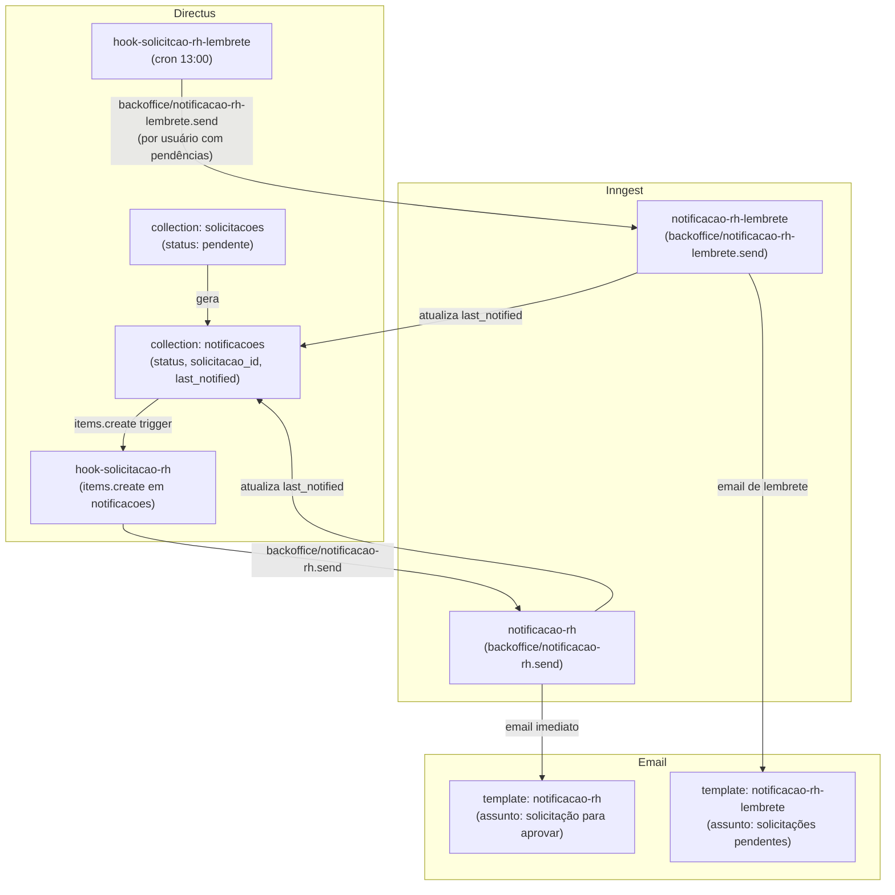

## Contexto de Produto

Jovens podem abrir **solicitações** na plataforma (ex: solicitação de ajuste contratual, dúvida
administrativa). Quando uma solicitação é criada, o RH responsável recebe um email automático.
Se a notificação ficar sem leitura com a solicitação pendente por mais de 5 dias, um lembrete
diário é enviado até que a situação seja resolvida.

## Arquitetura Técnica



## Fluxo 1: Notificação Imediata

### `hook-solicitacao-rh`

Escuta o evento Directus `items.create` na collection `notificacoes`.

**Filtro de disparo** — todos os campos devem estar presentes:
- `item.collection === "notificacoes"`
- `item.payload.solicitacao_id` — deve ter vínculo com uma solicitação
- `item.payload.title`, `item.payload.body`, `item.payload.user_id`

**Feature flag:** `HOOK_SOLICITACAO_RH`

**Evento Inngest disparado:**

```json
{
  "name": "backoffice/notificacao-rh.send",
  "data": {
    "notificacao_id": 42,
    "item": {
      "title": "Solicitação de ajuste de contrato",
      "body": "Preciso de ajuda com...",
      "user_id": 123,
      "solicitacao_id": 99
    },
    "message": "Notificação de nova solicitação enviada para o RH"
  }
}
```

### Job `notificacao-rh`

1. Busca dados do usuário RH (`first_name`, `last_name`, `email`, `account.name`)
2. Envia email via endpoint interno `/emails/send` (template `notificacao-rh`)
3. Atualiza `last_notified` na collection `notificacoes`

**Template de email:** `notificacao-rh`
- **Assunto:** "Leapy - Você tem uma solicitação para aprovar"
- **Dados:** `user_name`, `notification_title`, `notification_body`, `solicitacao_date`, `account`

---

## Fluxo 2: Lembrete de Solicitação Pendente

### `hook-solicitcao-rh-lembrete`

<Note>
  Atenção ao typo no nome do hook no código: **`hook-solicitcao-rh-lembrete`** (falta o "i" em
  "solicitacao"). O nome do arquivo e da feature flag seguem essa grafia.
</Note>

Executa diariamente às **13:00** (`0 13 * * *`).

**Feature flag:** `HOOK_SOLICITACAO_RH_LEMBRETE`

**Filtro de notificações a lembrar:**

```javascript
filter: {
  _and: [
    { status: { _eq: "nao_lido" } },                   // notificação não lida
    { solicitacao_id: { status: { _eq: "pendente" } } }, // solicitação ainda pendente
    { _or: [
      { last_notified: { _null: true } },               // nunca lembrada
      { last_notified: { _lte: 5_dias_atras } }         // ou lembrada há mais de 5 dias
    ]}
  ]
}
```

**Agrupamento por usuário:** o hook agrupa notificações por `user_id` antes de disparar
o evento — um único evento por usuário (mesmo que o usuário tenha múltiplas solicitações pendentes).

**Evento Inngest disparado (por usuário):**

```json
{
  "name": "backoffice/notificacao-rh-lembrete.send",
  "data": {
    "item": {
      "user_id": 123,
      "first_name": "Maria",
      "last_name": "Santos",
      "email": "maria@empresa.com",
      "account_name": "Empresa XYZ"
    },
    "message": "Notificação de nova solicitação enviada para o RH"
  }
}
```

### Job `notificacao-rh-lembrete`

1. Verifica se o usuário ainda tem notificações não lidas com solicitação pendente
2. Se não tiver: encerra sem enviar (proteção contra race condition)
3. Envia email via `/emails/send` (template `notificacao-rh-lembrete`)
4. Atualiza `last_notified` em todas as notificações pendentes do usuário

**Template de email:** `notificacao-rh-lembrete`
- **Assunto:** "Leapy - Você tem solicitações pendentes de aprovação"
- **Dados:** `user_name`, `count_solicitacoes`, `account`

---

## Observabilidade

### Diagnóstico no Directus

```sql
-- Notificações não lidas com solicitação pendente
SELECT n.id, n.title, n.status, n.last_notified, s.status as solicitacao_status
FROM notificacoes n
JOIN solicitacoes s ON n.solicitacao_id = s.id
WHERE n.status = 'nao_lido'
  AND s.status = 'pendente'
ORDER BY n.last_notified NULLS FIRST;

-- Usuários com múltiplas notificações pendentes
SELECT user_id, COUNT(*) as pendencias
FROM notificacoes
WHERE status = 'nao_lido'
GROUP BY user_id
HAVING COUNT(*) > 1;
```

### Verificar se notificação foi enviada

O campo `last_notified` na collection `notificacoes` registra a última vez que o email foi
disparado. Se for `null`, o hook de lembrete nunca processou aquela notificação.

---

## Riscos, Limites e Trade-offs

| Risco | Mitigação |
|---|---|
| Solicitação resolvida entre consulta e envio | Job verifica notificações abertas antes de enviar |
| Usuário sem email → email vazio | Job valida campos antes de disparar (early return) |
| Multiple hooks criando notificações duplicadas | Dedup pelo `solicitacao_id` na notificação |
| Spam de lembretes | Janela mínima de 5 dias entre lembretes (`last_notified`) |
| Feature flag desativada — notificações acumulam | Monitorar coleção `notificacoes` com `last_notified` antigo |

---

## Referências de Código

| Arquivo | Repo | Descrição |
|---|---|---|
| `extensions/hooks/src/hook-solicitacao-rh/index.js` | `directus-backoffice-with-extensions` | Hook items.create — disparo imediato |
| `extensions/hooks/src/hook-solicitcao-rh-lembrete/index.js` | `directus-backoffice-with-extensions` | Hook CRON — lembrete diário (typo no nome) |
| `src/inngest/functions/notificacoes/notificacao-rh-created.ts` | `backoffice-inngest-functions` | Job notificação imediata |
| `src/inngest/functions/notificacoes/notificacao-rh-lembrete.ts` | `backoffice-inngest-functions` | Job lembrete |

<CardGroup cols={2}>
  <Card title="Jovens" icon="user" href="/documentation/domains/jovens/index">
    Domínio de jovens aprendizes e estagiários
  </Card>
  <Card title="Comunicações e Follow-up" icon="envelope" href="/documentation/platform/communications-fup">
    Régua de comunicação automatizada da plataforma
  </Card>
  <Card title="Jobs e Eventos Inngest" icon="gear" href="/documentation/platform/events-jobs-inngest">
    Arquitetura de eventos assíncronos
  </Card>
  <Card title="Backoffice Directus" icon="database" href="/documentation/platform/backoffice-directus">
    Hooks e coleções do backoffice
  </Card>
</CardGroup>
