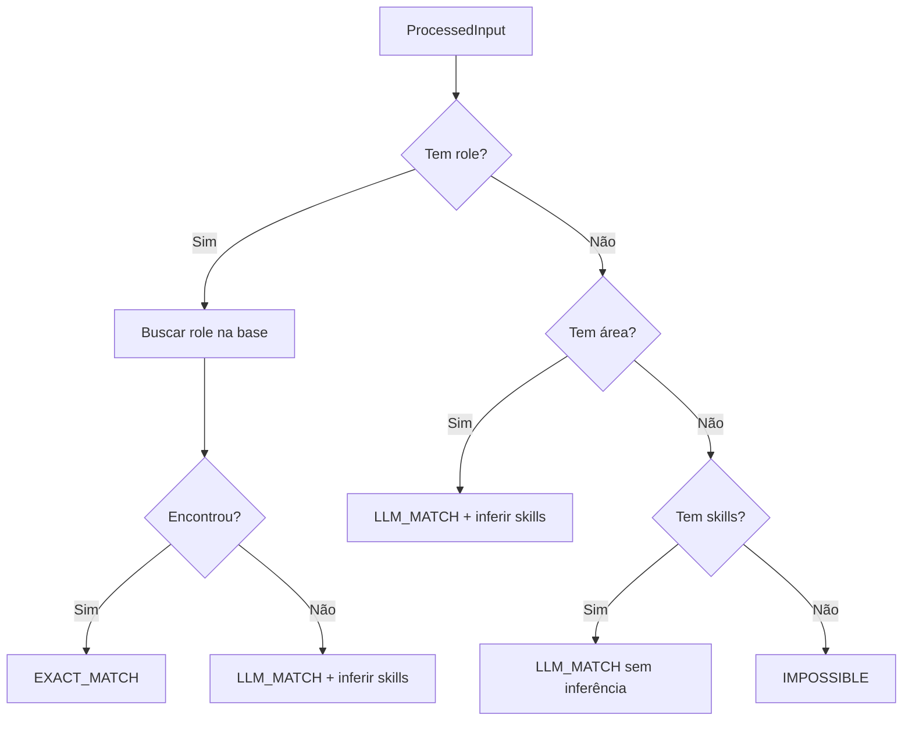

## Visão Geral

O Matchmaker segue regras específicas de classificação de input, busca de roles, normalização de skills e cálculo de matching, implementadas no FlowDecisionEngine e nos componentes do pipeline.

---

## Regras de Classificação de Input

### RN-MAT-001: Detecção Automática de Tipo

**Regra**: O InputProcessor detecta automaticamente se o input é URL, texto ou misto.

**Implementação**:
- Regex busca padrão `https?://` no texto
- Se encontra URL: tipo `url` (apenas URL) ou `mixed` (URL + texto)
- Se não encontra: tipo `text`

**Exemplos**:

| Input | Tipo |
|-------|------|
| `https://linkedin.com/jobs/123` | `url` |
| "Desenvolvedor Python sênior" | `text` |
| "Vaga: https://greenhouse.io/job/456" | `mixed` |

---

### RN-MAT-002: Scraping de URLs

**Regra**: Quando detectada uma URL, o sistema faz scraping antes de processar.

**Implementação**:
- Usa `httpx` + `BeautifulSoup` para extração
- Se scraping falha, emite warning e tenta processar o texto restante
- Timeout de scraping independente do timeout geral

**Fallback**: Se a URL não puder ser acessada, o sistema sugere ao usuário colar a descrição da vaga manualmente.

---

## Regras do FlowDecisionEngine

### RN-MAT-003: Árvore de Decisão de Estratégia

**Regra**: O FlowEngine segue uma árvore de decisão baseada nas informações extraídas do input.



---

### RN-MAT-004: Estratégia EXACT_MATCH

**Regra**: Quando o role é encontrado na base taxonômica, usa matching por quantidade de skills em comum.

**Condições**:
- Role identificado E encontrado na base
- Skills do role carregadas da tabela `role_skills`

**Flags adicionais**:
- `should_infer_skills = true` se role tem 3 ou menos skills no banco
- `should_rerank = true` se o input contém skills extras além do role

---

### RN-MAT-005: Estratégia LLM_MATCH

**Regra**: Quando o role não é encontrado ou apenas área/skills estão disponíveis, o LLM é usado para inferir e rankear.

**Cenários**:
- Role não encontrado na base -> inferir skills via LLM com contexto do role
- Apenas área identificada -> inferir skills via LLM com contexto da área
- Apenas skills no input -> usar skills diretamente sem inferência

---

### RN-MAT-006: Estratégia IMPOSSIBLE

**Regra**: Se nenhuma informação útil (role, área ou skills) foi extraída, o processamento é interrompido.

**Comportamento**: Retorna erro com mensagem orientando o usuário a fornecer mais detalhes.

---

## Regras de Busca de Role

### RN-MAT-007: Busca em 4 Camadas

**Regra**: A busca de role na base taxonômica segue 4 camadas, em ordem de prioridade e custo.

| Camada | Método | Tempo | Confidence |
|--------|--------|-------|------------|
| 1 | Match exato case-insensitive em `roles.name` | ~1-2ms | 1.0 |
| 2 | Match exato em `role_aliases.alias` | ~1-2ms | 1.0 |
| 3 | Similaridade trigram (`pg_trgm`) | ~10-30ms | 0.7-1.0 |
| 4 | Inferência via LLM (último recurso) | ~500-2000ms | variável |

**Implementação**:

```python
# Camada 1: Match exato
WHERE LOWER(name) = LOWER($1)

# Camada 2: Match por alias
WHERE LOWER(alias) = LOWER($1)

# Camada 3: Trigram similarity (threshold >= 0.7)
WHERE name % $1 ORDER BY similarity(name, $1) DESC

# Camada 4: LLM infere role mais próximo
```

<Warning>
  A camada 4 (LLM) é significativamente mais lenta e deve ser usada apenas como último recurso. O threshold trigram de 0.7 garante que a camada 3 capture a maioria dos casos.
</Warning>

---

### RN-MAT-008: Role Mínimo

**Regra**: Um role só é considerado válido se tiver mais de 2 caracteres.

**Racional**: Evita falsos positivos com abreviações muito curtas ou ruído da extração LLM.

---

## Regras de Normalização de Skills

### RN-MAT-009: Normalização em 4 Camadas

**Regra**: Cada skill extraída é normalizada em 4 camadas para encontrar o ID correspondente na base.

| Camada | Método | Exemplo |
|--------|--------|---------|
| 1. Exact | Match exato case-insensitive em `skills.name` | "Python" -> skill_id=123 |
| 2. Alias | Match em `skill_aliases` + `skills.synonyms` | "PowerBI" -> "Power BI" |
| 3. Embedding | Similaridade vetorial (threshold >= 0.85) | "Machine Learning" ~ "ML" |
| 4. New | Skill não encontrada, registrada como nova | Nova skill criada |

<Note>
  No fluxo do Orchestrator, novas skills **não são inseridas automaticamente** (`auto_insert_new=False`). Elas são registradas para revisão posterior.
</Note>

---

### RN-MAT-010: Threshold de Embedding

**Regra**: Para matches por embedding (camada 3), a similaridade mínima é **0.85** (85%).

**Racional**: Valores abaixo desse threshold geram falsos positivos com skills semanticamente distantes.

---

## Regras de Matching de Candidatos

### RN-MAT-011: Cálculo do Match Score

**Regra**: O `match_score` é calculado como a proporção de skills buscadas que o candidato possui.

```
match_score = matching_skills_count / total_skills_searched
```

**Exemplo**: Se a busca usa 10 skills e o candidato tem 7 delas, `match_score = 0.7` (70%).

---

### RN-MAT-012: Proficiência Mínima

**Regra**: Apenas skills com `proficiency >= 2` são consideradas no matching.

**Escala de proficiência**:

| Valor | Nível |
|-------|-------|
| 0 | Sem experiência |
| 1 | Iniciante |
| 2 | Intermediário |
| 3 | Avançado |
| 4 | Expert |

---

### RN-MAT-013: Re-ranking via LLM

**Regra**: Quando `should_rerank = true`, os candidatos são re-rankeados pelo LLM após o match inicial.

**Quando ativa**: Se o input contém skills extras além das do role encontrado na base.

**Limite**: Top 20 candidatos são re-rankeados (performance).

---

### RN-MAT-014: Limite de Candidatos

**Regra**: O Orchestrator busca até **50 candidatos** internamente, mas o limite de retorno é configurável pelo usuário (padrão: 10, máximo: 100).

---

## Regras de Rate Limiting

### RN-MAT-015: Limite por Usuário

**Regra**: Cada usuário pode fazer no máximo **10 requisições por minuto**.

**Implementação**: Rate limiter no proxy Directus com key `matchmaker:{user_id}`.

**Resposta ao exceder**: HTTP 429 com header `Retry-After` e campo `retry_after` no corpo.

---

### RN-MAT-016: Timeout de Processamento

**Regra**: O timeout total de uma busca é **120 segundos** (2 minutos).

**Implementação**: Configurado tanto no proxy Directus quanto na API Route do Next.js.

**Resposta ao exceder**: HTTP 504 Gateway Timeout com sugestão de query mais específica.

---

## Regras de Autenticação

### RN-MAT-017: Autenticação Obrigatória

**Regra**: Todas as requisições ao Matchmaker requerem autenticação via Bearer token.

**Fluxo**: Next.js API Route -> Directus Proxy (valida `req.accountability.user`) -> Agent System.

### RN-MAT-018: Logging Obrigatório

**Regra**: Toda busca é registrada na tabela `matchmaker_search_logs`, independente de sucesso ou falha.

**Dados logados**: query, user_id, request_id, execution_time, candidates_found, response completa.
