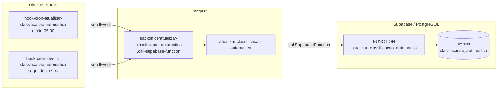

## Contexto de Produto

A classificação automática é um score de engajamento calculado para cada jovem ativo. Ela alimenta o Matchmaker (filtra candidatos por perfil), o dashboard do RH e os alertas de performance. O cálculo roda via Supabase Function — uma stored procedure que tem acesso ao banco completo — acionada por hooks cron no Directus.

## Escopo Funcional

<CardGroup cols={2}>
  <Card title="Recálculo Diário" icon="arrows-rotate">
    Todo dia às 05:00, a classificação de todos os jovens ativos é recalculada.
  </Card>
  <Card title="Recálculo Semanal" icon="calendar-week">
    Toda segunda-feira às 07:00, um segundo recálculo é disparado para garantir consistência após o fim de semana.
  </Card>
  <Card title="Via Supabase Function" icon="database">
    O cálculo ocorre em `atualizar_classificacao_automatica` — stored procedure em SQL no Supabase, com acesso direto e eficiente ao banco.
  </Card>
  <Card title="Integração Matchmaker" icon="magnifying-glass">
    O campo `classificacao_automatica` em `Jovens` é usado como filtro e ranking no Matchmaker AI.
  </Card>
</CardGroup>

## Arquitetura Técnica



## Fluxo de Execução

1. Hook cron no Directus (05:00 diário ou segunda 07:00) dispara.
2. Hook verifica a feature flag (`HOOK_CRON_ATUALIZAR_CLASSIFICACAO_AUTOMATICA` ou `HOOK_CRON_JOVENS_CLASSIFICACAO_AUTOMATICA`).
3. Envia evento `backoffice/atualizar-classificacao-automatica.call-supabase-function`.
4. Job Inngest `atualizar-classificacao-automatica` recebe o evento.
5. Job chama a Supabase Function `atualizar_classificacao_automatica` via SDK.
6. A função SQL calcula e atualiza `classificacao_automatica` em todos os jovens elegíveis.

## Schedules

| Hook | Schedule | Frequência |
|------|----------|------------|
| `hook-cron-atualizar-classificacao-automatica` | `0 5 * * *` | Diário 05:00 |
| `hook-cron-jovens-classificacao-automatica` | `0 7 * * 1` | Segunda 07:00 |

Ambos enviam o mesmo evento sem parâmetros de dados — a Supabase Function processa todos os jovens ativos por conta própria.

## Contrato do Evento

### `backoffice/atualizar-classificacao-automatica.call-supabase-function`

```json
{
  "data": {
    "message": "Send call function atualizar classificação automática"
  }
}
```

O campo `message` é apenas informativo — a Supabase Function não recebe parâmetros, ela lê direto do banco.

## Campos Afetados

| Tabela | Campo | Valores esperados |
|--------|-------|-------------------|
| `Jovens` | `classificacao_automatica` | Valores definidos pela Supabase Function (ex: `promotor`, `neutro`, `detrator`) |

## Integração com Matchmaker

O campo `classificacao_automatica` é usado como:
- **Filtro no Matchmaker:** candidatos podem ser filtrados por classificação.
- **Alertas:** `hook-cron-send-alerta-jovens-detratores` monitora `pulsos_jovens.nps_leapy` para disparar alertas de detratores.
- **Dashboard RH:** exibido no `GET /jovens/list` como parte do perfil do jovem.

## Feature Flags

| Hook | Constant |
|------|----------|
| `hook-cron-atualizar-classificacao-automatica` | `HOOK_CRON_ATUALIZAR_CLASSIFICACAO_AUTOMATICA` |
| `hook-cron-jovens-classificacao-automatica` | `HOOK_CRON_JOVENS_CLASSIFICACAO_AUTOMATICA` |

## Observabilidade e Operação

```sql
-- Jovens ativos sem classificação
SELECT id, "Status_formacao"
FROM "Jovens"
WHERE "Status_formacao" = 'em_andamento'
  AND ativo = true
  AND classificacao_automatica IS NULL;

-- Distribuição de classificações
SELECT classificacao_automatica, COUNT(*) as total
FROM "Jovens"
WHERE "Status_formacao" = 'em_andamento'
  AND ativo = true
GROUP BY classificacao_automatica
ORDER BY total DESC;
```

**Disparar recálculo manualmente:**
```bash
# Via Inngest dashboard
{
  "name": "backoffice/atualizar-classificacao-automatica.call-supabase-function",
  "data": {
    "message": "manual rerun"
  }
}
```

## Riscos e Limites

| Risco | Impacto | Mitigação |
|-------|---------|-----------|
| Supabase Function lenta para muitos jovens | Timeout no job Inngest | Monitorar execução; function pode ser otimizada com índices |
| Dois crons próximos (05:00 e segunda 07:00) | Double-run na segunda | Sem impacto de consistência — idempotente |
| Feature flag desabilitada | Classificação para de atualizar | Verificar constants no Directus |

## Referências de Código (Multirepo)

| Arquivo | Repositório | Descrição |
|---------|-------------|-----------|
| `extensions/hooks/src/hook-cron-atualizar-classificacao-automatica/index.js` | `directus-backoffice-with-extensions` | Cron diário 05:00 |
| `extensions/hooks/src/hook-cron-jovens-classificacao-automatica/index.js` | `directus-backoffice-with-extensions` | Cron segunda 07:00 |
| `src/inngest/functions/supabase-functions/atualizar-classificacao-automatica.ts` | `backoffice-inngest-functions` | Job Inngest |

## Veja Também

<CardGroup cols={2}>
  <Card title="Matchmaker — Visão Geral" icon="magnifying-glass" href="/documentation/domains/matchmaker/index">
    Como a classificação alimenta o ranking de candidatos do Matchmaker
  </Card>
  <Card title="Matchmaker — Regras de Negócio" icon="book" href="/documentation/domains/matchmaker/business-rules">
    Regras de classificação e scoring do Matchmaker
  </Card>
  <Card title="Ciclo de Vida de Jovens" icon="arrow-right-arrow-left" href="/documentation/domains/jovens/lifecycle">
    Outros crons que gerenciam o ciclo de vida de jovens
  </Card>
  <Card title="Eventos e Jobs Inngest" icon="gear" href="/documentation/platform/events-jobs-inngest">
    Arquitetura do sistema de eventos usado pelo job de classificação
  </Card>
</CardGroup>
