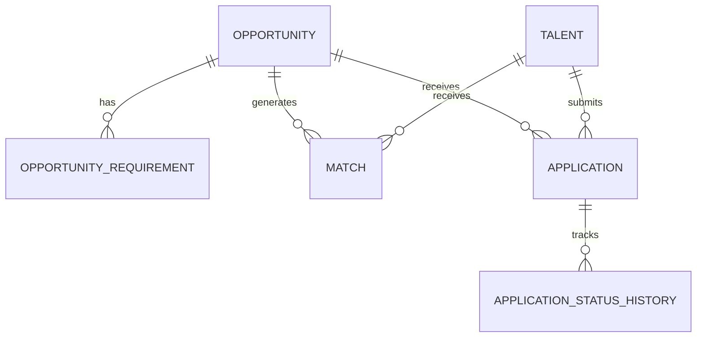
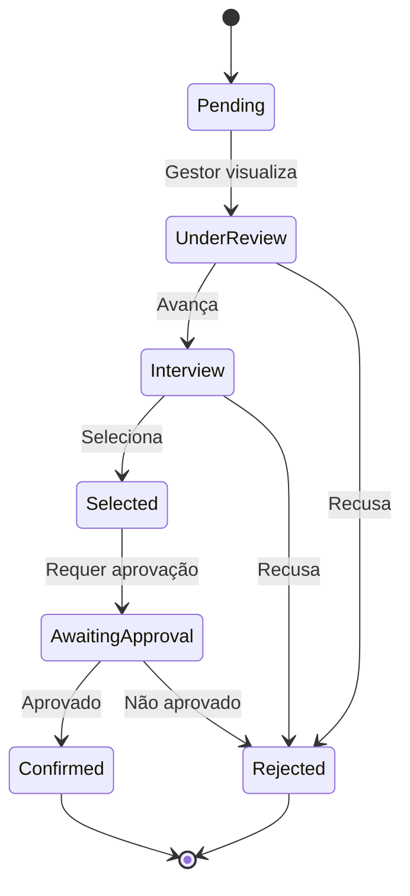

## Diagrama de Entidades

## Entidades Principais

### Opportunity (Oportunidade)

Representa uma vaga, projeto ou posição disponível.

| Campo | Tipo | Descrição |
|-------|------|-----------|
| `id` | UUID | Identificador único |
| `tenant_id` | UUID | Tenant proprietário |
| `title` | string | Título da oportunidade |
| `description` | text | Descrição detalhada |
| `type` | enum | Tipo (vacancy, project, rotation, mentoring) |
| `status` | enum | Status (draft, published, closed, cancelled) |
| `area_id` | UUID | Área responsável |
| `manager_id` | UUID | Gestor responsável |
| `location` | string | Localização |
| `is_remote` | boolean | Se aceita trabalho remoto |
| `start_date` | date | Data prevista de início |
| `end_date` | date | Data prevista de término (projetos) |
| `slots` | integer | Número de vagas |
| `published_at` | datetime | Data de publicação |
| `closes_at` | datetime | Data de encerramento |

### Opportunity Requirement (Requisito)

Requisitos e competências necessárias para a oportunidade.

| Campo | Tipo | Descrição |
|-------|------|-----------|
| `id` | UUID | Identificador único |
| `opportunity_id` | UUID | Oportunidade pai |
| `type` | enum | Tipo (skill, experience, certification) |
| `name` | string | Nome do requisito |
| `level` | enum | Nível (basic, intermediate, advanced) |
| `is_mandatory` | boolean | Se é obrigatório |
| `weight` | decimal | Peso no cálculo do score |

### Match (Sugestão de Match)

Sugestão gerada pelo algoritmo de matching.

| Campo | Tipo | Descrição |
|-------|------|-----------|
| `id` | UUID | Identificador único |
| `opportunity_id` | UUID | Oportunidade |
| `talent_id` | UUID | Talento sugerido |
| `score` | decimal | Score de compatibilidade (0-100) |
| `score_breakdown` | json | Detalhamento do score |
| `created_at` | datetime | Data da sugestão |
| `viewed_at` | datetime | Quando o talento visualizou |

### Application (Candidatura)

Manifestação de interesse de um talento.

| Campo | Tipo | Descrição |
|-------|------|-----------|
| `id` | UUID | Identificador único |
| `opportunity_id` | UUID | Oportunidade |
| `talent_id` | UUID | Talento candidato |
| `status` | enum | Status atual |
| `message` | text | Mensagem do candidato |
| `match_id` | UUID | Match de origem (se houver) |
| `applied_at` | datetime | Data da candidatura |
| `current_manager_approval` | enum | Aprovação do gestor atual |

## Status da Candidatura

| Status | Descrição |
|--------|-----------|
| `pending` | Aguardando análise |
| `under_review` | Em análise pelo gestor |
| `interview` | Em processo de entrevista |
| `selected` | Selecionado |
| `awaiting_approval` | Aguardando aprovação do gestor atual |
| `confirmed` | Confirmado |
| `rejected` | Recusado |
| `withdrawn` | Desistência do candidato |
