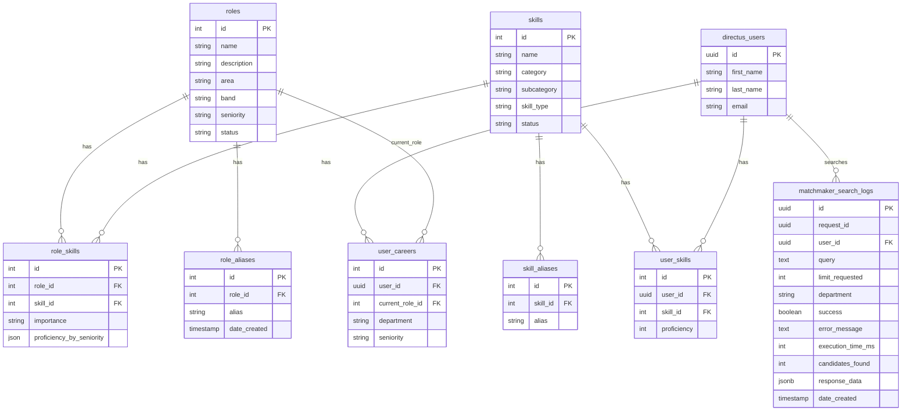
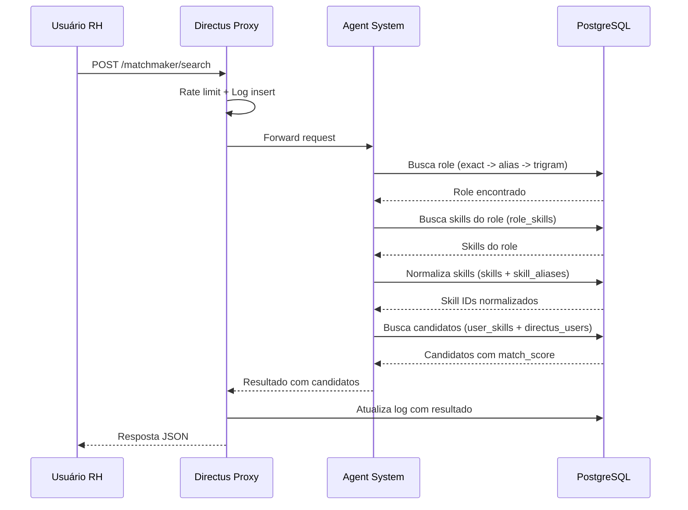

## Visão Geral

O Matchmaker utiliza uma **base taxonômica rica** no PostgreSQL (Supabase) com mais de 130 mil registros distribuídos entre roles, skills e seus relacionamentos. Além disso, mantém logs de buscas para análise e auditoria.

## Diagrama de Entidades


```mermaid
erDiagram
    roles ||--o{ role_skills : has
    roles ||--o{ role_aliases : has
    skills ||--o{ role_skills : has
    skills ||--o{ skill_aliases : has
    skills ||--o{ user_skills : has
    directus_users ||--o{ user_skills : has
    directus_users ||--o{ user_careers : has
    directus_users ||--o{ matchmaker_search_logs : searches
    roles ||--o{ user_careers : current_role

    roles {
        int id PK
        string name
        string description
        string area
        string band
        string seniority
        string status
    }

    role_aliases {
        int id PK
        int role_id FK
        string alias
        timestamp date_created
    }

    skills {
        int id PK
        string name
        string category
        string subcategory
        string skill_type
        string status
    }

    skill_aliases {
        int id PK
        int skill_id FK
        string alias
    }

    role_skills {
        int id PK
        int role_id FK
        int skill_id FK
        string importance
        json proficiency_by_seniority
    }

    user_skills {
        int id PK
        uuid user_id FK
        int skill_id FK
        int proficiency
    }

    user_careers {
        int id PK
        uuid user_id FK
        int current_role_id FK
        string department
        string seniority
    }

    directus_users {
        uuid id PK
        string first_name
        string last_name
        string email
    }

    matchmaker_search_logs {
        uuid id PK
        uuid request_id
        uuid user_id FK
        text query
        int limit_requested
        string department
        boolean success
        text error_message
        int execution_time_ms
        int candidates_found
        jsonb response_data
        timestamp date_created
    }
```

## Volumes da Base Taxonômica

| Tabela | Volume | Descrição |
|--------|--------|-----------|
| `roles` | ~63.000 | Cargos com name, description, area, band, seniority |
| `skills` | ~32.000 | Skills normalizadas com category, subcategory, skill_type |
| `role_skills` | ~41.000 | Relação N:N entre roles e skills com importance e proficiency |
| `role_aliases` | variável | Aliases de roles (ex: "PM" -> "Product Manager") |
| `skill_aliases` | variável | Aliases de skills (ex: "PowerBI" -> "Power BI") |

## Tabelas Detalhadas

### roles

Tabela principal de cargos da base taxonômica.

| Campo | Tipo | Descrição |
|-------|------|-----------|
| `id` | integer | Identificador único |
| `name` | varchar | Nome canônico do cargo (ex: "Product Manager") |
| `description` | text | Descrição do cargo |
| `area` | varchar | Área funcional (ex: "Tecnologia", "Marketing") |
| `band` | varchar | Banda/faixa do cargo |
| `seniority` | varchar | Senioridade padrão |
| `status` | varchar | Status: `published`, `active` |

**Índices otimizados:**

```sql
CREATE INDEX idx_roles_name_lower ON roles (LOWER(name));
CREATE INDEX idx_roles_name_trgm ON roles USING gin (name gin_trgm_ops);
CREATE INDEX idx_roles_area ON roles (area) WHERE area IS NOT NULL;
CREATE INDEX idx_roles_status ON roles (status) WHERE status = 'published' OR status = 'active';
```

### role_aliases

Mapeia variações de nomes de cargos para o role canônico.

| Campo | Tipo | Descrição |
|-------|------|-----------|
| `id` | serial | Identificador único |
| `role_id` | integer FK | ID do role canônico em `roles` |
| `alias` | varchar(500) | Nome alternativo (ex: "PM", "Gerente de Produto") |
| `date_created` | timestamptz | Data de criação |
| `date_updated` | timestamptz | Última atualização |

<Tip>
  Cada alias é **único globalmente** (constraint `unique_role_alias`), garantindo que não haja ambiguidade no mapeamento.
</Tip>

### skills

Skills normalizadas do sistema.

| Campo | Tipo | Descrição |
|-------|------|-----------|
| `id` | integer | Identificador único |
| `name` | varchar | Nome canônico da skill |
| `category` | varchar | Categoria (ex: "Programming", "Design") |
| `subcategory` | varchar | Subcategoria |
| `skill_type` | varchar | Tipo de skill |
| `status` | varchar | Status: `published`, `active`, `pending` |

**Índices:**

```sql
CREATE INDEX idx_skills_name_lower ON skills (LOWER(name));
CREATE INDEX idx_skills_name_trgm ON skills USING gin (name gin_trgm_ops);
CREATE INDEX idx_skills_category ON skills (category) WHERE category IS NOT NULL;
```

### role_skills

Relação N:N entre roles e skills, incluindo nível de importância.

| Campo | Tipo | Descrição |
|-------|------|-----------|
| `id` | integer | Identificador único |
| `role_id` | integer FK | ID do role |
| `skill_id` | integer FK | ID da skill |
| `importance` | varchar | Nível de importância da skill para o role |
| `proficiency_by_seniority` | json | Proficiência esperada por nível de senioridade |

### user_skills

Skills que cada candidato/talento possui.

| Campo | Tipo | Descrição |
|-------|------|-----------|
| `id` | integer | Identificador único |
| `user_id` | uuid FK | ID do usuário em `directus_users` |
| `skill_id` | integer FK | ID da skill em `skills` |
| `proficiency` | integer | Nível de proficiência (0-4) |

<Note>
  O CandidateMatcher filtra candidatos com `proficiency >= 2` por padrão, excluindo skills em nível iniciante.
</Note>

### matchmaker_search_logs

Logs completos de todas as buscas realizadas no Matchmaker.

| Campo | Tipo | Descrição |
|-------|------|-----------|
| `id` | uuid PK | Identificador único |
| `request_id` | uuid | ID para correlação com logs do Agent System |
| `user_id` | uuid FK | Usuário que realizou a busca |
| `query` | text | Texto da busca em linguagem natural |
| `limit_requested` | integer | Limite de candidatos solicitado (padrão: 10) |
| `department` | varchar | Filtro de departamento aplicado |
| `success` | boolean | Se a busca foi bem-sucedida |
| `error_message` | text | Mensagem de erro (se houve falha) |
| `execution_time_ms` | integer | Tempo de execução em milissegundos |
| `candidates_found` | integer | Número de candidatos encontrados |
| `response_data` | jsonb | Resposta completa do Matchmaker em JSON |
| `date_created` | timestamptz | Data e hora da busca |

**Índices para análise:**

```sql
CREATE INDEX idx_matchmaker_logs_user_id ON matchmaker_search_logs(user_id);
CREATE INDEX idx_matchmaker_logs_date_created ON matchmaker_search_logs(date_created DESC);
CREATE INDEX idx_matchmaker_logs_request_id ON matchmaker_search_logs(request_id);
CREATE INDEX idx_matchmaker_logs_success ON matchmaker_search_logs(success);
CREATE INDEX idx_matchmaker_logs_query ON matchmaker_search_logs USING gin(to_tsvector('portuguese', query));
```

## Extensões PostgreSQL

| Extensão | Uso |
|----------|-----|
| `pg_trgm` | Busca por similaridade (trigram) em roles e skills |
| `vector` | Embeddings para normalização semântica de skills |

## Fluxo de Dados


```mermaid
sequenceDiagram
    participant User as Usuário RH
    participant Proxy as Directus Proxy
    participant Agent as Agent System
    participant DB as PostgreSQL

    User->>Proxy: POST /matchmaker/search
    Proxy->>Proxy: Rate limit + Log insert
    Proxy->>Agent: Forward request

    Agent->>DB: Busca role (exact -> alias -> trigram)
    DB-->>Agent: Role encontrado

    Agent->>DB: Busca skills do role (role_skills)
    DB-->>Agent: Skills do role

    Agent->>DB: Normaliza skills (skills + skill_aliases)
    DB-->>Agent: Skill IDs normalizados

    Agent->>DB: Busca candidatos (user_skills + directus_users)
    DB-->>Agent: Candidatos com match_score

    Agent-->>Proxy: Resultado com candidatos
    Proxy->>DB: Atualiza log com resultado
    Proxy-->>User: Resposta JSON
```
