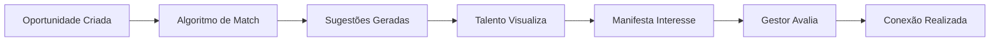

## Visão Geral

O módulo Matchmaker facilita conexões entre talentos e oportunidades internas, promovendo mobilidade, desenvolvimento e retenção de colaboradores.

## Funcionalidades Principais

<CardGroup cols={2}>
  <Card title="Oportunidades" icon="briefcase">
    Publique vagas, projetos e posições internas.
  </Card>
  <Card title="Matching Inteligente" icon="wand-magic-sparkles">
    Algoritmo que sugere conexões baseadas em perfis e competências.
  </Card>
  <Card title="Manifestação de Interesse" icon="hand">
    Talentos podem demonstrar interesse em oportunidades.
  </Card>
  <Card title="Acompanhamento" icon="chart-gantt">
    Gerencie o pipeline de candidatos e conexões.
  </Card>
</CardGroup>

## Tipos de Oportunidade

| Tipo | Descrição |
|------|-----------|
| **Vaga Interna** | Posição aberta para transferência |
| **Projeto** | Participação temporária em projetos |
| **Job Rotation** | Rotação entre áreas para desenvolvimento |
| **Mentoria** | Conexão mentor-mentorado |
| **Shadowing** | Acompanhamento de profissionais sêniores |

## Fluxo do Matching

## Próximos Passos

<Cards>
  <Card title="Jornadas" href="/documentation/domains/matchmaker/journeys">
    Entenda os fluxos de uso do módulo
  </Card>
  <Card title="Regras de Negócio" href="/documentation/domains/matchmaker/business-rules">
    Conheça as regras que governam o funcionamento
  </Card>
  <Card title="Modelo de Dados" href="/documentation/domains/matchmaker/data-model">
    Explore a estrutura de dados
  </Card>
</Cards>
