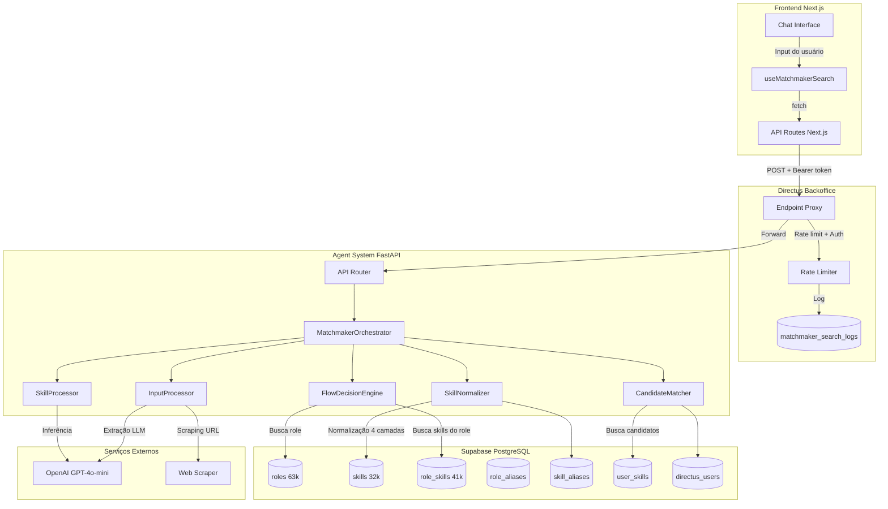
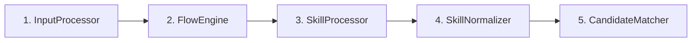
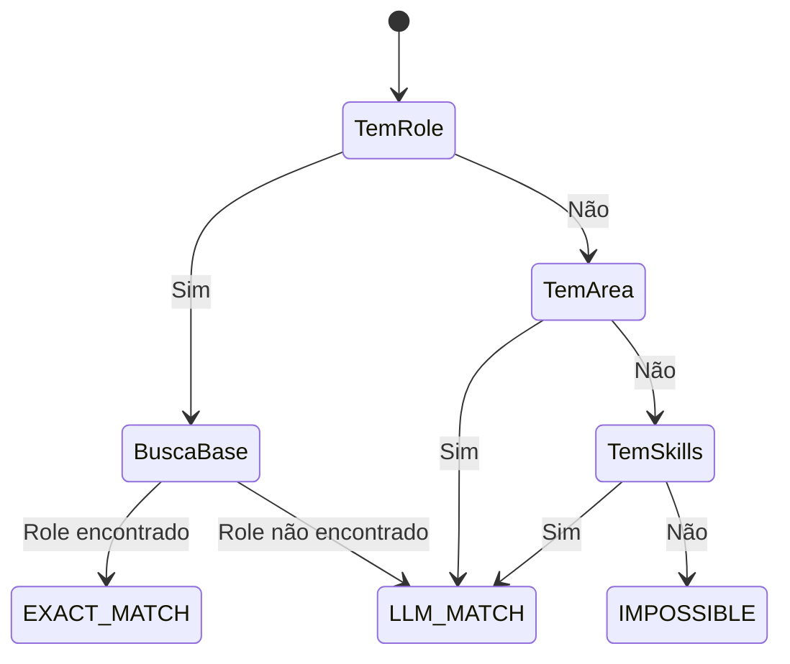

## Visão Geral

O Matchmaker é uma feature **chat-based** que permite a usuários RH encontrar talentos compatíveis com uma vaga ou perfil desejado. O usuário pode descrever o que precisa em linguagem natural — seja colando uma URL de vaga, descrevendo um cargo ou listando skills — e o sistema executa um pipeline de IA em 5 passos para retornar candidatos rankeados por percentual de compatibilidade.

## Arquitetura

```mermaid
flowchart TB
    subgraph frontend [Frontend Next.js]
        Chat[Chat Interface]
        Hook[useMatchmakerSearch]
        APIRoute[API Routes Next.js]
    end

    subgraph directus [Directus Backoffice]
        Proxy[Endpoint Proxy]
        RateLimit[Rate Limiter]
        Logs[(matchmaker_search_logs)]
    end

    subgraph agentSystem [Agent System FastAPI]
        Router[API Router]
        Orchestrator[MatchmakerOrchestrator]
        InputProc[InputProcessor]
        FlowEng[FlowDecisionEngine]
        SkillProc[SkillProcessor]
        SkillNorm[SkillNormalizer]
        CandMatch[CandidateMatcher]
    end

    subgraph external [Serviços Externos]
        OpenAI[OpenAI GPT-4o-mini]
        Scraper[Web Scraper]
    end

    subgraph database [Supabase PostgreSQL]
        Roles[(roles 63k)]
        Skills[(skills 32k)]
        RoleSkills[(role_skills 41k)]
        RoleAliases[(role_aliases)]
        SkillAliases[(skill_aliases)]
        UserSkills[(user_skills)]
        Users[(directus_users)]
    end

    Chat -->|Input do usuário| Hook
    Hook -->|fetch| APIRoute
    APIRoute -->|POST + Bearer token| Proxy
    Proxy -->|Rate limit + Auth| RateLimit
    RateLimit -->|Log| Logs
    Proxy -->|Forward| Router

    Router --> Orchestrator
    Orchestrator --> InputProc
    InputProc -->|Scraping URL| Scraper
    InputProc -->|Extração LLM| OpenAI
    Orchestrator --> FlowEng
    FlowEng -->|Busca role| Roles
    FlowEng -->|Busca skills do role| RoleSkills
    Orchestrator --> SkillProc
    SkillProc -->|Inferência| OpenAI
    Orchestrator --> SkillNorm
    SkillNorm -->|Normalização 4 camadas| Skills
    SkillNorm --> SkillAliases
    Orchestrator --> CandMatch
    CandMatch -->|Busca candidatos| UserSkills
    CandMatch --> Users
```

## Pipeline de Processamento

O Orchestrator executa **5 passos sequenciais**, cada um com responsabilidade bem definida:

```mermaid
flowchart LR
    P1[1. InputProcessor] --> P2[2. FlowEngine]
    P2 --> P3[3. SkillProcessor]
    P3 --> P4[4. SkillNormalizer]
    P4 --> P5[5. CandidateMatcher]
```

| Passo | Componente | Responsabilidade |
|-------|-----------|------------------|
| 1 | **InputProcessor** | Classifica input (texto/URL/misto), faz scraping se URL, extrai role/skills/seniority via LLM |
| 2 | **FlowDecisionEngine** | Decide estratégia de matching (EXACT_MATCH, LLM_MATCH, IMPOSSIBLE) e flags de controle |
| 3 | **SkillProcessor** | Processa e infere skills adicionais via LLM quando necessário |
| 4 | **SkillNormalizer** | Normaliza skills para IDs do banco em 4 camadas (exact, alias, embedding, new) |
| 5 | **CandidateMatcher** | Busca candidatos por skills, calcula match_score e opcionalmente re-rankeia via LLM |

## Funcionalidades Principais

<CardGroup cols={2}>
  <Card title="Chat Inteligente" icon="comments">
    Interface conversacional onde o RH descreve a vaga em linguagem natural
  </Card>
  <Card title="Scraping de URLs" icon="link">
    Cole links de vagas (LinkedIn, Greenhouse, etc.) e o sistema extrai automaticamente
  </Card>
  <Card title="Matching por Skills" icon="bullseye">
    Algoritmo que calcula % de compatibilidade baseado em skills normalizadas
  </Card>
  <Card title="Streaming em Tempo Real" icon="bolt">
    Feedback passo a passo via SSE enquanto o processamento acontece
  </Card>
  <Card title="Exportação de Candidatos" icon="file-export">
    Exporte a lista de candidatos encontrados para análise
  </Card>
  <Card title="Perfil Detalhado" icon="user">
    Visualize o perfil completo do talento diretamente no chat
  </Card>
</CardGroup>

## Tipos de Input Suportados

| Tipo | Exemplo | Processamento |
|------|---------|---------------|
| **Texto livre** | "Desenvolvedor Python sênior com AWS" | LLM extrai role, skills e seniority |
| **URL de vaga** | `https://linkedin.com/jobs/view/123` | Scraping + LLM extrai do conteúdo |
| **Misto** | "Quero alguém para essa vaga https://..." | Detecta URL, faz scraping, combina com texto |
| **Apenas skills** | "Python, React, Docker, AWS" | Usa skills diretamente sem busca de role |

## Estratégias de Matching

```mermaid
stateDiagram-v2
    [*] --> TemRole
    TemRole --> BuscaBase: Sim
    TemRole --> TemArea: Não

    BuscaBase --> EXACT_MATCH: Role encontrado
    BuscaBase --> LLM_MATCH: Role não encontrado

    TemArea --> LLM_MATCH: Sim
    TemArea --> TemSkills: Não

    TemSkills --> LLM_MATCH: Sim
    TemSkills --> IMPOSSIBLE: Não
```

| Estratégia | Quando | Comportamento |
|------------|--------|---------------|
| **EXACT_MATCH** | Role encontrado na base taxonômica | Ranking por quantidade de skills em comum |
| **LLM_MATCH** | Role não encontrado, ou apenas área/skills | LLM infere skills e/ou re-rankeia candidatos |
| **IMPOSSIBLE** | Nenhuma informação útil extraída | Retorna erro com orientação ao usuário |

## Tecnologias

| Componente | Tecnologia | Uso |
|------------|------------|-----|
| **Backend IA** | FastAPI (Python) | API do Agent System, Orchestrator |
| **Proxy/Auth** | Directus (Node.js) | Autenticação, rate limiting, logging |
| **LLM** | OpenAI GPT-4o-mini | Extração de role/skills, inferência, re-ranking |
| **Database** | PostgreSQL (Supabase) | Base taxonômica (63k roles, 32k skills) |
| **Busca fuzzy** | pg_trgm | Busca por similaridade em roles e skills |
| **Frontend** | Next.js 14 | Interface de chat com streaming SSE |
| **Streaming** | Server-Sent Events | Feedback em tempo real durante processamento |
| **Scraping** | httpx + BeautifulSoup | Extração de conteúdo de URLs de vagas |

## Próximos Passos

<CardGroup cols={2}>
  <Card title="Modelo de Dados" icon="database" href="/documentation/domains/matchmaker/data-model">
    Tabelas, relacionamentos e volumes
  </Card>
  <Card title="Regras de Negócio" icon="book" href="/documentation/domains/matchmaker/business-rules">
    Regras do FlowEngine e normalização
  </Card>
  <Card title="Integrações" icon="plug" href="/documentation/domains/matchmaker/integrations">
    OpenAI, Supabase, Directus
  </Card>
  <Card title="Jornadas" icon="route" href="/documentation/domains/matchmaker/journeys">
    Fluxos de uso por perfil
  </Card>
  <Card title="Operações" icon="wrench" href="/documentation/domains/matchmaker/operations">
    Monitoramento e troubleshooting
  </Card>
  <Card title="Métricas" icon="chart-bar" href="/documentation/domains/matchmaker/metrics">
    KPIs e indicadores
  </Card>
  <Card title="API Reference" icon="code" href="/api-reference/agent-system/matchmaker-search">
    Documentação completa da API
  </Card>
  <Card title="Quickstart" icon="rocket" href="/guides/app-rh/matchmaker-quickstart">
    Tutorial para usuários RH
  </Card>
</CardGroup>
