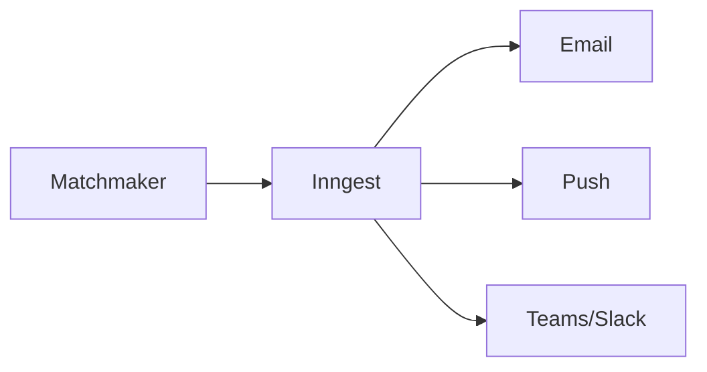

## Integrações Internas

### Módulo de Talentos

O Matchmaker consome dados de Talentos para:

- **Perfis**: Informações para cálculo de compatibilidade
- **Competências**: Skills e níveis de proficiência
- **Histórico**: Experiências e formações
- **Interesses**: Áreas de interesse declaradas

### Módulo de Pulsos

Integração bidirecional com Pulsos:

- **Pesquisas de Satisfação**: Pós-conexão para medir efetividade
- **Engajamento**: Dados de engajamento influenciam recomendações

### Módulo Admin

- **Permissões**: Controle de quem pode criar oportunidades
- **Hierarquia**: Definição de aprovadores
- **Audit**: Registro de ações

### Módulo de Insights

O Matchmaker alimenta Insights com:

- Taxa de preenchimento de vagas
- Tempo médio de contratação interna
- Score médio dos candidatos
- Taxa de sucesso de matches

## Integrações Externas

### Notificações



**Eventos de notificação:**

| Evento | Destinatário | Canal |
|--------|--------------|-------|
| Nova oportunidade compatível | Talento | Email, Push |
| Nova candidatura | Gestor | Email, Teams |
| Status atualizado | Talento | Email, Push |
| Aprovação pendente | Gestor atual | Email |
| Prazo expirando | Gestor | Email |

### Webhooks

Eventos disponíveis para integração:

```json
{
  "event": "matchmaker.application.status_changed",
  "timestamp": "2024-01-15T14:00:00Z",
  "data": {
    "application_id": "uuid",
    "opportunity_id": "uuid",
    "talent_id": "uuid",
    "old_status": "pending",
    "new_status": "under_review"
  }
}
```

**Eventos disponíveis:**

- `matchmaker.opportunity.published`
- `matchmaker.opportunity.closed`
- `matchmaker.application.submitted`
- `matchmaker.application.status_changed`
- `matchmaker.connection.confirmed`

### ATS Externos

O Matchmaker pode se integrar com sistemas de ATS externos:

<CardGroup cols={2}>
  <Card title="Gupy" icon="link">
    Sincronização de vagas e candidatos
  </Card>
  <Card title="Greenhouse" icon="link">
    Exportação de candidatos internos
  </Card>
  <Card title="Workday" icon="link">
    Integração com módulo de recrutamento
  </Card>
  <Card title="SAP SuccessFactors" icon="link">
    Sincronização de mobilidade interna
  </Card>
</CardGroup>

### Make (Automações)

Cenários de automação comuns:

- **Sync com calendário**: Agendamento automático de entrevistas
- **Alertas de prazo**: Notificação quando prazos estão próximos
- **Relatórios automáticos**: Envio periódico de status
- **Integração com HRIS**: Atualização de registros após transferência
