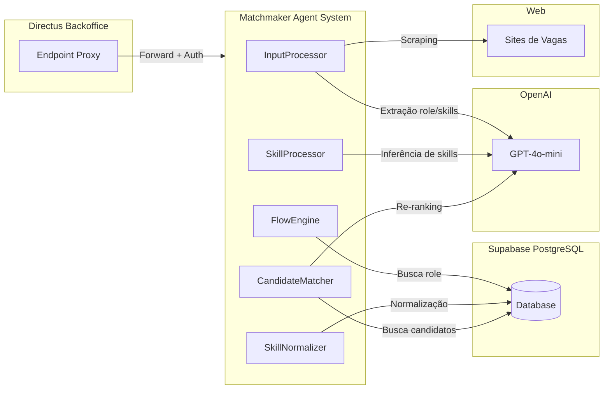

## Visão Geral

O Matchmaker integra com 4 sistemas principais: OpenAI para processamento de linguagem natural, Supabase/PostgreSQL como banco de dados, Directus como proxy autenticado e web scraping para extração de URLs.

## Diagrama de Integrações


```mermaid
flowchart LR
    subgraph matchmaker [Matchmaker Agent System]
        IP[InputProcessor]
        FE[FlowEngine]
        SP[SkillProcessor]
        SN[SkillNormalizer]
        CM[CandidateMatcher]
    end

    subgraph openai [OpenAI]
        GPT[GPT-4o-mini]
    end

    subgraph supabase [Supabase PostgreSQL]
        DB[(Database)]
    end

    subgraph directus [Directus Backoffice]
        Proxy[Endpoint Proxy]
    end

    subgraph web [Web]
        Sites[Sites de Vagas]
    end

    IP -->|Extração role/skills| GPT
    IP -->|Scraping| Sites
    SP -->|Inferência de skills| GPT
    CM -->|Re-ranking| GPT

    FE -->|Busca role| DB
    SN -->|Normalização| DB
    CM -->|Busca candidatos| DB

    Proxy -->|Forward + Auth| matchmaker
```

---

## OpenAI (GPT-4o-mini)

O Matchmaker usa o modelo `gpt-4o-mini` da OpenAI em 3 pontos do pipeline.

### Uso no InputProcessor

**Propósito**: Extrair role, skills e seniority de texto em linguagem natural.

| Aspecto | Detalhe |
|---------|---------|
| **Modelo** | `gpt-4o-mini` |
| **Quando** | Sempre (para qualquer tipo de input) |
| **Input** | Texto da vaga ou conteúdo scrapeado |
| **Output** | `{ role, skills[], seniority, area, confidence }` |

### Uso no SkillProcessor

**Propósito**: Inferir skills adicionais quando o contexto permite.

| Aspecto | Detalhe |
|---------|---------|
| **Quando** | `should_infer_skills = true` (flag do FlowEngine) |
| **Contexto** | Role não encontrado na base, ou role com poucas skills |
| **Input** | Contexto: `"role:Product Manager"` ou `"area:Tecnologia"` |
| **Output** | Lista de skills inferidas |

### Uso no CandidateMatcher

**Propósito**: Re-rankear candidatos quando há skills extras do input.

| Aspecto | Detalhe |
|---------|---------|
| **Quando** | `should_rerank = true` (flag do FlowEngine) |
| **Input** | Top 20 candidatos + skills + contexto |
| **Output** | Candidatos re-ordenados por relevância |

<Warning>
  A chamada LLM na camada 4 de busca de role é a mais custosa em tempo (~500-2000ms). O sistema prioriza as camadas anteriores (exact, alias, trigram) para evitar essa chamada sempre que possível.
</Warning>

---

## Supabase / PostgreSQL

O banco de dados é o coração do Matchmaker, armazenando toda a base taxonômica.

### Conexão

| Aspecto | Detalhe |
|---------|---------|
| **Tipo** | PostgreSQL via Supabase |
| **Driver** | `asyncpg` (Python, async) |
| **Pool** | Pool de conexões compartilhado |
| **Variável** | `SUPABASE_DB_URL` ou `DATABASE_URL` |

### Extensões Utilizadas

| Extensão | Uso | Criação |
|----------|-----|---------|
| `pg_trgm` | Busca fuzzy por similaridade trigram em roles e skills | `CREATE EXTENSION IF NOT EXISTS pg_trgm` |
| `vector` | Embeddings para normalização semântica de skills (camada 3) | Nativa do Supabase |

### Queries Principais

**Busca exata de role (camada 1)**:
```sql
SELECT id, name, description, area, band
FROM roles
WHERE LOWER(name) = LOWER($1)
  AND (status = 'published' OR status = 'active')
LIMIT 1
```

**Busca por alias (camada 2)**:
```sql
SELECT r.id, r.name, r.description, r.area, r.band
FROM role_aliases ra
JOIN roles r ON r.id = ra.role_id
WHERE LOWER(ra.alias) = LOWER($1)
LIMIT 1
```

**Busca por similaridade trigram (camada 3)**:
```sql
SELECT id, name, description, area, band, similarity(name, $1) as sim
FROM roles
WHERE name % $1
  AND (status = 'published' OR status = 'active')
ORDER BY sim DESC
LIMIT 5
```

**Busca de skills do role**:
```sql
SELECT s.id, s.name, rs.importance
FROM role_skills rs
JOIN skills s ON s.id = rs.skill_id
WHERE rs.role_id = $1
```

**Busca de candidatos por skills**:
```sql
SELECT du.id, du.first_name, du.last_name, du.email,
       COUNT(us.skill_id) as matching_count
FROM directus_users du
JOIN user_skills us ON us.user_id = du.id
WHERE us.skill_id = ANY($1)
  AND us.proficiency >= $2
GROUP BY du.id
ORDER BY matching_count DESC
LIMIT $3
```

---

## Directus Backoffice (Proxy)

O Directus atua como **proxy autenticado** entre o frontend e o Agent System.

### Endpoint Extension

| Aspecto | Detalhe |
|---------|---------|
| **Localização** | `extensions/endpoints/src/matchmaker/index.js` |
| **ID** | `matchmaker` |
| **Base URL** | `/matchmaker` |

### Funcionalidades do Proxy

| Feature | Implementação |
|---------|--------------|
| **Autenticação** | Valida `req.accountability.user` (sessão Directus) |
| **Rate Limiting** | 10 req/min por usuário (key: `matchmaker:{userId}`) |
| **Logging** | Insert em `matchmaker_search_logs` (assíncrono) |
| **Timeout** | 120 segundos via `fetchWithTimeout` |
| **Rastreabilidade** | Headers `X-Request-ID`, `X-Execution-Time`, `X-RateLimit-Remaining` |
| **Streaming** | Proxy SSE transparente para o endpoint `/search/stream` |

### Variáveis de Ambiente

| Variável | Descrição | Obrigatória |
|----------|-----------|-------------|
| `AGENT_SYSTEM_URL` | URL base do Agent System | Sim |

<Note>
  Se `AGENT_SYSTEM_URL` não estiver configurada, o endpoint retorna HTTP 503 (Service Unavailable) com mensagem orientando contato com o administrador.
</Note>

---

## Web Scraping

O InputProcessor faz scraping de URLs de vagas para extrair o conteúdo da descrição.

### Stack

| Componente | Tecnologia |
|------------|------------|
| **HTTP Client** | `httpx` (async) |
| **Parser** | `BeautifulSoup4` |

### Sites Suportados

O scraper é **genérico** — funciona com qualquer URL pública. Sites comumente usados:

| Site | URL Pattern |
|------|-------------|
| LinkedIn Jobs | `linkedin.com/jobs/view/*` |
| Greenhouse | `job-boards.greenhouse.io/*` |
| Gupy | `*.gupy.io/job/*` |
| Lever | `jobs.lever.co/*` |
| Qualquer outro | Qualquer URL pública com descrição de vaga |

### Fallback

Se o scraping falhar (site bloqueado, timeout, etc.):
1. Emite warning via streaming: "Não foi possível analisar a URL"
2. Sugere ao usuário colar a descrição manualmente
3. Tenta processar qualquer texto adicional do input
