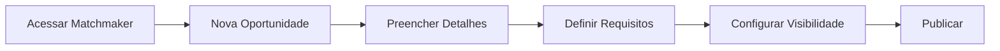
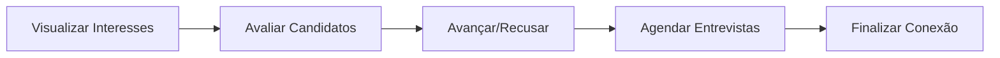
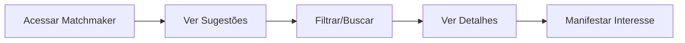
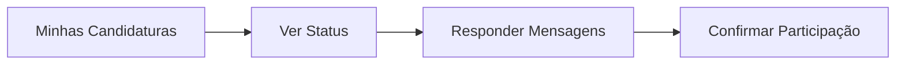
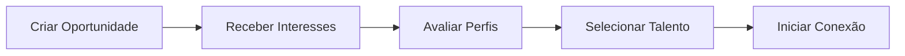
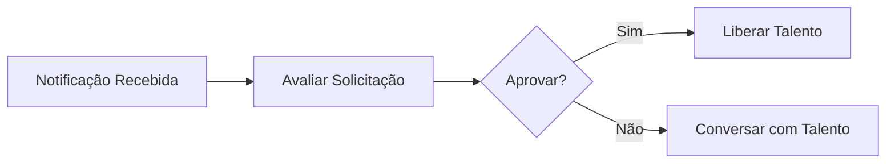

## Jornada do RH

### Criar Oportunidade

**Passos detalhados:**

1. **Acessar o módulo Matchmaker** no menu lateral
2. **Criar nova oportunidade** clicando em "+ Nova Oportunidade"
3. **Preencher informações** (título, descrição, área, gestor responsável)
4. **Definir requisitos** (competências, experiência, nível)
5. **Configurar visibilidade** (toda empresa, áreas específicas)
6. **Publicar** para disponibilizar aos talentos

### Gerenciar Pipeline

## Jornada do Talento

### Explorar Oportunidades

**Pontos importantes:**

- O talento vê oportunidades ordenadas por score de compatibilidade
- Pode filtrar por tipo, área, localização
- Ao manifestar interesse, pode adicionar uma mensagem
- Recebe notificações sobre atualizações de status

### Acompanhar Candidaturas

## Jornada da Liderança

### Buscar Talentos para Projetos

### Aprovar Transferências

Quando um talento da equipe manifesta interesse em outra área:

<Note>
  A aprovação do gestor atual é necessária para transferências definitivas, mas não para projetos temporários.
</Note>
