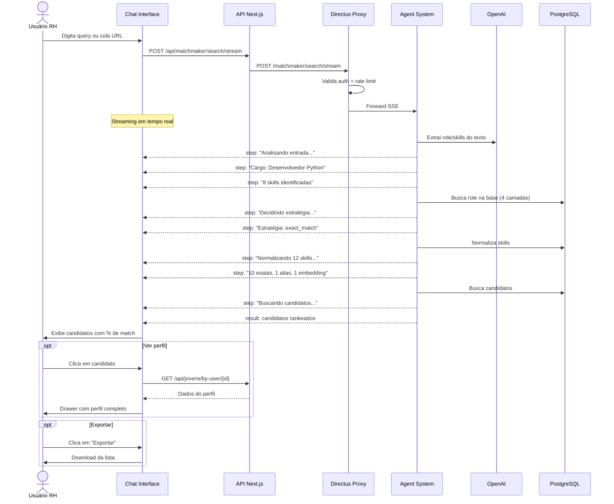
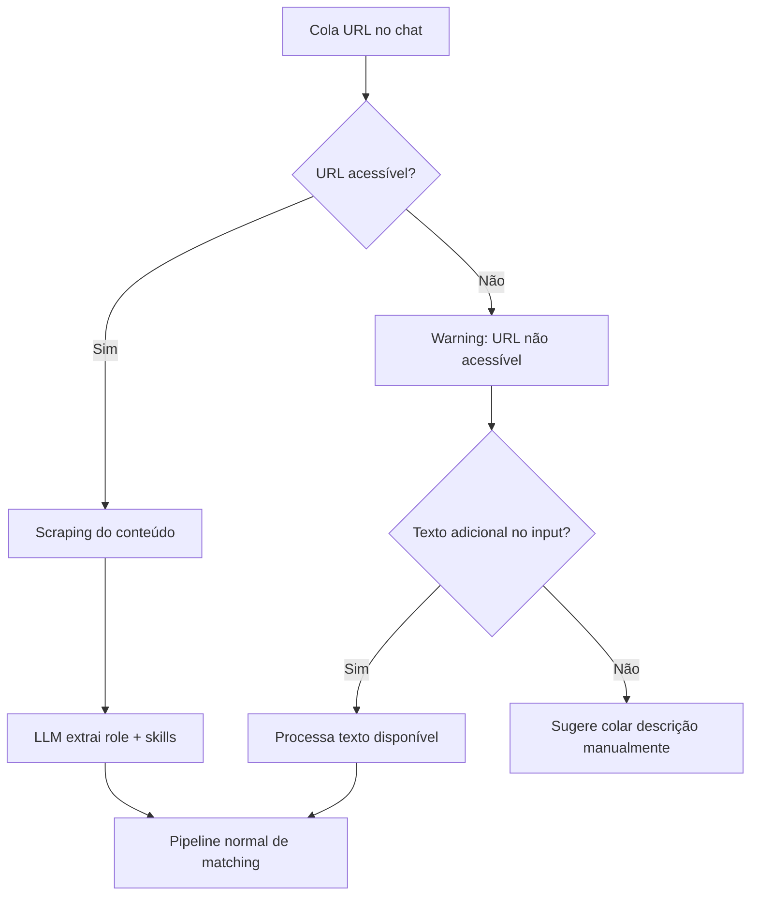
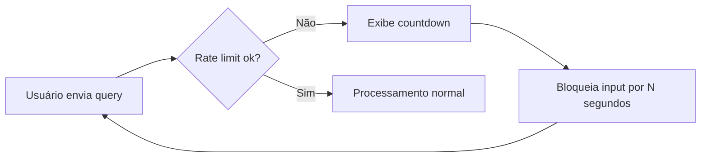

## Visão Geral

O Matchmaker possui uma jornada principal centrada no perfil **RH** que busca talentos para vagas. O fluxo é inteiramente baseado em chat com feedback em tempo real.

---

## Jornada Principal: Buscar Talentos (RH)

### Fluxo Completo

```mermaid
sequenceDiagram
    actor RH as Usuário RH
    participant Chat as Chat Interface
    participant API as API Next.js
    participant Proxy as Directus Proxy
    participant Agent as Agent System
    participant LLM as OpenAI
    participant DB as PostgreSQL

    RH->>Chat: Digita query ou cola URL
    Chat->>API: POST /api/matchmaker/search/stream
    API->>Proxy: POST /matchmaker/search/stream
    Proxy->>Proxy: Valida auth + rate limit
    Proxy->>Agent: Forward SSE

    Note over Chat: Streaming em tempo real

    Agent->>LLM: Extrai role/skills do texto
    Agent-->>Chat: step: "Analisando entrada..."
    Agent-->>Chat: step: "Cargo: Desenvolvedor Python"
    Agent-->>Chat: step: "8 skills identificadas"

    Agent->>DB: Busca role na base (4 camadas)
    Agent-->>Chat: step: "Decidindo estratégia..."
    Agent-->>Chat: step: "Estratégia: exact_match"

    Agent->>DB: Normaliza skills
    Agent-->>Chat: step: "Normalizando 12 skills..."
    Agent-->>Chat: step: "10 exatas, 1 alias, 1 embedding"

    Agent->>DB: Busca candidatos
    Agent-->>Chat: step: "Buscando candidatos..."
    Agent-->>Chat: result: candidatos rankeados

    Chat->>RH: Exibe candidatos com % de match

    opt Ver perfil
        RH->>Chat: Clica em candidato
        Chat->>API: GET /api/jovens/by-user/{id}
        API-->>Chat: Dados do perfil
        Chat->>RH: Drawer com perfil completo
    end

    opt Exportar
        RH->>Chat: Clica em "Exportar"
        Chat->>RH: Download da lista
    end
```

### Passo a Passo

#### 1. Abrir o Matchmaker

O usuário RH acessa o Matchmaker pelo menu lateral da plataforma.

**Rota**: `/{account}/matchmaker`

Ao abrir, vê a tela inicial com:
- Campo de chat vazio
- Sugestões de queries exemplo
- Sidebar de conversas anteriores

#### 2. Digitar a Query

O usuário pode:
- **Descrever a vaga**: "Preciso de um desenvolvedor Python sênior com experiência em microsserviços, AWS e FastAPI"
- **Colar uma URL**: `https://linkedin.com/jobs/view/123456789`
- **Combinar**: "Quero alguém para essa vaga https://..."
- **Listar skills**: "Python, React, Docker, AWS"

#### 3. Acompanhar o Processamento

Após enviar, o chat exibe steps em tempo real:

| Step | Mensagem | Duração |
|------|----------|---------|
| 1 | "Iniciando Matchmaker..." | imediato |
| 2 | "Analisando entrada..." | ~100ms |
| 3 | "Tipo: text" ou "Tipo: url" | imediato |
| 4 | "Cargo: [nome]" | ~500ms-2s |
| 5 | "X skills identificadas" | imediato |
| 6 | "Decidindo estratégia..." | ~100ms |
| 7 | "Estratégia: exact_match" | imediato |
| 8 | "Processando skills..." | ~200ms |
| 9 | "Normalizando N skills..." | ~200ms |
| 10 | "Buscando candidatos..." | ~500ms |
| 11 | "X candidatos encontrados" | imediato |

<Tip>
  Os steps são colapsáveis — quando o processamento termina, apenas os últimos 4 ficam visíveis. O usuário pode expandir para ver todos.
</Tip>

#### 4. Analisar Resultados

O chat exibe:

**Skills utilizadas** (organizadas em grupos):
- Skills do Input (extraídas do texto do usuário)
- Skills do Role (carregadas da base taxonômica)
- Total de Skills (usadas no matching)

**Lista de candidatos** ordenada por match_score:
- Nome e cargo atual
- Percentual de match (ex: 85%)
- Skills em comum
- Explicação do match

#### 5. Ver Perfil do Talento

Ao clicar em um candidato, abre um **drawer lateral** com:
- Dados pessoais
- Skills completas
- Histórico de carreira
- Percentual de match com target role

#### 6. Exportar Candidatos

Botão de exportar aparece após os resultados, permitindo baixar a lista de candidatos encontrados.

#### 7. Nova Busca

O usuário pode fazer múltiplas buscas na mesma conversa. Cada busca gera uma nova mensagem com seus próprios steps e resultados.

---

## Jornada: Busca com URL (variação)

```mermaid
flowchart TD
    A[Cola URL no chat] --> B{URL acessível?}
    B -->|Sim| C[Scraping do conteúdo]
    C --> D[LLM extrai role + skills]
    D --> E[Pipeline normal de matching]

    B -->|Não| F[Warning: URL não acessível]
    F --> G{Texto adicional no input?}
    G -->|Sim| H[Processa texto disponível]
    G -->|Não| I[Sugere colar descrição manualmente]

    H --> E
```

**Mensagens de progresso específicas para URL**:

| Step | Mensagem |
|------|----------|
| 1 | "Capturando dados da página..." |
| 2 | "Ainda estamos trabalhando..." |
| 3 | "Extraindo conteúdo..." |
| 4 | "URL scrapeada com sucesso" |

---

## Jornada: Gerenciar Conversas

O Matchmaker mantém um **histórico de conversas** persistente:

| Ação | Descrição |
|------|-----------|
| **Nova conversa** | Botão "+" na sidebar cria nova conversa |
| **Alternar** | Clicar em conversa anterior carrega seu histórico |
| **Renomear** | Editar título da conversa |
| **Excluir** | Remover conversa do histórico |

<Note>
  O histórico de conversas é armazenado localmente no navegador. As buscas são registradas no servidor via `matchmaker_search_logs`.
</Note>

---

## Cenários de Erro

### Rate Limit Excedido

```mermaid
flowchart LR
    A[Usuário envia query] --> B{Rate limit ok?}
    B -->|Não| C[Exibe countdown]
    C --> D[Bloqueia input por N segundos]
    D --> A
    B -->|Sim| E[Processamento normal]
```

O chat exibe um **banner de aviso** com countdown até liberar nova requisição.

### Timeout

Se o processamento exceder 120 segundos:
- Mensagem: "A busca demorou muito. Tente uma query mais específica."
- Sugestão: reduzir escopo da query

### Nenhum Resultado

Se a estratégia resultar em `IMPOSSIBLE`:
- Mensagem: "Não foi possível identificar role, área ou skills para busca"
- Sugestão: fornecer mais detalhes sobre o perfil desejado
