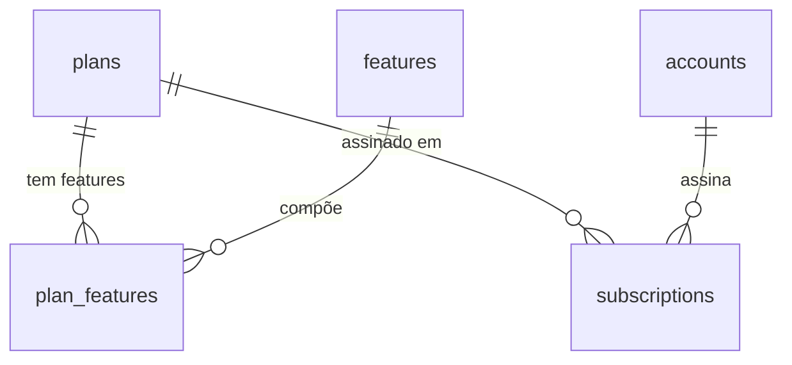

## Visão Geral

O domínio de **Planos e Assinaturas** define o que cada [Conta](/documentation/domains/accounts/index)
contrata. Um **plano** (`plans`) agrupa **features** (`features`) com limites de uso; uma
**assinatura** (`subscriptions`) vincula uma conta a um plano por um período.



## Modelo de dados

| Tabela | Campos principais | Papel |
|---|---|---|
| `plans` | `id`, `name`, `description`, `trial_period` | Plano contratável |
| `features` | `id`, `name`, `type`, `normalized_name` | Capacidade que um plano libera |
| `plan_features` | `plan_id`, `feature_id`, `use_limit`, `period` | N:N plano↔feature com limite de uso e janela |
| `subscriptions` | `id`, `plan_id`, `account_id`, `start_date`, `due_date` | Assinatura de uma conta a um plano |

Schemas em `leapy/packages/db/src/schema/{plans,features,plan-features,subscriptions}.ts`.

## Regra de assinatura vigente

A única regra de domínio (`plan.rules.ts`) é o predicado `isSubscriptionActive`:

```
isSubscriptionActive(sub):
  - due_date == null  → true   (assinatura perpétua)
  - due_date  > agora → true
  - caso contrário    → false
```

<Note>
A query que busca a assinatura vigente (`getCurrentSubscription`) fica no **repositório**
(é SQL); o domínio expõe só o predicado `isSubscriptionActive`, usado tanto na query quanto
em testes unitários sem tocar o banco. Quando há múltiplas assinaturas ativas (drift de dados
legado), o caller ordena por `start_date DESC` para pegar a mais recente. O `switch-account-plan`
usa `FOR UPDATE` para evitar novas ambiguidades.
</Note>

## Use cases

| Use case | Propósito |
|---|---|
| `backoffice/plans/list-plans` | Lista os planos disponíveis |
| `backoffice/accounts/get-account-subscription` | Assinatura vigente de uma conta |
| `backoffice/accounts/switch-account-plan` | Troca o plano de uma conta (com lock) |

## Referências de código

| Repo | Arquivo | Propósito |
|---|---|---|
| `leapy` | `packages/db/src/schema/plans.ts`, `features.ts`, `plan-features.ts`, `subscriptions.ts` | Schemas |
| `leapy` | `packages/core/src/domain/plan.rules.ts` | `isSubscriptionActive` |
| `leapy` | `packages/core/src/use-cases/backoffice/plans/`, `.../accounts/` | Listagem, leitura e troca de plano |

## Veja também

<CardGroup cols={2}>
  <Card title="Contas" icon="building-user" href="/documentation/domains/accounts/index">
    A conta que assina um plano
  </Card>
  <Card title="Arquitetura do Monorepo" icon="cubes" href="/documentation/architecture/monorepo-core">
    A camada packages/core onde planos são modelados
  </Card>
</CardGroup>
