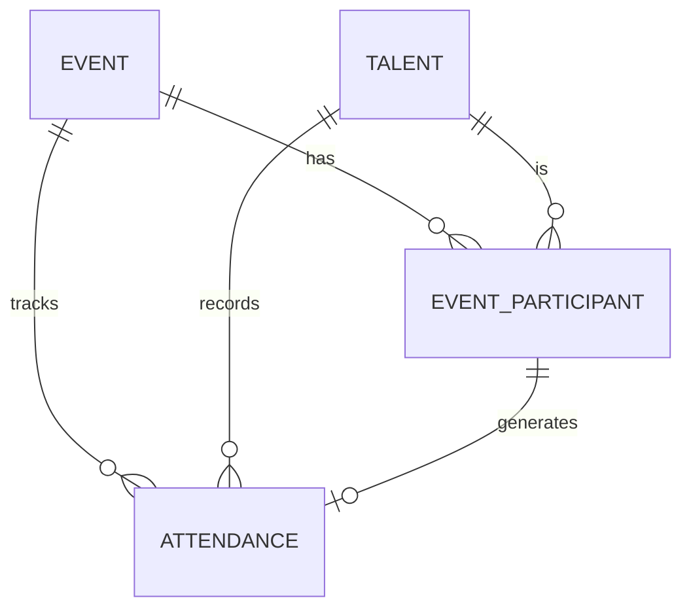
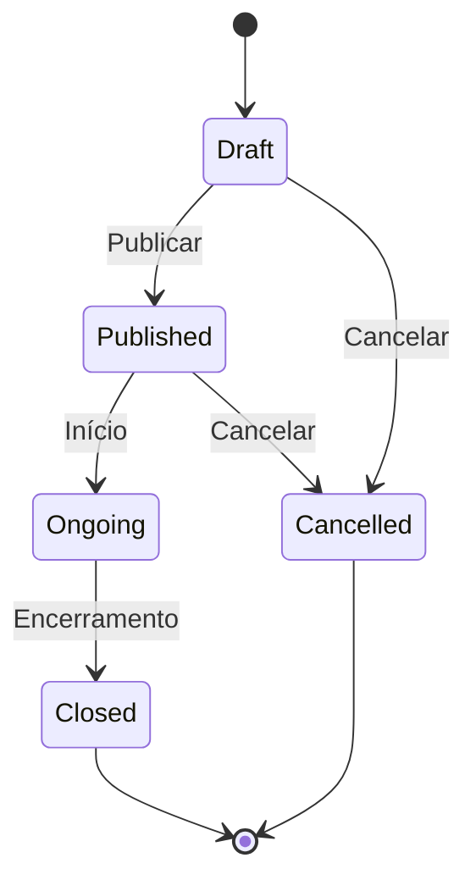

## Diagrama de Entidades

## Entidades Principais

### Event (Evento)

Representa um evento ou atividade com controle de presença.

| Campo | Tipo | Descrição |
|-------|------|-----------|
| `id` | UUID | Identificador único |
| `tenant_id` | UUID | Tenant proprietário |
| `title` | string | Título do evento |
| `description` | text | Descrição |
| `type` | enum | Tipo (training, meeting, workshop) |
| `status` | enum | Status (draft, published, ongoing, closed) |
| `start_datetime` | datetime | Data/hora de início |
| `end_datetime` | datetime | Data/hora de término |
| `location` | string | Local do evento |
| `location_lat` | decimal | Latitude (geolocalização) |
| `location_lng` | decimal | Longitude (geolocalização) |
| `is_online` | boolean | Se é evento online |
| `online_url` | string | URL da reunião online |
| `capacity` | integer | Capacidade máxima |
| `checkin_method` | enum | Método de check-in |
| `requires_checkout` | boolean | Se check-out é obrigatório |
| `organizer_id` | UUID | Organizador |

### Event Participant (Participante)

Convite e confirmação de participante.

| Campo | Tipo | Descrição |
|-------|------|-----------|
| `id` | UUID | Identificador único |
| `event_id` | UUID | Evento |
| `talent_id` | UUID | Talento convidado |
| `status` | enum | Status (invited, confirmed, declined, waitlist) |
| `is_mandatory` | boolean | Se participação é obrigatória |
| `invited_at` | datetime | Data do convite |
| `responded_at` | datetime | Data da resposta |
| `decline_reason` | string | Motivo da recusa |

### Attendance (Presença)

Registro de presença no evento.

| Campo | Tipo | Descrição |
|-------|------|-----------|
| `id` | UUID | Identificador único |
| `event_id` | UUID | Evento |
| `talent_id` | UUID | Talento |
| `participant_id` | UUID | Participante (convite) |
| `checkin_at` | datetime | Horário do check-in |
| `checkout_at` | datetime | Horário do check-out |
| `checkin_method` | enum | Método usado no check-in |
| `checkin_location` | point | Localização do check-in |
| `status` | enum | Status da presença |
| `duration_minutes` | integer | Tempo de permanência |
| `notes` | text | Observações |

## Status do Evento

## Status da Presença

| Status | Descrição |
|--------|-----------|
| `present` | Presente (check-in e check-out válidos) |
| `late` | Presente com atraso |
| `partial` | Presença parcial (saiu antes) |
| `absent` | Ausente |
| `justified` | Ausência justificada |
| `no_show` | Confirmou mas não compareceu |

## Métodos de Check-in

| Método | Código | Descrição |
|--------|--------|-----------|
| QR Code | `qr_code` | Escaneamento de código |
| Link | `link` | Acesso via URL |
| Geolocalização | `geolocation` | Validação por GPS |
| Manual | `manual` | Registro pelo organizador |
| Automático | `auto` | Sistema registrou automaticamente |
