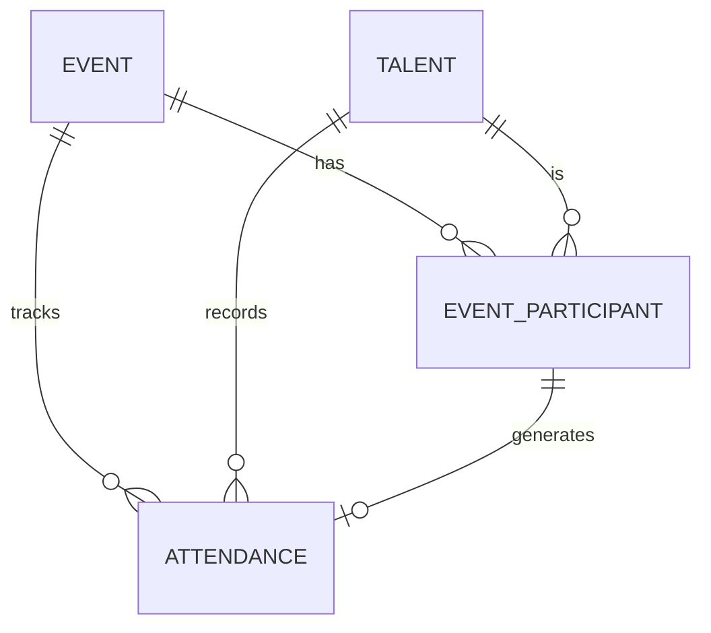
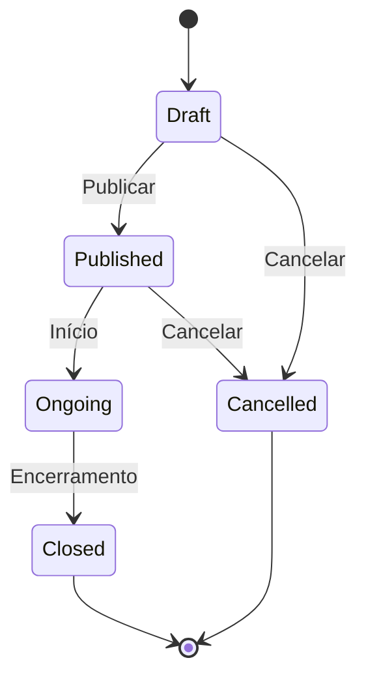

## Diagrama de Entidades

```mermaid
erDiagram
    EVENT ||--o{ EVENT_PARTICIPANT : has
    EVENT ||--o{ ATTENDANCE : tracks
    TALENT ||--o{ EVENT_PARTICIPANT : is
    TALENT ||--o{ ATTENDANCE : records
    EVENT_PARTICIPANT ||--o| ATTENDANCE : generates
```

## Entidades Principais

### Event (Evento)

Representa um evento ou atividade com controle de presença.

| Campo | Tipo | Descrição |
|-------|------|-----------|
| `id` | UUID | Identificador único |
| `tenant_id` | UUID | Tenant proprietário |
| `title` | string | Título do evento |
| `description` | text | Descrição |
| `type` | enum | Tipo (training, meeting, workshop) |
| `status` | enum | Status (draft, published, ongoing, closed) |
| `start_datetime` | datetime | Data/hora de início |
| `end_datetime` | datetime | Data/hora de término |
| `location` | string | Local do evento |
| `location_lat` | decimal | Latitude (geolocalização) |
| `location_lng` | decimal | Longitude (geolocalização) |
| `is_online` | boolean | Se é evento online |
| `online_url` | string | URL da reunião online |
| `capacity` | integer | Capacidade máxima |
| `checkin_method` | enum | Método de check-in |
| `requires_checkout` | boolean | Se check-out é obrigatório |
| `organizer_id` | UUID | Organizador |

### Event Participant (Participante)

Convite e confirmação de participante.

| Campo | Tipo | Descrição |
|-------|------|-----------|
| `id` | UUID | Identificador único |
| `event_id` | UUID | Evento |
| `talent_id` | UUID | Talento convidado |
| `status` | enum | Status (invited, confirmed, declined, waitlist) |
| `is_mandatory` | boolean | Se participação é obrigatória |
| `invited_at` | datetime | Data do convite |
| `responded_at` | datetime | Data da resposta |
| `decline_reason` | string | Motivo da recusa |

### Attendance (Presença)

Registro de presença no evento.

| Campo | Tipo | Descrição |
|-------|------|-----------|
| `id` | UUID | Identificador único |
| `event_id` | UUID | Evento |
| `talent_id` | UUID | Talento |
| `participant_id` | UUID | Participante (convite) |
| `checkin_at` | datetime | Horário do check-in |
| `checkout_at` | datetime | Horário do check-out |
| `checkin_method` | enum | Método usado no check-in |
| `checkin_location` | point | Localização do check-in |
| `status` | enum | Status da presença |
| `duration_minutes` | integer | Tempo de permanência |
| `notes` | text | Observações |

## Status do Evento

```mermaid
stateDiagram-v2
    [*] --> Draft
    Draft --> Published : Publicar
    Published --> Ongoing : Início
    Ongoing --> Closed : Encerramento
    Draft --> Cancelled : Cancelar
    Published --> Cancelled : Cancelar
    Closed --> [*]
    Cancelled --> [*]
```

## Status da Presença

| Status | Descrição |
|--------|-----------|
| `present` | Presente (check-in e check-out válidos) |
| `late` | Presente com atraso |
| `partial` | Presença parcial (saiu antes) |
| `absent` | Ausente |
| `justified` | Ausência justificada |
| `no_show` | Confirmou mas não compareceu |

## Métodos de Check-in

| Método | Código | Descrição |
|--------|--------|-----------|
| QR Code | `qr_code` | Escaneamento de código |
| Link | `link` | Acesso via URL |
| Geolocalização | `geolocation` | Validação por GPS |
| Manual | `manual` | Registro pelo organizador |
| Automático | `auto` | Sistema registrou automaticamente |

## Schema Real em Produção — Pipeline Zoom

As três coleções abaixo materializam o pipeline descrito em
[Pipeline Zoom → Backoffice](/documentation/domains/presences/pipeline-zoom-backoffice).
Esta é a representação física **em produção** (snapshot 28/05/2026).

### `report_presenca_zoom` — Fonte de Verdade

Uma linha por jovem por encontro. ~107.000 registros em produção.

| Campo | Tipo | Descrição |
|---|---|---|
| `id` | integer (PK) | Identificador |
| `jovem` | integer (FK) | → `Jovens.id`. **Atenção: nome é `jovem`, não `jovem_id`.** |
| `turma` | integer (FK) | → `Turmas.id` |
| `empresa` | integer (FK) | → `Empresas.id` |
| `escola` | integer | Identificador de escola/polo |
| `inicio_contrato`, `fim_contrato` | integer | Snapshot da janela contratual |
| `email_zoom` | varchar | Email usado na sessão Zoom (pode diferir de `Jovens.E-mail corporativo`) |
| `meeting_id`, `occurrence_id` | varchar (NOT NULL) | Identificadores Zoom |
| `meeting_name`, `meeting_date` | varchar / timestamp | Metadados do encontro |
| `entrada`, `saida` | timestamp | Entrada/saída da sala |
| `duracao` | integer | Segundos no encontro |
| `presenca` | varchar | **Status final** — ver valores abaixo |
| `sugestao_presenca` | varchar | Heurística do flow `[Parte 1]` (não confundir com `presenca`) |
| `observacoes` | text | Texto livre |
| `justificativa` | varchar | Categoria escolhida pelo jovem (ver [Justificativas](/documentation/domains/presences/justificativas)) |
| `descricao_justificativa` | text | Texto da justificativa |
| `anexo_justificativa` | uuid | Arquivo Directus |
| `status_justificativa` | varchar (NOT NULL) | `pendente` / `aprovada` / `reprovada` / `eco-importacao-manual` |
| `csat_in`, `csat_out` | integer | Pesquisa de satisfação |
| `last_access` | timestamp | Última atividade do jovem na sala |
| `meeting_date_day`, `meeting_date_month`, `meeting_date_year` | int/varchar/int | Denormalização |
| `nome_opcional`, `email_opcional` | varchar | Fallback quando vinculação automática falhou |

**Valores canônicos de `presenca`:**

| Valor | Volume em prod | Semântica |
|---|---|---|
| `presente` | ~80.000 | Jovem compareceu no horário |
| `presente_com_atraso` | ~12.000 | Compareceu fora do horário esperado |
| `ausente` | ~8.000 | Não compareceu — origem majoritária: flow `Calcular Faltas II` |
| `abono` | ~3.000 | Justificativa de falta aprovada pelo PL ([detalhes](/documentation/domains/presences/justificativas)) |
| `ferias` | ~1.000 | Jovem em férias no dia |

<Note>
  Há ~315 registros com valores não-canônicos (variantes com espaços, capitalização —
  `presente `, ` presente`, `Presente`; sinônimos legados — `inativo`, `desligado`,
  `ausencia_abonada`). Filtros robustos devem usar `_in: ["presente", "presente_com_atraso", "abono"]`
  pra contar presença efetiva.
</Note>

**Valores de `status_justificativa`:**

| Valor | Volume | Semântica |
|---|---|---|
| `pendente` | ~95.000 | Default — sem submissão OU PL não revisou ainda |
| `eco-importacao-manual` | ~11.000 | Linha veio de import periódico de ecossistema |
| `aprovada` | ~500 | PL aprovou. Job Inngest atualiza `presenca = 'abono'` automaticamente |
| `reprovada` | ~300 | PL reprovou. `presenca` mantém valor original |

### `report_presenca_zoom_bruto` — Staging do Zoom

Uma linha por participação Zoom individual (pode haver várias por encontro se o jovem entrou
e saiu várias vezes). Consumida pelo flow `[Parte 1]` na reconciliação.

| Campo | Tipo | Descrição |
|---|---|---|
| `id` | integer (PK) | Identificador |
| `meeting_id`, `occurrence_id` | varchar (NOT NULL) | Identificadores Zoom |
| `meeting_name`, `meeting_date` | varchar / timestamp | |
| `meeting_duration` | integer (NOT NULL) | Duração total do encontro |
| `empresa_id`, `turma_id`, `jovem_id` | **varchar** | ⚠️ `character varying`, não integer — diferente de `report_presenca_zoom` |
| `email` | varchar | Email do participante no Zoom |
| `duration` | integer (NOT NULL) | Tempo do participante na sala |
| `join_time`, `leave_time` | timestamp (NOT NULL) | Entrada/saída |
| `calculated` | boolean (NOT NULL) | `true` após `[Parte 3]` consumir esta linha |
| `participant_uuid` | varchar | UUID Zoom |
| `imersao` | boolean | `true` se evento de imersão (regras especiais) |
| `matricula` | varchar | Vínculo com matrícula (não é id Directus) |
| `csat_in`, `csat_out` | varchar | Captura da pesquisa Zoom |
| `nome_opcional`, `email_opcional` | varchar | Fallback |

<Note>
  **Pegadinha de FK:** em `report_presenca_zoom` a FK pra jovem é `jovem` (integer). Em
  `report_presenca_zoom_bruto` é `jovem_id` (varchar). Verificar via `directus_schema_inspect`
  antes de filtrar.
</Note>

### `report_presenca_logs` — Log do Pipeline

Uma linha por execução do cenário Make `Presenças Zoom` pra um meeting. Volume baixo (~2.000
registros total, 5–10/dia útil). **Não confundir com log por jovem** — é log por meeting
processado.

| Campo | Tipo | Descrição |
|---|---|---|
| `id` | integer (PK) | |
| `meeting_id`, `occurence_id` | varchar | Identificadores (sic — `occurence` sem segundo `r` no schema) |
| `meeting_name`, `meeting_date`, `meeting_duration` | varchar / timestamp / varchar | |
| `success` | boolean | `true` se coleta + escrita no bruto deu certo |
| `calculated` | boolean | `true` se já processado pela `[Parte 3]` |
| `user_created`, `date_created` | uuid / timestamp | Auditoria Directus padrão |
