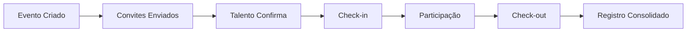

## Visão Geral

O módulo de Presenças gerencia o registro e acompanhamento de presença dos colaboradores em atividades, eventos e no dia a dia de trabalho.

## Funcionalidades Principais

<CardGroup cols={2}>
  <Card title="Registro de Presença" icon="clock">
    Check-in e check-out em atividades e eventos.
  </Card>
  <Card title="Eventos e Atividades" icon="calendar">
    Gestão de eventos com controle de participação.
  </Card>
  <Card title="Relatórios" icon="chart-bar">
    Análise de taxas de presença e participação.
  </Card>
  <Card title="Integrações" icon="plug">
    Conexão com sistemas de ponto e calendário.
  </Card>
</CardGroup>

## Tipos de Presença

| Tipo | Descrição |
|------|-----------|
| **Evento** | Treinamentos, workshops, reuniões |
| **Atividade Recorrente** | Reuniões semanais, check-ins |
| **Presença Diária** | Controle de jornada (opcional) |
| **Participação Online** | Eventos virtuais e webinars |

## Fluxo de Presença

## Métodos de Check-in

- **QR Code**: Escaneamento no local
- **Link Único**: Acesso via URL personalizada
- **Geolocalização**: Validação por localização
- **Manual**: Registro pelo organizador

## Próximos Passos

<Cards>
  <Card title="Jornadas" href="/documentation/domains/presences/journeys">
    Entenda os fluxos de uso
  </Card>
  <Card title="Regras de Negócio" href="/documentation/domains/presences/business-rules">
    Conheça as regras do módulo
  </Card>
  <Card title="Modelo de Dados" href="/documentation/domains/presences/data-model">
    Explore a estrutura de dados
  </Card>
</Cards>
