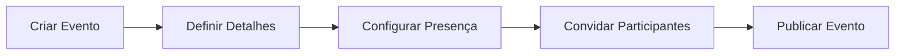
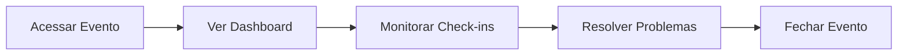
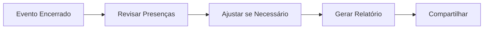
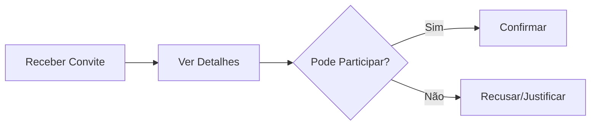
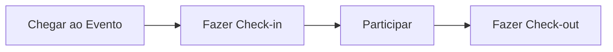
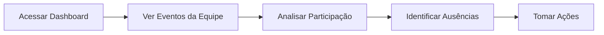

## Jornada do Organizador (RH/Liderança)

### Criar Evento com Controle de Presença

**Passos detalhados:**

1. **Criar evento** em Presenças > Eventos
2. **Definir detalhes**: título, data, local, descrição
3. **Configurar controle de presença**: método de check-in, tolerância
4. **Convidar participantes**: todos, área específica, lista manual
5. **Publicar** para disponibilizar aos convidados

### Acompanhar Presença em Tempo Real

**Durante o evento:**

- Visualizar participantes presentes
- Registrar presenças manualmente se necessário
- Resolver problemas de check-in
- Enviar lembretes para ausentes

### Consolidar e Reportar

## Jornada do Talento

### Confirmar Participação

### Registrar Presença

**Métodos de check-in:**

1. **QR Code**: Abrir app/câmera e escanear
2. **Link**: Clicar no link recebido
3. **Geolocalização**: Confirmar localização no app

### Verificar Histórico

O talento pode consultar seu histórico de participações:

- Eventos participados
- Taxa de presença
- Certificados (quando aplicável)

## Jornada da Liderança

### Monitorar Equipe

**Análises disponíveis:**

- Taxa de participação por colaborador
- Eventos com baixa adesão
- Padrões de ausência

<Note>
  Líderes só visualizam dados da sua equipe direta.
</Note>
