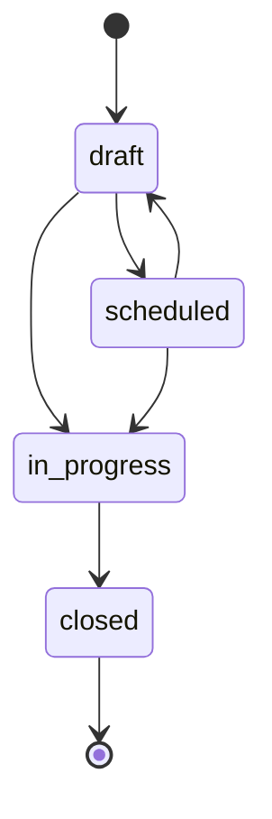

## Visão Geral

As regras de negócio das [Coletas de Pulso](/documentation/domains/pulse-collections/index)
vivem como **funções puras** em `leapy/packages/core/src/domain/pulse-collection.rules.ts` —
sem I/O e sem dependência de framework. Cada função recebe dados e devolve um boolean ou valor
calculado; o use case decide se uma regra violada vira `ValidationError`.

## Transição de estado — `canTransitionPulseCollectionStatus`

Define quais transições da máquina de estados são válidas.



| De | Para (permitido) |
|---|---|
| `draft` | `scheduled`, `in_progress` (pode pular `scheduled` se `startAt = now`) |
| `scheduled` | `in_progress`, `draft` (volta para edição) |
| `in_progress` | `closed` |
| `closed` | nenhum (terminal) |

Não permite encurtar o fluxo (`closed → in_progress`) nem voltar (`in_progress → draft`).
Reversões precisariam de uma feature explícita futura.

## Elegibilidade — `isApprenticeEligible`

Retorna `true` se o aprendiz pode entrar na audiência de uma coleta. Duas condições:

1. `statusFormacao === "em_andamento"` — único valor elegível. Estados reversíveis
   (`pausado`, `licenca`, `ferias`) são **excluídos** no v1; Ops pode adicionar manualmente
   como override.
2. `contractStartAt` existe **e** o contrato tem **≥ `minContractDays`** dias até
   `collection.startAt`. A borda é inclusiva: um contrato com exatamente `minContractDays`
   dias passa (`>=`, não `>`).

<Note>
A elegibilidade não decide pelo papel da liderança (a audiência é sempre o aprendiz) nem
considera férias dinamicamente — decisões de simplicidade do v1.
</Note>

## Remoção de audiência — `canRemoveFromAudience`

Retorna `true` se um membro pode ser removido com base no status do pulso correspondente.
Pulsos **respondidos preservam o dado** — só removem `pendente` ou `vencido`.

```
canRemoveFromAudience(pulseStatus) = pulseStatus !== "respondido"
```

## Extensão de prazo — `canExtendEndAt`

Retorna `true` se `newEndAt` pode substituir o `endAt` atual:

- Coleta `closed` é **imutável** → sempre `false`.
- `newEndAt` deve ser **estritamente posterior** ao atual (não permite encurtar nem manter —
  Ops precisa explicitar a extensão, forçando o raciocínio sobre o impacto).

## Numeração de pulso — `computeNextPulseNumber`

Retorna o próximo número de pulso de um aprendiz dado os números já usados:

- Lista vazia → `1`.
- Caso contrário → `max(existentes) + 1`.
- **Aceita gaps** (ex.: `[3, 5, 7]` → `8`), porque o pulso 4 pode ter sido apagado numa era
  pré-FK.

Para aprendizes, numera por `pulsos_jovens.pulso`; para lideranças, por `"Pulsos".pulso` do
aprendiz-alvo (não do líder respondente).

## Normalização de status legado — `normalizePulseStatus`

A coluna de status do pulso individual é `varchar` (não enum) e contém valores legados não
normalizados (capitalização variada, `draft` residual). O repositório normaliza para os três
valores canônicos antes de devolver ao domínio: `pendente`, `respondido`, `vencido`.

## Referências de código

| Arquivo | Conteúdo |
|---|---|
| `leapy/packages/core/src/domain/pulse-collection.rules.ts` | Todas as funções acima |
| `leapy/packages/core/src/use-cases/coletas/*` | Use cases que aplicam as regras |
| `leapy/packages/db/src/schema/pulse-collections.ts` | Schema (enums espelhados nas regras) |

## Veja também

<CardGroup cols={2}>
  <Card title="Coletas de Pulso" icon="layer-group" href="/documentation/domains/pulse-collections/index">
    Visão geral, máquina de estados e ciclo de vida
  </Card>
  <Card title="Coletas — Modelo de Dados" icon="database" href="/documentation/domains/pulse-collections/data-model">
    Schema das 4 tabelas da coleta
  </Card>
</CardGroup>
