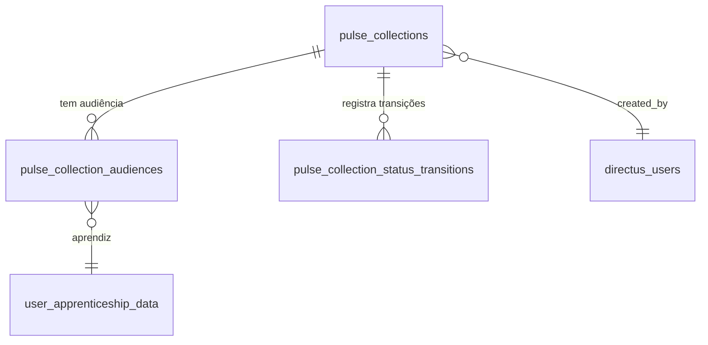

## Visão Geral

O schema de Coletas vive em `leapy/packages/db/src/schema/pulse-collections.ts` (Drizzle
ORM, PostgreSQL). São **três tabelas próprias** mais a relação com as tabelas legadas de
pulso individual (`pulsos_jovens` e `"Pulsos"`).

## Enums

| Enum | Valores | Uso |
|---|---|---|
| `target_audience` | `aprendizes`, `liderancas` | Tipo da coleta. Ops opera aprendizes; CS opera lideranças |
| `pulse_collection_status` | `draft`, `scheduled`, `in_progress`, `closed` | Máquina de estados da coleta |
| `audience_membership_reason` | `initial`, `added_manually` | Por que o aprendiz entrou na audiência |

<Note>
O `status` do **pulso individual** (em `pulsos_jovens` / `"Pulsos"`) **não** é um `pgEnum`:
a coluna é `varchar(255)` e contém valores legados não normalizados (capitalização variada,
`draft` residual). A normalização para os valores canônicos (`pendente`, `respondido`,
`vencido`) acontece no repositório, não no schema. O contrato com o `leapy-rh` é: a app só
exibe o pulso quando `status='pendente'`.
</Note>

## Tabela `pulse_collections`

A coleta como entidade agregadora — uma rodada de pulsos com janela, audiência-alvo e estado.

| Coluna | Tipo | Nulo | Default | Descrição |
|---|---|---|---|---|
| `id` | `uuid` | não | `defaultRandom()` | PK |
| `name` | `varchar(255)` | não | — | Nome da coleta |
| `target_audience` | `target_audience` | não | — | `aprendizes` ou `liderancas` |
| `status` | `pulse_collection_status` | não | `draft` | Estado atual |
| `start_at` | `timestamptz` | não | — | Início da janela |
| `end_at` | `timestamptz` | não | — | Fim da janela |
| `min_contract_days` | `integer` | não | `30` | Dias mínimos de contrato para elegibilidade |
| `created_by` | `uuid` | não | — | FK → `directus_users.id` (autor) |
| `created_at` | `timestamptz` | não | `now()` | Criação |
| `updated_at` | `timestamptz` | não | `now()` | Atualização |
| `closed_at` | `timestamptz` | sim | — | Quando foi fechada |

**Índices:**
- `pulse_collections_audience_status_idx` em `(target_audience, status)` — a listagem
  filtra muito por tipo + estado (Ops/CS veem só o seu tipo).
- `pulse_collections_scheduled_start_at_idx` em `(start_at)` **parcial**
  `WHERE status = 'scheduled'` — o cron `pulse-tick` busca coletas agendadas com janela
  já iniciada; o índice parcial mantém o B-tree pequeno.

## Tabela `pulse_collection_audiences`

Snapshot da audiência. **Append-only** com soft-remove via `removed_at` — "removido da
audiência" é semanticamente diferente de "deletado do sistema" (o aprendiz continua
existindo, só não responde mais esta coleta).

| Coluna | Tipo | Nulo | Default | Descrição |
|---|---|---|---|---|
| `id` | `uuid` | não | `defaultRandom()` | PK |
| `pulse_collection_id` | `uuid` | não | — | FK → `pulse_collections.id` (`ON DELETE CASCADE`) |
| `apprentice_id` | `integer` | não | — | FK → `user_apprenticeship_data.id` |
| `membership_reason` | `audience_membership_reason` | não | `initial` | `initial` (snapshot da criação) ou `added_manually` |
| `added_at` | `timestamptz` | não | `now()` | Quando entrou |
| `added_by` | `uuid` | não | — | FK → `directus_users.id` |
| `removed_at` | `timestamptz` | sim | — | Soft-remove |
| `removed_by` | `uuid` | sim | — | FK → `directus_users.id` |
| `removal_note` | `text` | sim | — | Motivo da remoção |

**Índices:**
- `pulse_collection_audiences_apprentice_active_idx` **unique parcial** em
  `(pulse_collection_id, apprentice_id) WHERE removed_at IS NULL` — garante 1 aprendiz
  ativo por coleta. Linhas removidas permanecem para auditoria; reincluir o mesmo
  aprendiz cria uma nova linha ativa.
- `pulse_collection_audiences_collection_active_idx` parcial em `(pulse_collection_id)
  WHERE removed_at IS NULL` — "audiências ativas desta coleta" no painel.

<Warning>
A audiência-alvo é **sempre o aprendiz**. Para coletas de `liderancas`, o CS seleciona uma
empresa, que é expandida para todos os aprendizes elegíveis. A liderança respondente é
derivada de `user_career.leader_id` na leitura do queue — **não** é gravada nesta tabela.
</Warning>

## Tabela `pulse_collection_status_transitions`

Log de auditoria **append-only** da máquina de estados. Toda transição cria uma linha.
Persistido para debugging e compliance; sem UI no v1.

| Coluna | Tipo | Nulo | Default | Descrição |
|---|---|---|---|---|
| `id` | `uuid` | não | `defaultRandom()` | PK |
| `pulse_collection_id` | `uuid` | não | — | FK → `pulse_collections.id` (`ON DELETE CASCADE`) |
| `from_status` | `pulse_collection_status` | sim | — | Estado de origem; `null` na primeira transição saindo do `draft` |
| `to_status` | `pulse_collection_status` | não | — | Estado de destino |
| `transitioned_at` | `timestamptz` | não | `now()` | Quando |
| `transitioned_by` | `uuid` | não | — | FK → `directus_users.id` |
| `note` | `text` | sim | — | Observação |

**Índice:** `pulse_collection_status_transitions_collection_idx` em `(pulse_collection_id)`.

## Relação com os pulsos individuais

Os pulsos gerados pela coleta são gravados nas tabelas legadas de pulso
(`pulsos_jovens` para aprendizes, `"Pulsos"` para lideranças), com `status='pendente'`.
O ciclo de vida do pulso individual — e o contrato de leitura com o `leapy-rh` — está
descrito em [Modelo de Dados dos Pulsos](/documentation/domains/pulses/data-model).

## Veja também

<CardGroup cols={2}>
  <Card title="Coletas de Pulso" icon="layer-group" href="/documentation/domains/pulse-collections/index">
    Visão geral, máquina de estados e ciclo de vida da coleta
  </Card>
  <Card title="Pulsos — Modelo de Dados" icon="database" href="/documentation/domains/pulses/data-model">
    Schema dos pulsos individuais (pulsos_jovens, Pulsos)
  </Card>
</CardGroup>
