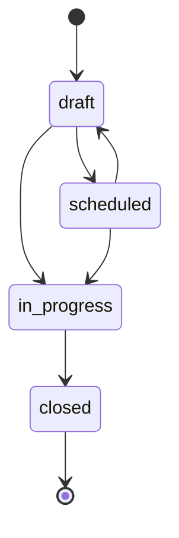
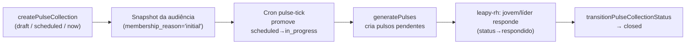

## Visão Geral

Uma **Coleta de Pulso** (`pulse_collection`) é a entidade que organiza uma rodada de
pulsos: define **quem** responde (audiência), **quando** (janela `start_at`/`end_at`) e
em que **estado** a rodada está. Ela substitui a convenção verbal antiga ("Q2 2026 –
Aprendizes") por uma entidade persistida, com auditoria e regras de negócio explícitas.

A feature vive no monorepo `leapy/packages/core` (arquitetura limpa: regras de domínio +
use cases + schema Drizzle), e o app `leapy-rh` consome os pulsos individuais gerados a
partir da coleta.

<Info>
Esta página descreve o **novo sistema de Coletas**. Os pulsos individuais (a unidade que
o jovem/líder responde) continuam descritos em [Pulsos](/documentation/domains/pulses/index).
A Coleta é a camada que orquestra a criação desses pulsos.
</Info>

## Quem usa

- **Ops** opera coletas de **aprendizes** (`target_audience = "aprendizes"`).
- **CS** opera coletas de **lideranças** (`target_audience = "liderancas"`) — nesse caso
  a audiência continua sendo o **aprendiz**, e o líder respondente é derivado de
  `user_career.leader_id` no momento da leitura (não é snapshotado na coleta).

## Máquina de estados

A coleta evolui por uma máquina de estados estrita, validada por
`canTransitionPulseCollectionStatus` em `pulse-collection.rules.ts`:

| Estado | Significado | Transições permitidas |
|---|---|---|
| `draft` | Rascunho. Audiência definida, sem pulsos gerados. | → `scheduled`, `in_progress` |
| `scheduled` | Agendada. Cron promove para `in_progress` quando `start_at <= NOW`. | → `in_progress`, `draft` (volta pra edição) |
| `in_progress` | Ativa. Pulsos gerados e visíveis no app. | → `closed` |
| `closed` | Terminal. Imutável — nenhuma transição permitida. | — |

A promoção `scheduled → in_progress` acontece via **cron** (não é avaliada
preguiçosamente na leitura). Reversões (`closed → in_progress`, `in_progress → draft`)
não são permitidas no v1.

## Ciclo de vida

### Modos de criação

`createPulseCollection` aceita três modos, que mapeiam 1-para-1 com os cards do wizard:

<Steps>
  <Step title="draft (padrão)">
    Insere a coleta com `status='draft'` e o snapshot da audiência. Sem pulsos e sem
    registro de transição. Ops edita audiência e agenda depois.
  </Step>
  <Step title="scheduled">
    Igual ao `draft`, mas com `status='scheduled'` e um registro de transição
    (`draft → scheduled`). O cron `pulse-tick` promove para `in_progress` quando a
    janela começa.
  </Step>
  <Step title="now">
    Insere com `status='in_progress'`, snapshot da audiência, transição
    (`draft → in_progress`) e chama `generatePulses` **na mesma transação**. Os pulsos
    ficam visíveis no `leapy-rh` imediatamente. Exige `start_at <= now`.
  </Step>
</Steps>

## Regras de negócio (resumo)

Definidas como funções puras em `pulse-collection.rules.ts` — sem I/O. O use case decide
se uma regra violada vira `ValidationError`. Detalhe completo em
[Regras de Negócio](/documentation/domains/pulse-collections/business-rules).

| Regra | Função | Resumo |
|---|---|---|
| Transição de estado | `canTransitionPulseCollectionStatus` | Valida a máquina de estados |
| Elegibilidade | `isApprenticeEligible` | `statusFormacao = "em_andamento"` **e** contrato com ≥ `minContractDays` dias até `start_at` |
| Remoção da audiência | `canRemoveFromAudience` | Só remove pulso `pendente`/`vencido` — `respondido` preserva o dado |
| Estender prazo | `canExtendEndAt` | `closed` é imutável; `newEndAt` deve ser estritamente maior |
| Numeração de pulso | `computeNextPulseNumber` | `max(existentes) + 1`; aceita gaps |

## Use cases

Localizados em `leapy/packages/core/src/use-cases/coletas/`:

| Use case | Propósito |
|---|---|
| `create-pulse-collection` | Cria a coleta + snapshot da audiência (3 modos) |
| `add-audience-to-collection` | Adiciona aprendizes manualmente (`membership_reason='added_manually'`) |
| `remove-audience-from-collection` | Remove membro (soft-remove via `removed_at`) |
| `generate-pulses` | Gera os pulsos individuais (idempotente — `ON CONFLICT DO NOTHING`) |
| `run-pulse-tick` | Cron: promove coletas agendadas e vence pulsos |
| `transition-pulse-collection-status` | Aplica uma transição validada da máquina de estados |
| `list-pulse-collections` / `list-pulse-collection-summaries` | Listagem para o painel |
| `get-pulse-collection-operational-summary` | Resumo operacional de uma coleta |

## Referências de código (multirepo)

| Repo | Arquivo | Propósito |
|---|---|---|
| `leapy` | `packages/core/src/domain/pulse-collection.rules.ts` | Regras puras de domínio |
| `leapy` | `packages/core/src/use-cases/coletas/*.ts` | Use cases da coleta |
| `leapy` | `packages/db/src/schema/pulse-collections.ts` | Schema Drizzle (4 tabelas) |
| `leapy-rh` | `src/app/api/pulsos/*` | Consumo dos pulsos individuais gerados |

## Veja também

<CardGroup cols={2}>
  <Card title="Pulsos" icon="wave-pulse" href="/documentation/domains/pulses/index">
    A unidade individual respondida pelo jovem/líder, gerada pela coleta
  </Card>
  <Card title="Coletas — Modelo de Dados" icon="database" href="/documentation/domains/pulse-collections/data-model">
    Schema das 4 tabelas: coleta, audiência, transições e pulsos
  </Card>
  <Card title="Regras de negócio dos Pulsos" icon="scale-balanced" href="/documentation/domains/pulses/business-rules">
    Regras do pulso individual (status, prazos, lembretes)
  </Card>
  <Card title="Jobs e Eventos Inngest" icon="gear" href="/documentation/platform/events-jobs-inngest">
    Arquitetura de eventos assíncronos e jobs relacionados
  </Card>
</CardGroup>
