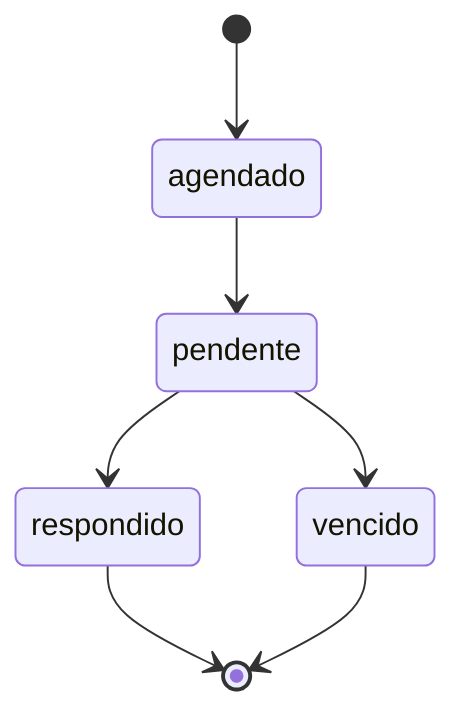

## Visão Geral

O sistema de Pulsos segue regras específicas de criação, transição de status, prazos e privacidade baseadas na implementação real do sistema.

---

## Regras de Criação

### RN-PUL-001: Quantidade de Pulsos por Programa

**Regra**: Cada talento recebe **exatamente 5 pulsos** ao longo do programa de 18-24 meses.

**Implementação**:

- Job `createPulsosJovens` cria 5 pulsos quando jovem é adicionado
- Job `createPulsosLiderancas` cria 5 pulsos para liderança avaliar o jovem
- Numeração: 1, 2, 3, 4, 5

**Racional**: Permite acompanhar evolução em 5 momentos-chave do programa.

---

### RN-PUL-002: Criação Automática via Evento

**Regra**: Pulsos são criados automaticamente quando evento `backoffice/jovem.created` é disparado.

**Implementação**:

```typescript
// Job escuta evento
{
  event: "backoffice/jovem.created";
}

// Cria 5 pulsos para jovem
// Cria 5 pulsos para liderança
```

**Exceção**: Criação manual via Backoffice é possível mas desencorajada.

---

### RN-PUL-003: Três Tipos Distintos

**Regra**: Sistema possui 3 tipos de pulsos independentes:

| Tipo                 | Collection      | Respondente | Propósito                  |
| -------------------- | --------------- | ----------- | -------------------------- |
| Pulsos de Jovens     | `pulsos_jovens` | Talentos    | Autoavaliação e satisfação |
| Pulsos de Lideranças | `Pulsos`        | Gestores    | Avaliação de performance   |
| Pulsos de RH         | `pulsos_rh`     | Time de RH  | Satisfação com Leapy       |

**Implementação**: Collections separadas, jobs separados, templates de email separados.

---

## Regras de Status

### RN-PUL-010: Ciclo de Vida do Status

**Regra**: Pulsos seguem transição de estados bem definida:



**Valores permitidos**: `agendado`, `pendente`, `respondido`, `vencido`

**Transições proibidas**:

- ❌ `respondido` → `pendente` (perde dados)
- ❌ `vencido` → `agendado` (estado inválido)

---

### RN-PUL-011: Transição Automática para Pendente

**Regra**: Pulsos mudam de `agendado` para `pendente` automaticamente na `data_aplicacao`.

**Implementação**:

- Job `updateStatusPulsosJovensParaPendentes` roda diariamente às 8h
- Query: `WHERE status = 'agendado' AND data_aplicacao <= CURRENT_DATE`

**Consequência**: Notificação de abertura é enviada automaticamente.

---

### RN-PUL-012: Transição Automática para Vencido

**Regra**: Pulsos pendentes viram `vencido` automaticamente quando `data_vencimento` expira.

**Implementação**:

- Job `updateStatusPulsosJovensParaVencidos` roda **a cada hora**
- Query: `WHERE status = 'pendente' AND data_vencimento < NOW()`

**Tolerância**: Job roda de hora em hora, então pode haver delay de até 59 minutos.

---

### RN-PUL-013: Imutabilidade após Resposta

**Regra**: Uma vez com status `respondido`, as **respostas não podem ser editadas**.

**Implementação**: Frontend não permite edição, API não tem endpoint de update para pulsos respondidos.

**Exceção**: RH pode reabrir manualmente via Backoffice (muda status de volta para `pendente`), mas isso **apaga as respostas anteriores**.

<Warning>
  Reabrir um pulso respondido apaga todas as respostas. Use apenas em casos de
  erro crítico.
</Warning>

---

## Regras de Prazo

### RN-PUL-020: Prazo Padrão

**Regra**: Prazo típico entre `data_aplicacao` e `data_vencimento` é de **7 dias**.

**Implementação**:

```typescript
data_vencimento = addDays(data_aplicacao, 7);
```

**Variações por tipo**:

- Jovens: 7 dias
- Lideranças: 7 dias
- RH: 14 dias (prazo estendido)

---

### RN-PUL-021: Extensão de Prazo

**Regra**: RH pode estender prazo manualmente, sem limite máximo.

**Implementação**:

- Via App RH: Editar pulsos em lote
- Via Backoffice: Alterar `data_vencimento` diretamente

**Validação**: Nova data deve ser futura (não pode ser passada).

**Efeito colateral**: Pulsos `vencidos` voltam para `pendente` se nova data for futura.

---

### RN-PUL-022: Sistema de Lembretes

**Regra**: Lembretes automáticos são enviados em intervalos regulares.

**Implementação**:

| Momento  | Ação                      | Job                             |
| -------- | ------------------------- | ------------------------------- |
| T=0      | Notificação de abertura   | `sendLiberacaoPulsosJovensToRh` |
| T+3 dias | Primeiro lembrete         | `sendPulsosLembretetoJovens`    |
| T+6 dias | Segundo lembrete          | `sendPulsosLembretetoJovens`    |
| T+7 dias | Vencimento (sem lembrete) | `updateStatusParaVencidos`      |

**Configuração**: Intervalo de lembretes está em `pulsos_paramentros.recorrencia_notificacao_pendentes` (default: 3 dias).

---

## Regras de Privacidade

### RN-PUL-030: Pulsos de Jovens são Identificados

**Regra**: Respostas de jovens são **identificadas** (não anônimas).

**Quem vê**:

- ✅ Time de RH da empresa
- ✅ Liderança direta do jovem
- ✅ Time Leapy (dados agregados)

**Quem NÃO vê**:

- ❌ Outros talentos
- ❌ Lideranças de outras áreas

**Racional**: Permite feedback individualizado e acompanhamento personalizado.

---

### RN-PUL-031: Pulsos de Lideranças são Confidenciais

**Regra**: Avaliações de lideranças são **confidenciais**.

**Quem vê**:

- ✅ Time de RH da empresa
- ✅ Time Leapy (dados agregados)

**Quem NÃO vê**:

- ❌ O talento avaliado (não tem acesso direto)
- ❌ Outras lideranças
- ❌ Outros talentos

**Exceção**: RH pode compartilhar feedback estruturado com o talento, mas não a avaliação bruta.

<Warning>
  Avaliações de lideranças são confidenciais por design. Não exponha esses dados
  diretamente para talentos.
</Warning>

---

### RN-PUL-032: Pulsos de RH são Identificados por Empresa

**Regra**: Pulsos de RH são vinculados à empresa (`account_id`), não ao usuário individual.

**Quem vê**:

- ✅ Time de RH da própria empresa
- ✅ Time Leapy

**Uso**: Dados agregados para melhoria do serviço Leapy.

---

## Regras de Notificação

### RN-PUL-040: Multi-Canal

**Regra**: Notificações são enviadas por **email** (Resend) e, se necessário, **WhatsApp** (Agent System).

**Prioridade**:

1. Email (sempre)
2. WhatsApp (fallback se email falhar ou taxa de resposta baixa)

**Implementação**:

- Job dispara evento para Resend
- Se bounce, dispara evento para Agent System

---

### RN-PUL-041: Templates Específicos

**Regra**: Cada tipo de pulso e cada ação tem template específico.

**9 templates ativos**:

- `pulsos-lembrete-jovens`
- `pulsos-lembrete-liderancas`
- `pulsos-lembrete-jovens-to-rh`
- `pulsos-lembrete-liderancas-to-rh`
- `pulsos-liberacao-jovens-to-rh`
- `pulsos-liberacao-liderancas-to-rh`
- `pulsos-liberacao-rh-to-rh`
- `pulsos-lembrete-rh-to-rh`
- `pulsos-notificacao-abertura`

**Regra de conteúdo**: Templates devem incluir:

- Nome do destinatário
- Número do pulso
- Data de vencimento
- Link direto para responder

---

## Regras de Validação

### RN-PUL-050: Campos Obrigatórios

**Regra**: Ao criar pulso, campos obrigatórios devem ser preenchidos.

**Pulsos de Jovens**:

```json
{
  "jovem_id": "obrigatório",
  "pulso": "obrigatório (1-5)",
  "status": "obrigatório",
  "data_aplicacao": "obrigatório",
  "data_vencimento": "obrigatório"
}
```

**Validação**: API retorna 422 se faltar algum campo.

---

### RN-PUL-051: Validação de Datas

**Regra**: `data_vencimento` deve ser posterior a `data_aplicacao`.

**Validação**:

```typescript
if (data_vencimento <= data_aplicacao) {
  throw new Error("data_vencimento deve ser posterior a data_aplicacao");
}
```

**Recomendação**: Mínimo de 3 dias entre datas.

---

### RN-PUL-052: Validação de Valores

**Regra**: Campos com valores limitados devem respeitar os valores permitidos.

**Exemplos**:

| Campo             | Valores Permitidos                  |
| ----------------- | ----------------------------------- |
| `performance`     | "Abaixo", "Dentro", "Acima"         |
| `prob_efetivacao` | "Alta", "Média", "Baixa", "Nenhuma" |
| `recontrataria`   | "Sim", "Não", "Talvez"              |
| `nps_*`           | 0-10 (integer)                      |

**Validação**: Frontend e API validam valores antes de salvar.

---

## Regras de Agendamento

### RN-PUL-060: Cadências Permitidas

**Regra**: Sistema suporta cadências flexíveis via `pulsos_schedule_settings`.

**Cadências válidas**:

| Cadência   | `cadence_unit` | `cadence_interval` |
| ---------- | -------------- | ------------------ |
| Semanal    | `week`         | `1`                |
| Quinzenal  | `week`         | `2`                |
| Mensal     | `month`        | `1`                |
| Bimestral  | `month`        | `2`                |
| Trimestral | `month`        | `3`                |
| Semestral  | `month`        | `6`                |
| Anual      | `month`        | `12`               |

**Recomendação**: Trimestral para programas de 18-24 meses.

---

### RN-PUL-061: Próxima Data Automática

**Regra**: Após criar pulsos, sistema calcula automaticamente a `next_pulso_date`.

**Cálculo**:

```typescript
next_pulso_date = current_next_pulso_date + cadence_interval;
```

**Exemplo**:

- Atual: 01/04/2024
- Cadência: Trimestral (3 meses)
- Próxima: 01/07/2024

---

## Tabela Resumo de Regras

| Código     | Regra                  | Valor/Comportamento   |
| ---------- | ---------------------- | --------------------- |
| RN-PUL-001 | Pulsos por programa    | 5 pulsos              |
| RN-PUL-002 | Criação                | Automática via evento |
| RN-PUL-003 | Tipos                  | 3 tipos distintos     |
| RN-PUL-010 | Status                 | 4 estados possíveis   |
| RN-PUL-011 | Transição pendente     | Automática na data    |
| RN-PUL-012 | Transição vencido      | A cada hora           |
| RN-PUL-013 | Imutabilidade          | Respondido não edita  |
| RN-PUL-020 | Prazo padrão           | 7 dias                |
| RN-PUL-021 | Extensão               | Sem limite            |
| RN-PUL-022 | Lembretes              | T+3 e T+6 dias        |
| RN-PUL-030 | Privacidade jovens     | Identificado          |
| RN-PUL-031 | Privacidade lideranças | Confidencial          |
| RN-PUL-040 | Notificação            | Email + WhatsApp      |
| RN-PUL-041 | Templates              | 9 templates           |
| RN-PUL-050 | Validação campos       | Obrigatórios          |
| RN-PUL-060 | Cadências              | Flexível              |

---

## Próximos Passos

<CardGroup cols={2}>
  <Card
    title="Modelo de Dados"
    icon="database"
    href="/documentation/domains/pulses/data-model"
  >
    Estrutura das collections
  </Card>
  <Card
    title="Jobs Inngest"
    icon="gear"
    href="/documentation/domains/pulses/jobs-inngest"
  >
    Implementação dos jobs
  </Card>
  <Card
    title="API Reference"
    icon="code"
    href="/api-reference/backoffice/pulsos-jovens"
  >
    Como usar a API
  </Card>
  <Card
    title="Guia de Operações"
    icon="wrench"
    href="/guides/backoffice/pulsos-operacoes"
  >
    Operações manuais
  </Card>
</CardGroup>
