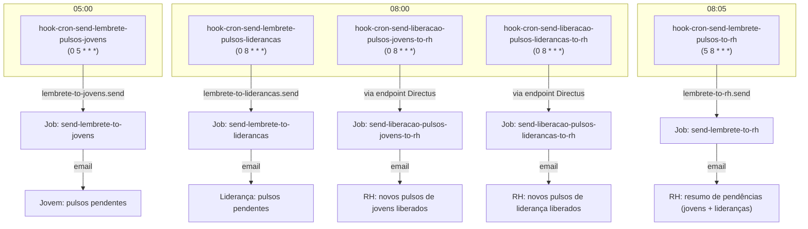

## Contexto de Produto

Quando um pulso entra em status `pendente`, três grupos precisam ser notificados em momentos
diferentes: o jovem ou liderança que deve responder, e o RH que acompanha a abertura. A plataforma
usa cinco hooks CRON independentes para cobrir cada combinação de audiência e tipo de notificação
(lembrete de pendência vs. liberação de novo ciclo).

Os jobs Inngest correspondentes estão documentados em
[Jobs Inngest de Pulsos](/documentation/domains/pulses/jobs-inngest).

## Os Cinco Hooks CRON

### Visão geral

| Hook | Schedule | Audiência | Tipo |
|---|---|---|---|
| `hook-cron-send-lembrete-pulsos-jovens` | `0 5 * * *` (05:00) | Jovens | Lembrete de pendência |
| `hook-cron-send-lembrete-pulsos-liderancas` | `0 8 * * *` (08:00) | Lideranças | Lembrete de pendência |
| `hook-cron-send-lembrete-pulsos-to-rh` | `5 8 * * *` (08:05) | RH | Lembrete de pendência (ambos) |
| `hook-cron-send-liberacao-pulsos-jovens-to-rh` | `0 8 * * *` (08:00) | RH | Liberação de jovens |
| `hook-cron-send-liberacao-pulsos-liderancas-to-rh` | `0 8 * * *` (08:00) | RH | Liberação de lideranças |

---

## Fluxo 1 — Lembrete para Jovens

### `hook-cron-send-lembrete-pulsos-jovens`

**Schedule:** `0 5 * * *` (diariamente às 05:00)

**Feature flag:** `HOOK_CRON_SEND_LEMBRETE_PULSOS_JOVENS`

**Lógica:**

1. Carrega config do pulso tipo `"jovem"` para obter `recorrenciaPendentesDias`
2. Calcula `days_ago = hoje - recorrenciaPendentesDias`
3. Busca `pulsos_jovens` onde:
   - `jovem_id.ativo = true`
   - `data_aplicacao <= days_ago` (pulso já está no período de resposta)
   - `status = "pendente"`
   - `ultima_notificacao <= days_ago` **ou** `ultima_notificacao = null`
4. Se encontrar pulsos → dispara evento Inngest

**Evento disparado:**

```json
{
  "name": "backoffice/pulsos_jovens/lembrete-to-jovens.send",
  "data": {
    "message": "Send lembretes de pulsos to jovens",
    "pulsos_jovens": [
      {
        "id": 101,
        "status": "pendente",
        "data_aplicacao": "2026-04-20T00:00:00.000Z",
        "data_vencimento": "2026-05-05T23:59:59.000Z",
        "ultima_notificacao": null,
        "jovem_id": { "id": 55, "empresa_id": { "Empresa": "Empresa XYZ" } }
      }
    ]
  }
}
```

**Job Inngest:** `send-lembrete-to-jovens`

Por cada pulso:
1. Busca dados do jovem (`first_name`, `last_name`, `email_corporativo`, `personal_email`, `empresa_name`)
2. Determina template com base em `ultima_notificacao`:
   - `null` → primeira notificação → template `pulsos-liberacao-jovens` ("Hora de responder o pulso")
   - não nulo → lembrete → template `pulsos-lembrete-jovens` ("Você ainda não respondeu")
3. Envia email para `email_corporativo || personal_email`
4. Atualiza `ultima_notificacao` no pulso

---

## Fluxo 2 — Lembrete para Lideranças

### `hook-cron-send-lembrete-pulsos-liderancas`

**Schedule:** `0 8 * * *` (diariamente às 08:00)

**Feature flag:** `HOOK_CRON_SEND_LEMBRETE_PULSOS_LIDERANCA`

**Lógica:**

1. Carrega config do pulso tipo `"lideranca"` para obter `recorrenciaPendentesDias`
2. Calcula `days_ago` com base na recorrência
3. Busca `Pulsos` onde:
   - `jovem_id.lideranca_id.ativo = true`
   - `jovem_id.ativo = true`
   - `jovem_id.Status_formacao = "em_andamento"`
   - `data_aplicacao <= days_ago`
   - `status = "pendente"`
   - `ultima_notificacao <= days_ago` **ou** `ultima_notificacao = null`
4. Dispara evento se encontrar pulsos

**Evento disparado:**

```json
{
  "name": "backoffice/pulsos_liderancas/lembrete-to-liderancas.send",
  "data": {
    "message": "Send lembretes de pulsos to lideranças",
    "pulsos_liderancas": [...]
  }
}
```

**Job Inngest:** `send-lembrete-to-liderancas`
- Template: `pulsos-lembrete-liderancas`

---

## Fluxo 3 — Lembrete Agregado para RH

### `hook-cron-send-lembrete-pulsos-to-rh`

**Schedule:** `5 8 * * *` (diariamente às 08:05 — 5 minutos depois dos lembretes diretos)

**Feature flag:** `HOOK_CRON_SEND_LEMBRETE_PULSOS_TO_RH`

**Lógica:**

O hook combina pulsos de jovens e lideranças pendentes em um único payload agrupado por `account`:

1. Consulta `pulsoLiderancaCfg.recorrenciaPendentesRhDias` e `pulsoJovemCfg.recorrenciaPendentesRhDias`
2. Busca `Pulsos` (lideranças) e `pulsos_jovens` com mesmos filtros de status e data
3. Agrupa os resultados por `account`:

```json
{
  "Empresa XYZ": {
    "account": "Empresa XYZ",
    "account_id": 10,
    "sub_account": null,
    "jovens": [{ "jovem_id": 55, "name": "Ana Lima", "account_id": 10 }],
    "liderancas": [{ "lideranca_id": 12, "name": "Carlos Souza", "account_id": 10 }],
    "pulsos_jovens": [101, 102],
    "pulsos_liderancas": [88]
  }
}
```

4. Envia um evento por conta com `lista` (array de objetos agrupados)

**Evento disparado:**

```json
{
  "name": "backoffice/pulsos_jovens/pulsos_liderancas/lembrete-to-rh.send",
  "data": {
    "message": "Send lembretes de pulsos to rh",
    "lista": [...]
  }
}
```

**Job Inngest:** `send-lembrete-to-rh`

<Note>
  O delay de 5 minutos (`5 8`) é intencional: garante que os hooks de lembrete direto
  (05:00 e 08:00) já executaram e `ultima_notificacao` foi atualizada antes do resumo ao RH.
</Note>

---

## Fluxo 4 — Liberação para RH (Jovens)

### `hook-cron-send-liberacao-pulsos-jovens-to-rh`

**Schedule:** `0 8 * * *` (diariamente às 08:00)

**Feature flag:** `HOOK_CRON_SEND_LIBERACAO_PULSOS_JOVENS_TO_RH`

**Lógica:**

Em vez de consultar o Directus diretamente, o hook chama o **endpoint interno** do Directus via HTTP:

```
GET {DIRECTUS_LOCAL_URL}/pulsos/send-liberacao-pulsos-jovens-to-rh?send_event=true
Authorization: Bearer {DIRECTUS_LOCAL_TOKEN}
```

Esse endpoint determina quais pulsos de jovens foram liberados recentemente e dispara o evento
`backoffice/pulsos_jovens/liberacao-to-rh.send` para o job `send-liberacao-pulsos-jovens-to-rh`.

**Job Inngest:** `send-liberacao-pulsos-jovens-to-rh`
- Template: `pulsos-liberacao-jovens-to-rh`

---

## Fluxo 5 — Liberação para RH (Lideranças)

### `hook-cron-send-liberacao-pulsos-liderancas-to-rh`

**Schedule:** `0 8 * * *` (diariamente às 08:00)

**Feature flag:** `HOOK_CRON_SEND_LIBERACAO_PULSOS_LIDERANCAS_TO_RH`

**Lógica idêntica** ao fluxo 4, mas para lideranças:

```
GET {DIRECTUS_LOCAL_URL}/pulsos/send-liberacao-pulsos-liderancas-to-rh?send_event=true
Authorization: Bearer {DIRECTUS_LOCAL_TOKEN}
```

**Job Inngest:** `send-liberacao-pulsos-liderancas-to-rh`
- Template: `pulsos-liberacao-liderancas-to-rh`

---

## Arquitetura dos Crons



## Templates de Email

| Contexto | Template | Assunto |
|---|---|---|
| Primeira notif. ao jovem | `pulsos-liberacao-jovens` | "Hora de responder o pulso — Leapy + {empresa}" |
| Lembrete ao jovem | `pulsos-lembrete-jovens` | "Você ainda não respondeu o pulso — Leapy" |
| Lembrete à liderança | `pulsos-lembrete-liderancas` | — |
| Liberação (jovens) ao RH | `pulsos-liberacao-jovens-to-rh` | — |
| Liberação (lideranças) ao RH | `pulsos-liberacao-liderancas-to-rh` | — |
| Lembrete ao RH | `pulsos-lembrete-jovens-to-rh`, `pulsos-lembrete-liderancas-to-rh` | — |

## Observabilidade

```sql
-- Pulsos pendentes sem ultima_notificacao (candidatos ao próximo lembrete de jovens)
SELECT id, status, data_aplicacao, ultima_notificacao, jovem_id
FROM pulsos_jovens
WHERE status = 'pendente'
  AND ultima_notificacao IS NULL
ORDER BY data_aplicacao;

-- Pulsos de liderança pendentes há mais de 7 dias sem lembrete
SELECT id, status, data_aplicacao, ultima_notificacao
FROM "Pulsos"
WHERE status = 'pendente'
  AND ultima_notificacao < NOW() - INTERVAL '7 days'
ORDER BY ultima_notificacao NULLS FIRST;
```

## Riscos, Limites e Trade-offs

| Risco | Mitigação |
|---|---|
| Hook de lembrete jovens às 05:00 gera emails cedo | Horário configurado para notificação matinal; sem controle de fuso por empresa |
| Fluxos 4 e 5 dependem do endpoint Directus estar disponível | Se endpoint falhar, hook não retenta — Inngest não recebe evento |
| `ultima_notificacao` não atualizada entre C2 e C5 (ambos às 08:00) | Delay de 5 min em C5 (`08:05`) mitiga race condition |
| Feature flag por constante no código | Desativar exige mudança de código + deploy |
| Pulso liberado mas `send_event=false` no endpoint | Parâmetro `send_event=true` hardcoded no hook — proteção extra |

## Referências de Código

| Arquivo | Repo | Descrição |
|---|---|---|
| `extensions/hooks/src/hook-cron-send-lembrete-pulsos-jovens/index.js` | `directus-backoffice-with-extensions` | Hook cron 05:00 — lembrete jovens |
| `extensions/hooks/src/hook-cron-send-lembrete-pulsos-liderancas/index.js` | `directus-backoffice-with-extensions` | Hook cron 08:00 — lembrete lideranças |
| `extensions/hooks/src/hook-cron-send-lembrete-pulsos-to-rh/index.js` | `directus-backoffice-with-extensions` | Hook cron 08:05 — lembrete RH (agrupado) |
| `extensions/hooks/src/hook-cron-send-liberacao-pulsos-jovens-to-rh/index.js` | `directus-backoffice-with-extensions` | Hook cron 08:00 — liberação jovens ao RH |
| `extensions/hooks/src/hook-cron-send-liberacao-pulsos-liderancas-to-rh/index.js` | `directus-backoffice-with-extensions` | Hook cron 08:00 — liberação lideranças ao RH |
| `src/inngest/functions/send-pulsos-lembrete-to-jovens.ts` | `backoffice-inngest-functions` | Job: lembrete por jovem + update ultima_notificacao |
| `src/inngest/functions/send-pulsos-lembrete-to-liderancas.ts` | `backoffice-inngest-functions` | Job: lembrete por liderança |
| `src/inngest/functions/pulsos/rh/send-pulsos-lembrete-to-rh.ts` | `backoffice-inngest-functions` | Job: lembrete agregado ao RH |
| `src/inngest/functions/pulsos/rh/send-liberacao-pulsos-jovens-to-rh.ts` | `backoffice-inngest-functions` | Job: notif. liberação jovens ao RH |
| `src/inngest/functions/pulsos/rh/send-liberacao-pulsos-liderancas-to-rh.ts` | `backoffice-inngest-functions` | Job: notif. liberação lideranças ao RH |

<CardGroup cols={2}>
  <Card title="Pulsos — Visão Geral" icon="pulse" href="/documentation/domains/pulses/index">
    Domínio completo de pulsos de feedback
  </Card>
  <Card title="Jobs Inngest de Pulsos" icon="gear" href="/documentation/domains/pulses/jobs-inngest">
    Jobs send-lembrete e send-liberacao documentados
  </Card>
  <Card title="Webhooks e Eventos de Pulsos" icon="webhook" href="/documentation/domains/pulses/webhooks">
    Eventos que disparam atualizações de status
  </Card>
  <Card title="Backoffice Directus" icon="database" href="/documentation/platform/backoffice-directus">
    Hooks e collections do backoffice
  </Card>
</CardGroup>
