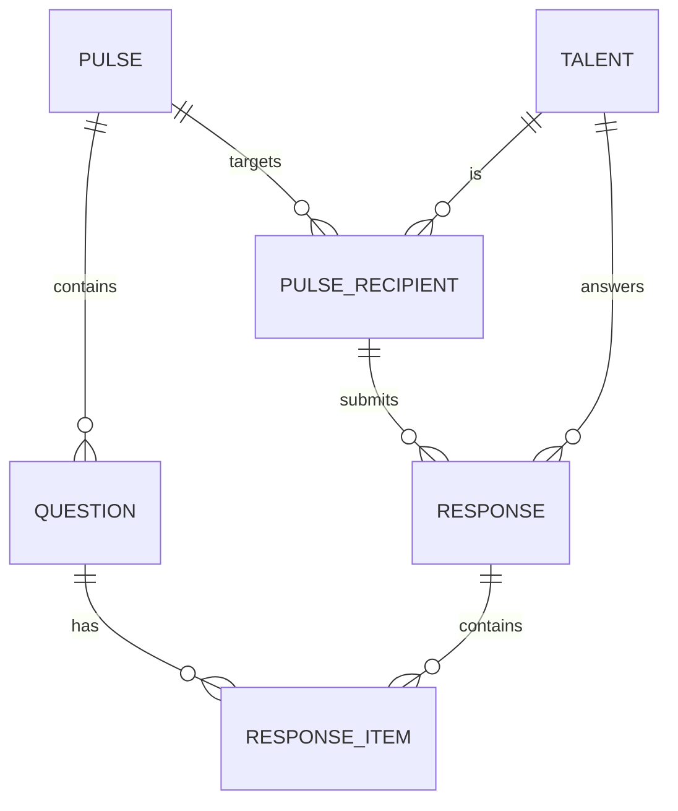
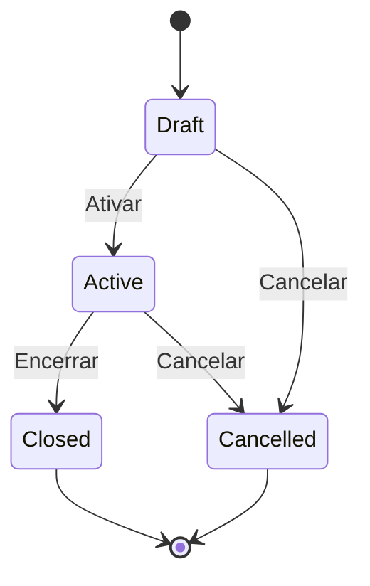

## Diagrama de Entidades

## Entidades Principais

### Pulse (Pulso)

Representa uma pesquisa ou questionário.

| Campo | Tipo | Descrição |
|-------|------|-----------|
| `id` | UUID | Identificador único |
| `tenant_id` | UUID | Tenant proprietário |
| `title` | string | Título do pulso |
| `description` | string | Descrição/instruções |
| `type` | enum | Tipo do pulso (eNPS, clima, etc) |
| `status` | enum | Status atual (draft, active, closed) |
| `is_anonymous` | boolean | Se as respostas são anônimas |
| `start_date` | datetime | Data de início |
| `end_date` | datetime | Data de encerramento |
| `created_at` | datetime | Data de criação |
| `created_by` | UUID | Usuário criador |

### Question (Pergunta)

Representa uma pergunta dentro de um pulso.

| Campo | Tipo | Descrição |
|-------|------|-----------|
| `id` | UUID | Identificador único |
| `pulse_id` | UUID | Pulso pai |
| `text` | string | Texto da pergunta |
| `type` | enum | Tipo (scale, text, multiple_choice) |
| `required` | boolean | Se é obrigatória |
| `order` | integer | Ordem de exibição |
| `options` | json | Opções (para múltipla escolha) |

### Response (Resposta)

Representa o conjunto de respostas de um talento.

| Campo | Tipo | Descrição |
|-------|------|-----------|
| `id` | UUID | Identificador único |
| `pulse_id` | UUID | Pulso respondido |
| `talent_id` | UUID | Talento (null se anônimo) |
| `submitted_at` | datetime | Data de envio |
| `is_complete` | boolean | Se todas perguntas foram respondidas |

### Response Item (Item de Resposta)

Representa a resposta a uma pergunta específica.

| Campo | Tipo | Descrição |
|-------|------|-----------|
| `id` | UUID | Identificador único |
| `response_id` | UUID | Resposta pai |
| `question_id` | UUID | Pergunta respondida |
| `value` | string | Valor da resposta |
| `score` | integer | Pontuação (para escalas) |

## Status do Pulso

| Status | Descrição |
|--------|-----------|
| `draft` | Em edição, não visível para destinatários |
| `active` | Ativo e coletando respostas |
| `closed` | Encerrado, apenas visualização |
| `cancelled` | Cancelado, não contabilizado |
