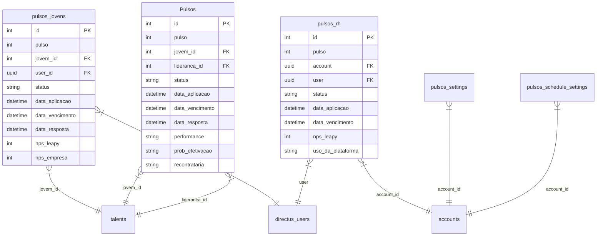
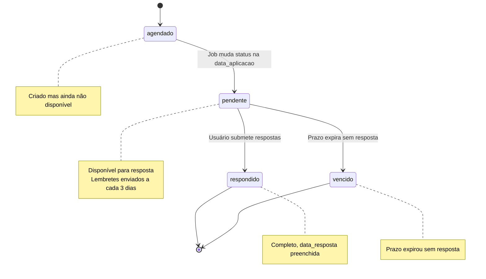

## Visão Geral

O sistema de Pulsos utiliza **7 collections** principais no Directus (PostgreSQL via Supabase) para armazenar dados de pesquisas, respostas, configurações e agendamentos.

## Diagrama de Entidades



---

## Collections Principais

### 1. `pulsos_jovens`

Respostas dos talentos (estagiários e aprendizes).

| Campo             | Tipo       | Descrição                              | Obrigatório |
| ----------------- | ---------- | -------------------------------------- | :---------: |
| `id`              | `integer`  | Identificador único (PK, serial)       |     ✅      |
| `pulso`           | `integer`  | Número do pulso (1-5)                  |     ✅      |
| `jovem_id`        | `integer`  | ID do talento (FK → talents.id)        |     ✅      |
| `user_id`         | `uuid`     | ID do usuário (FK → directus_users.id) |     ✅      |
| `status`          | `string`   | Status atual                           |     ✅      |
| `data_aplicacao`  | `datetime` | Data de disponibilização               |     ✅      |
| `data_vencimento` | `datetime` | Data limite para resposta              |     ✅      |
| `data_resposta`   | `datetime` | Data em que foi respondido             |     ❌      |

#### Campos de Avaliação (Escalas 0-10)

| Campo                                                      | Tipo      | Descrição                         |
| ---------------------------------------------------------- | --------- | --------------------------------- |
| `nps_leapy`                                                | `integer` | Satisfação com a Leapy (0-10)     |
| `nps_empresa`                                              | `integer` | Satisfação com a empresa (0-10)   |
| `relacao_com_a_lideranca`                                  | `integer` | Qualidade da relação (0-10)       |
| `ambiente_da_empresa`                                      | `integer` | Avaliação do ambiente (0-10)      |
| `avaliacao_tarefas_e_desafios_dia_a_dia`                   | `integer` | Qualidade das tarefas (0-10)      |
| `avaliacao_apoio_empresa_e_lideranca_para_desenvolvimento` | `integer` | Suporte ao desenvolvimento (0-10) |

#### Perguntas Sim/Não

| Campo                                                 | Valores      |
| ----------------------------------------------------- | ------------ |
| `sei_o_que_e_esperado_de_mim_na_empresa`              | "Sim", "Não" |
| `sinto_que_sou_desafiado_todos_os_dias`               | "Sim", "Não" |
| `estou_satisfeito_com_a_minha_area`                   | "Sim", "Não" |
| `minha_lideranca_se_preocupa_com_meu_desenvolvimento` | "Sim", "Não" |
| `oportunidade_de_aplicar_o_que_aprendo_com_a_leapy`   | "Sim", "Não" |
| `consigo_gerar_valor_para_o_meu_time`                 | "Sim", "Não" |

#### Efetivação

| Campo                                                      | Tipo      | Descrição                   |
| ---------------------------------------------------------- | --------- | --------------------------- |
| `quanto_voce_quer_ser_efetivado`                           | `integer` | Desejo de efetivação (0-10) |
| `areas_de_interesse_em_caso_de_efetivacao`                 | `text`    | Áreas de interesse          |
| `nivel_de_interesse_em_continuar_na_area_que_esta_atuando` | `string`  | "Alto", "Médio", "Baixo"    |

#### Feedbacks

| Campo                     | Tipo   |
| ------------------------- | ------ |
| `feedback_para_leapy`     | `text` |
| `depoimento_para_empresa` | `text` |

---

### 2. `Pulsos` (Lideranças)

⚠️ **Nota**: Nome da collection é `Pulsos` com P maiúsculo (diferente das demais).

Avaliações das lideranças sobre seus liderados.

| Campo             | Tipo       | Descrição                  | Obrigatório |
| ----------------- | ---------- | -------------------------- | :---------: |
| `id`              | `integer`  | Identificador único (PK)   |     ✅      |
| `pulso`           | `integer`  | Número do pulso (1-5)      |     ✅      |
| `jovem_id`        | `integer`  | ID do talento avaliado     |     ✅      |
| `lideranca_id`    | `integer`  | ID da liderança avaliadora |     ✅      |
| `status`          | `string`   | Status atual               |     ✅      |
| `data_aplicacao`  | `datetime` | Data de disponibilização   |     ✅      |
| `data_vencimento` | `datetime` | Data limite                |     ✅      |
| `data_resposta`   | `datetime` | Data de resposta           |     ❌      |
| `respondido_por`  | `string`   | "lideranca" ou "rh"        |     ❌      |

#### Campos de Avaliação

| Campo             | Tipo     | Valores Permitidos                  |
| ----------------- | -------- | ----------------------------------- |
| `performance`     | `string` | "Abaixo", "Dentro", "Acima"         |
| `prob_efetivacao` | `string` | "Alta", "Média", "Baixa", "Nenhuma" |
| `recontrataria`   | `string` | "Sim", "Não", "Talvez"              |
| `depoimento`      | `text`   | Texto livre                         |
| `pontos_fortes`   | `text`   | Texto livre                         |
| `pontos_melhoria` | `text`   | Texto livre                         |

---

### 3. `pulsos_rh`

Pesquisas com o time de RH sobre a parceria Leapy.

| Campo             | Tipo       | Descrição                        |
| ----------------- | ---------- | -------------------------------- |
| `id`              | `integer`  | Identificador único (PK)         |
| `pulso`           | `integer`  | Número do pulso                  |
| `account`         | `uuid`     | ID da empresa (FK → accounts.id) |
| `user`            | `uuid`     | ID do usuário RH                 |
| `email`           | `string`   | Email do respondente             |
| `status`          | `string`   | Status atual                     |
| `data_aplicacao`  | `datetime` | Data de disponibilização         |
| `data_vencimento` | `datetime` | Data limite                      |
| `data_resposta`   | `datetime` | Data de resposta                 |
| `ultimo_pulso`    | `boolean`  | Se é o último pulso              |

#### Campos de Avaliação

| Campo                         | Tipo      | Descrição                                                    |
| ----------------------------- | --------- | ------------------------------------------------------------ |
| `nps_leapy`                   | `integer` | NPS geral da Leapy (0-10)                                    |
| `report_e_dados_da_leapy`     | `integer` | Qualidade dos reports (0-10)                                 |
| `comunicacao_leapy`           | `integer` | Qualidade da comunicação (0-10)                              |
| `uso_da_plataforma_leapy`     | `string`  | "Muito Frequente", "Frequente", "Pouco", "Nunca"             |
| `probabilidade_recontratacao` | `string`  | "Muito Provável", "Provável", "Pouco Provável", "Improvável" |
| `destaques_leapy`             | `jsonb`   | Array de destaques                                           |
| `sugestoes`                   | `text`    | Sugestões de melhoria                                        |

---

## Collections de Configuração

### 4. `pulsos_settings`

Configuração de perguntas habilitadas por perfil.

| Campo               | Tipo    | Descrição                        |
| ------------------- | ------- | -------------------------------- |
| `id`                | `uuid`  | Identificador único (PK)         |
| `account_id`        | `uuid`  | ID da empresa                    |
| `profile_enabled`   | `jsonb` | Perfis habilitados               |
| `questions_enabled` | `jsonb` | Perguntas habilitadas por perfil |

**Estrutura do `questions_enabled`:**

```json
{
  "jovens": ["nps_leapy", "nps_empresa", "relacao_com_a_lideranca"],
  "liderancas": ["performance", "prob_efetivacao", "recontrataria"],
  "rh": ["nps_leapy", "report_e_dados_da_leapy"]
}
```

---

### 5. `pulsos_schedule_settings`

Configuração de agendamento automático de pulsos.

| Campo              | Tipo      | Descrição                         |
| ------------------ | --------- | --------------------------------- |
| `id`               | `uuid`    | Identificador único (PK)          |
| `account_id`       | `uuid`    | ID da empresa                     |
| `profile`          | `enum`    | "jovens", "liderancas" ou "rh"    |
| `enabled`          | `boolean` | Se agendamento está ativo         |
| `cadence_unit`     | `text`    | "month", "week" ou "day"          |
| `cadence_interval` | `integer` | Intervalo (ex: 3 para trimestral) |
| `next_pulso_date`  | `date`    | Próxima data de criação           |
| `max_changes`      | `integer` | Máximo de alterações permitidas   |

**Exemplo - Agendamento Trimestral:**

```json
{
  "account_id": "uuid-da-empresa",
  "profile": "jovens",
  "enabled": true,
  "cadence_unit": "month",
  "cadence_interval": 3,
  "next_pulso_date": "2024-04-01"
}
```

---

### 6. `pulsos_paramentros`

Parâmetros globais do sistema (raramente alterados).

| Campo                               | Tipo      | Descrição                       |
| ----------------------------------- | --------- | ------------------------------- |
| `id`                                | `integer` | Identificador único (PK)        |
| `tipo_pulso`                        | `string`  | Tipo do pulso                   |
| `frequencia`                        | `integer` | Frequência em dias              |
| `dias_antes_notificacao_abertura`   | `integer` | Dias antes de notificar         |
| `recorrencia_notificacao_pendentes` | `integer` | Recorrência de lembretes (dias) |
| `gatilho_criacao`                   | `string`  | Gatilho que dispara criação     |
| `gatilho_parada`                    | `string`  | Gatilho que para criação        |
| `roles`                             | `json`    | Roles que devem receber         |
| `prazo`                             | `integer` | Prazo para resposta (dias)      |

---

## Views Materializadas (Analytics)

### 7. Views de Charts

Views pré-calculadas para dashboards:

| View                                  | Descrição                        |
| ------------------------------------- | -------------------------------- |
| `chart_nps_pulsos_jovens`             | NPS de jovens por pulso          |
| `chart_nps_pulsos_liderancas`         | NPS de avaliações de lideranças  |
| `chart_satisfacao_empresa_por_pulsos` | Satisfação com empresa por pulso |
| `chart_satisfacao_leapy_por_pulsos`   | Satisfação com Leapy por pulso   |

---

## Status dos Pulsos

### Diagrama de Estados



### Valores de Status

| Status       | Descrição                       | Editável? |
| ------------ | ------------------------------- | :-------: |
| `agendado`   | Criado mas não disponível ainda |    ✅     |
| `pendente`   | Disponível para resposta        |    ✅     |
| `respondido` | Respondido pelo usuário         |    ❌     |
| `vencido`    | Prazo expirado sem resposta     |    ✅     |

---

## Índices Importantes

Para performance de queries:

```sql
-- pulsos_jovens
CREATE INDEX idx_pulsos_jovens_status ON pulsos_jovens(status);
CREATE INDEX idx_pulsos_jovens_jovem_id ON pulsos_jovens(jovem_id);
CREATE INDEX idx_pulsos_jovens_pulso ON pulsos_jovens(pulso);
CREATE INDEX idx_pulsos_jovens_data_aplicacao ON pulsos_jovens(data_aplicacao);

-- Pulsos (lideranças)
CREATE INDEX idx_pulsos_status ON Pulsos(status);
CREATE INDEX idx_pulsos_jovem_id ON Pulsos(jovem_id);
CREATE INDEX idx_pulsos_lideranca_id ON Pulsos(lideranca_id);

-- pulsos_rh
CREATE INDEX idx_pulsos_rh_account ON pulsos_rh(account);
CREATE INDEX idx_pulsos_rh_status ON pulsos_rh(status);
```

---

## Próximos Passos

<CardGroup cols={2}>
  <Card
    title="Jobs Inngest"
    icon="gear"
    href="/documentation/domains/pulses/jobs-inngest"
  >
    Jobs que manipulam essas collections
  </Card>
  <Card
    title="Integrações"
    icon="plug"
    href="/documentation/domains/pulses/integrations"
  >
    Resend, Agent System, Inngest
  </Card>
  <Card
    title="API Reference"
    icon="code"
    href="/api-reference/backoffice/pulsos-jovens"
  >
    Como acessar via API
  </Card>
  <Card
    title="Business Rules"
    icon="book"
    href="/documentation/domains/pulses/business-rules"
  >
    Regras de validação e negócio
  </Card>
</CardGroup>
